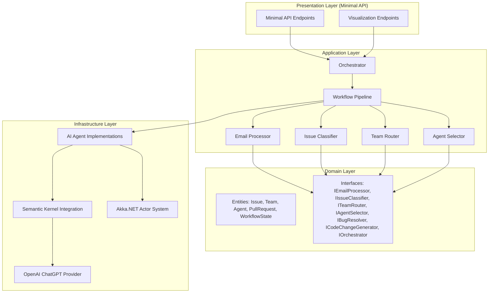
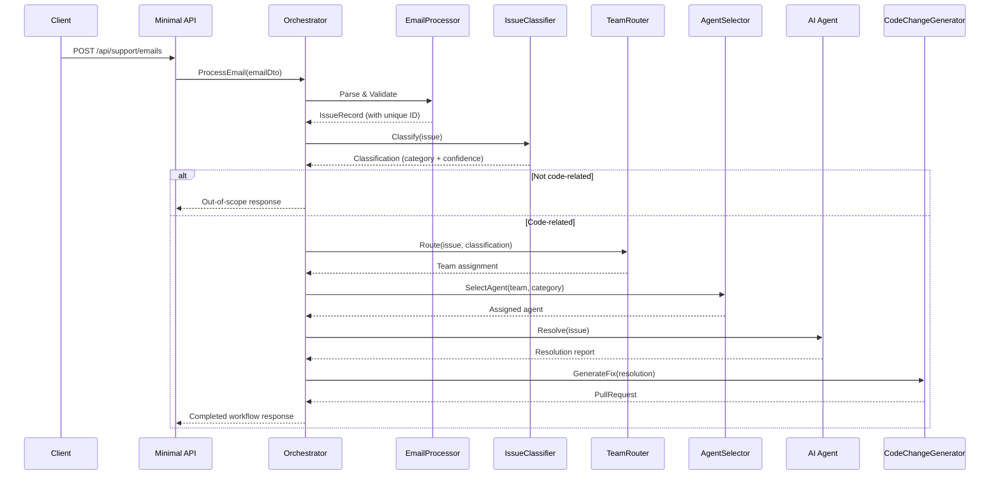
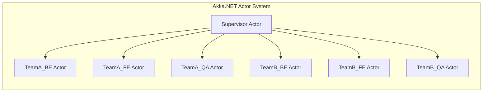
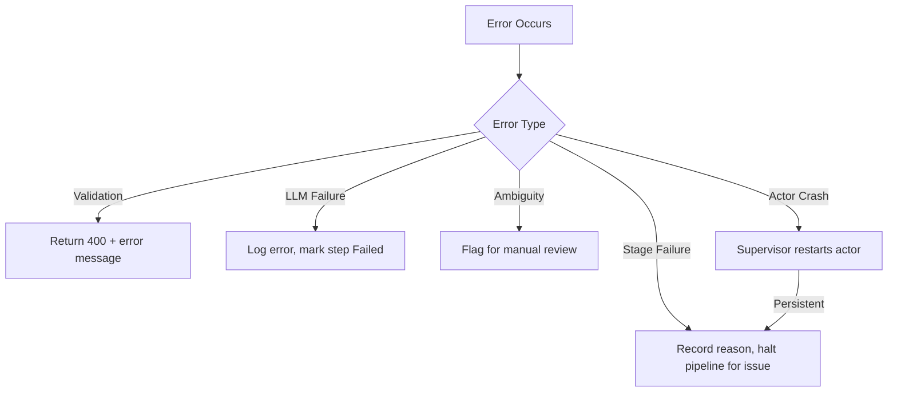

# Design Document: AI Support Workflow

## Overview

This design describes a .NET 10 sample project that simulates an AI-driven technical support workflow. The system receives support emails via Minimal API endpoints, classifies them using Semantic Kernel + ChatGPT (non-Azure OpenAI), routes them to the appropriate team and agent, and resolves them through simulated bug analysis, code fix generation, and pull request creation.

The project serves as a reference implementation demonstrating:
- Multi-agent orchestration with Microsoft Semantic Kernel and Akka.NET
- Actor-based concurrency where every AI agent is an Akka.NET actor
- Clean Architecture with Minimal APIs in .NET 10
- End-to-end AI-driven workflow automation

### Key Design Decisions

1. **Clean Architecture layers**: Domain → Application → Infrastructure → Presentation. Domain has zero external dependencies.
2. **Akka.NET as the agent runtime**: Every AI agent is an Akka.NET actor. The actor system manages agent lifecycle, supervision, and message passing. There is no non-actor execution path.
3. **Semantic Kernel as the AI backbone**: All LLM reasoning (classification, routing, bug analysis, code generation) flows through Semantic Kernel plugins/functions.
4. **Configuration-driven extensibility**: Teams, roles, and pipeline stages are defined in configuration, not hard-coded.
5. **Non-Azure OpenAI**: The system targets the OpenAI ChatGPT API directly (not Azure OpenAI), with model name configurable (e.g., `gpt-4o`, `gpt-4o-mini`).

## Architecture

### High-Level Architecture



### Workflow Pipeline



### Actor Model Integration

Every AI Agent is an Akka.NET actor. The actor system manages:
- Agent lifecycle (creation, supervision, restart on failure)
- Message passing between agents for inter-agent communication
- Concurrent issue processing via actor mailboxes

The Orchestrator interacts with agents exclusively through the Akka.NET actor system message protocol.



## Components and Interfaces

### Domain Layer Interfaces

```csharp
// Core workflow interfaces — Domain layer, zero external dependencies

public interface IEmailProcessor
{
    Result<IssueRecord> Process(IncomingEmail email);
}

public interface IIssueClassifier
{
    Task<ClassificationResult> ClassifyAsync(IssueRecord issue, CancellationToken ct = default);
}

public interface ITeamRouter
{
    Result<TeamAssignment> Route(IssueRecord issue, ClassificationResult classification);
}

public interface IAgentSelector
{
    AgentAssignment Select(TeamAssignment team, IssueCategory category);
}

public interface IBugResolver
{
    Task<ResolutionReport> ResolveAsync(IssueRecord issue, AgentAssignment agent, CancellationToken ct = default);
}

public interface ICodeChangeGenerator
{
    Task<PullRequest> GenerateAsync(ResolutionReport resolution, CancellationToken ct = default);
}

public interface IOrchestrator
{
    Task<WorkflowResult> ProcessIssueAsync(IncomingEmail email, CancellationToken ct = default);
}

public interface IWorkflowStateTracker
{
    void Transition(Guid issueId, WorkflowStage stage, string? detail = null);
    WorkflowState GetState(Guid issueId);
    IReadOnlyList<WorkflowState> GetAllStates();
}
```

### AI Agent Interface

```csharp
public interface IAIAgent
{
    string AgentId { get; }
    string TeamName { get; }
    AgentRole Role { get; }
    Task<ResolutionReport> AnalyzeAndResolveAsync(IssueRecord issue, CancellationToken ct = default);
}
```

### Pipeline Stage Interface (Extensibility)

```csharp
public interface IPipelineStage<TInput, TOutput>
{
    string StageName { get; }
    Task<Result<TOutput>> ExecuteAsync(TInput input, CancellationToken ct = default);
}
```

### Akka.NET Actor Messages

```csharp
public record AssignIssueMessage(IssueRecord Issue, IssueCategory Category);
public record ResolutionCompleteMessage(Guid IssueId, ResolutionReport Report);
public record AgentStatusQuery();
public record AgentStatusResponse(string AgentId, string Status, string? LastAction);
```

### Minimal API Endpoints

| Method | Route | Description |
|--------|-------|-------------|
| POST | `/api/support/emails` | Submit a support email for processing |
| GET | `/api/support/issues/{id}` | Query workflow status by issue ID |
| GET | `/api/support/issues` | List all processed issues |
| GET | `/api/support/stream` | SSE stream of workflow state updates (visualization) |
| GET | `/api/support/agents` | Current state of all AI agents (visualization) |


## Data Models

### Core Entities

```csharp
public record IncomingEmail(
    string Sender,
    string Subject,
    string Body
);

public record IssueRecord(
    Guid Id,
    string Sender,
    string Subject,
    string Body,
    DateTimeOffset CreatedAt
);

public enum IssueCategory
{
    BackendBug,
    FrontendBug,
    QualityTestIssue,
    OutOfScope
}

public record ClassificationResult(
    bool IsCodeRelated,
    IssueCategory Category,
    double ConfidenceScore,  // 0.0 to 1.0
    string Reasoning
);

public record TeamAssignment(
    string TeamName,       // "TeamA" or "TeamB"
    string ApplicationName // "ApplicationA" or "ApplicationB"
);

public enum AgentRole
{
    BackendDeveloper,
    FrontendDeveloper,
    QAEngineer
}

public record AgentAssignment(
    string AgentId,
    string TeamName,
    AgentRole Role
);

public record ResolutionReport(
    Guid IssueId,
    string RootCauseDescription,
    string AffectedComponent,
    string SeverityAssessment,
    string ProposedFixSummary,
    bool RequiresEscalation,
    string? EscalationReason
);

public record PullRequest(
    Guid Id,
    Guid IssueId,
    string Title,
    string Description,
    IReadOnlyList<string> AffectedFilePaths,
    string SimulatedDiff
);

public enum WorkflowStage
{
    Received,
    Classified,
    ClassifiedOutOfScope,
    TeamAssigned,
    AgentAssigned,
    Resolving,
    Resolved,
    CodeChangeGenerated,
    Failed,
    ManualReviewRequired
}

public record WorkflowState(
    Guid IssueId,
    WorkflowStage Stage,
    DateTimeOffset LastUpdated,
    string? Detail
);
```

### Result Type

```csharp
public class Result<T>
{
    public bool IsSuccess { get; }
    public T? Value { get; }
    public string? Error { get; }

    private Result(T value) { IsSuccess = true; Value = value; }
    private Result(string error) { IsSuccess = false; Error = error; }

    public static Result<T> Success(T value) => new(value);
    public static Result<T> Failure(string error) => new(error);
}
```

### Configuration Models

```csharp
public class TeamConfiguration
{
    public string TeamName { get; set; } = "";
    public string ApplicationName { get; set; } = "";
    public List<AgentRoleConfiguration> Agents { get; set; } = [];
}

public class AgentRoleConfiguration
{
    public AgentRole Role { get; set; }
    public string Persona { get; set; } = "";
}

public class OpenAIConfiguration
{
    public string ApiKey { get; set; } = "";
    public string ModelName { get; set; } = "gpt-4o-mini";
}

public class WorkflowConfiguration
{
    public bool EnableVisualization { get; set; } = false;
    public List<TeamConfiguration> Teams { get; set; } = [];
}
```

### Dummy Application Bug Scenarios

Each dummy application contains predefined bug scenario files:

```csharp
public record BugScenario(
    string ScenarioId,
    string ApplicationName,
    IssueCategory Category,
    string Description,
    string AffectedFile,
    string AffectedLineRange,
    string BuggyCode,
    string FixedCode
);
```

Application_A and Application_B each include at least 3 scenarios:
- One backend bug (e.g., null reference in API controller)
- One frontend bug (e.g., incorrect data binding in component)
- One quality/test issue (e.g., missing test coverage for edge case)


## Correctness Properties

*A property is a characteristic or behavior that should hold true across all valid executions of a system — essentially, a formal statement about what the system should do. Properties serve as the bridge between human-readable specifications and machine-verifiable correctness guarantees.*

### Property 1: Email processing round trip

*For any* valid incoming email (non-empty subject and body), processing it through the EmailProcessor should produce an IssueRecord where the sender, subject, and body match the original email, the timestamp is valid, and the assigned ID is unique across all processed emails.

**Validates: Requirements 1.1, 1.3**

### Property 2: Invalid email rejection

*For any* incoming email where the subject is empty/whitespace or the body is empty/whitespace, the EmailProcessor should reject the submission and return a failure result, leaving the system state unchanged.

**Validates: Requirements 1.2**

### Property 3: Classification result consistency

*For any* ClassificationResult produced by the IssueClassifier: if `IsCodeRelated` is true, then `Category` must be one of `{BackendBug, FrontendBug, QualityTestIssue}`; if `IsCodeRelated` is false, then `Category` must be `OutOfScope`; and `ConfidenceScore` must be in the range `[0.0, 1.0]`.

**Validates: Requirements 2.1, 2.2, 2.3, 2.4**

### Property 4: Application-to-team mapping

*For any* TeamAssignment produced by the TeamRouter, if `ApplicationName` is `"ApplicationA"` then `TeamName` must be `"TeamA"`, and if `ApplicationName` is `"ApplicationB"` then `TeamName` must be `"TeamB"`.

**Validates: Requirements 3.1, 3.2, 3.3**

### Property 5: Category-to-role mapping

*For any* issue category and team, the AgentSelector should map `BackendBug` to `BackendDeveloper`, `FrontendBug` to `FrontendDeveloper`, and `QualityTestIssue` to `QAEngineer`, and the selected agent's `TeamName` must match the assigned team.

**Validates: Requirements 4.1, 4.2, 4.3, 4.4**

### Property 6: Resolution report completeness

*For any* ResolutionReport produced by the BugResolver (where escalation is not required), the `RootCauseDescription`, `AffectedComponent`, `SeverityAssessment`, and `ProposedFixSummary` fields must all be non-null and non-empty.

**Validates: Requirements 5.1, 5.2**

### Property 7: Pull request completeness and traceability

*For any* PullRequest produced by the CodeChangeGenerator, the `Title`, `Description`, and `SimulatedDiff` must be non-empty, `AffectedFilePaths` must contain at least one entry, and `IssueId` must match the original issue's identifier.

**Validates: Requirements 6.1, 6.2, 6.4**

### Property 8: Workflow state transitions follow pipeline order

*For any* issue processed through the workflow, the sequence of WorkflowStage transitions must follow a valid path through the pipeline: `Received → Classified → TeamAssigned → AgentAssigned → Resolving → Resolved → CodeChangeGenerated`, or branch to `ClassifiedOutOfScope`, `Failed`, or `ManualReviewRequired` at the appropriate stage. No stage may be skipped or revisited.

**Validates: Requirements 5.3, 6.3, 8.2, 8.3**

### Property 9: Concurrent issue processing independence

*For any* set of N concurrently submitted emails, each should produce an independent workflow result with its own unique issue ID, and no workflow state from one issue should appear in another issue's state history.

**Validates: Requirements 8.5**

### Property 10: Generated fixes reference valid dummy application files

*For any* PullRequest generated by the CodeChangeGenerator, every path in `AffectedFilePaths` must correspond to a file that exists within the dummy application associated with the issue's team assignment.

**Validates: Requirements 9.4**

### Property 11: Configuration-driven team instantiation

*For any* valid WorkflowConfiguration containing a list of team definitions, the system should instantiate exactly the agents specified in the configuration — no more, no fewer — with the correct roles and team assignments.

**Validates: Requirements 12.1**

### Property 12: Visualization decision logging

*For any* workflow execution with visualization enabled, each decision point (classification, team assignment, agent selection) must produce a log entry containing the Semantic Kernel reasoning output.

**Validates: Requirements 13.3**


## Code Quality & Maintainability

This section defines the practical code quality guidelines that apply across the entire codebase. These are not dogmatic rules but pragmatic guidelines to keep the code comprehensible and maintainable.

### SOLID Principles (Practical, Not Dogmatic)

The project applies SOLID as a compass, not a religion:

| Principle | Practical Application |
|-----------|----------------------|
| **Single Responsibility** | Each class/method does one thing. If a method name needs "And" in it, split it. |
| **Open/Closed** | New teams, roles, and pipeline stages are added via configuration and new implementations — not by editing existing classes. The `IPipelineStage<TInput, TOutput>` and `IAIAgent` interfaces enable this. |
| **Liskov Substitution** | All `IAIAgent` implementations (BE, FE, QA) are interchangeable through the interface. The Orchestrator never checks the concrete type. |
| **Interface Segregation** | Domain interfaces are small and focused: `IEmailProcessor`, `IIssueClassifier`, `ITeamRouter`, etc. No "god interfaces." |
| **Dependency Inversion** | All layers depend on Domain interfaces. Infrastructure implements them. Wired at the composition root via DI. |

### Method Size Guidelines

Methods should be short, focused, and self-explanatory:

- Target ~5–15 lines per method. If a method exceeds ~20 lines, extract helper methods.
- Each method should have a single, clear responsibility.
- Name extracted methods descriptively — the name should explain *what* it does, not *how*.

```csharp
// ✅ Small, focused methods
public async Task<WorkflowResult> ProcessIssueAsync(IncomingEmail email, CancellationToken ct)
{
    var issue = ParseAndValidateEmail(email);
    var classification = await ClassifyIssueAsync(issue, ct);

    if (!classification.IsCodeRelated)
        return WorkflowResult.OutOfScope(issue.Id);

    var team = AssignTeam(issue, classification);
    var agent = SelectAgent(team, classification.Category);
    var resolution = await ResolveWithAgentAsync(agent, issue, ct);

    return await GenerateCodeChangeAsync(resolution, ct);
}

// ❌ Avoid: monolithic methods with 50+ lines of mixed logic
```

### LINQ Preference

Prefer LINQ over complex `for`/`foreach` loops and manual dictionary manipulation. LINQ is more declarative, composable, and readable for collection operations.

```csharp
// ✅ LINQ — clear intent
var backendAgents = teams
    .SelectMany(t => t.Agents)
    .Where(a => a.Role == AgentRole.BackendDeveloper)
    .Select(a => new AgentAssignment(a.AgentId, a.TeamName, a.Role))
    .ToList();

// ❌ Avoid: manual loop + dictionary
var backendAgents = new List<AgentAssignment>();
foreach (var team in teams)
{
    foreach (var agent in team.Agents)
    {
        if (agent.Role == AgentRole.BackendDeveloper)
        {
            backendAgents.Add(new AgentAssignment(agent.AgentId, team.TeamName, agent.Role));
        }
    }
}

// ✅ LINQ for lookups
var agentsByTeam = agents.ToLookup(a => a.TeamName);
var teamAAgents = agentsByTeam["TeamA"];

// ✅ LINQ for aggregation
var issueCountByStage = states
    .GroupBy(s => s.Stage)
    .ToDictionary(g => g.Key, g => g.Count());
```

### Project Folder Structure

Each Clean Architecture layer is organized into subfolders that separate concerns:

```
src/
├── AiSupportWorkflow.Domain/
│   ├── Entities/
│   │   ├── IssueRecord.cs
│   │   ├── IncomingEmail.cs
│   │   ├── PullRequest.cs
│   │   ├── WorkflowState.cs
│   │   ├── BugScenario.cs
│   │   └── ...
│   ├── Enums/
│   │   ├── IssueCategory.cs
│   │   ├── AgentRole.cs
│   │   └── WorkflowStage.cs
│   ├── Interfaces/
│   │   ├── IEmailProcessor.cs
│   │   ├── IIssueClassifier.cs
│   │   ├── ITeamRouter.cs
│   │   ├── IAgentSelector.cs
│   │   ├── IBugResolver.cs
│   │   ├── ICodeChangeGenerator.cs
│   │   ├── IOrchestrator.cs
│   │   └── IWorkflowStateTracker.cs
│   └── ValueObjects/
│       ├── ClassificationResult.cs
│       ├── TeamAssignment.cs
│       ├── AgentAssignment.cs
│       ├── ResolutionReport.cs
│       └── Result.cs
│
├── AiSupportWorkflow.Application/
│   ├── Interfaces/
│   │   └── IPipelineStage.cs
│   ├── Services/
│   │   ├── Orchestrator.cs
│   │   ├── EmailProcessor.cs
│   │   ├── TeamRouter.cs
│   │   └── AgentSelector.cs
│   └── UseCases/
│       └── ProcessSupportEmailUseCase.cs
│
├── AiSupportWorkflow.Infrastructure/
│   ├── Actors/
│   │   ├── AIAgentActor.cs
│   │   ├── SupervisorActor.cs
│   │   └── ActorMessages.cs
│   ├── SemanticKernel/
│   │   ├── IssueClassifierService.cs
│   │   ├── BugResolverService.cs
│   │   ├── CodeChangeGeneratorService.cs
│   │   └── SemanticKernelSetup.cs
│   ├── Services/
│   │   └── WorkflowStateTracker.cs
│   └── Configuration/
│       ├── TeamConfiguration.cs
│       ├── OpenAIConfiguration.cs
│       └── WorkflowConfiguration.cs
│
├── AiSupportWorkflow.Presentation/
│   ├── Endpoints/
│   │   ├── SupportEmailEndpoints.cs
│   │   ├── WorkflowStatusEndpoints.cs
│   │   └── VisualizationEndpoints.cs
│   └── Program.cs
│
├── DummyApps/
│   ├── ApplicationA/
│   │   └── ...
│   └── ApplicationB/
│       └── ...
```

### Self-Documenting Code Practices

- Choose meaningful names: `ClassifyIssueAsync` over `DoStep2`, `isCodeRelated` over `flag`.
- Avoid comments that restate the code. Comments should explain *why* a decision was made, not *what* the code does.
- Use domain vocabulary from the Glossary consistently (e.g., `IssueClassifier`, `TeamRouter`, `AgentSelector`).
- Prefer small, well-named methods over inline comments explaining complex blocks.

```csharp
// ✅ Self-documenting — no comment needed
var assignedTeam = routeIssueToResponsibleTeam(issue, classification);

// ❌ Comment restates the code
// Route the issue to the responsible team
var team = Route(issue, classification);
```

## Error Handling

### Strategy

The system uses a `Result<T>` type for synchronous operations and structured exception handling for async/LLM operations. Errors are categorized into:

1. **Validation errors** — Invalid input (empty subject/body). Returned immediately as `Result.Failure` with descriptive message. HTTP 400.
2. **LLM errors** — OpenAI API failures, timeouts, malformed responses. Caught at the infrastructure layer, logged, and the affected workflow step is marked `Failed` or `ManualReviewRequired`.
3. **Classification ambiguity** — Classifier or router cannot make a confident decision. Issue flagged for manual review with the analysis attempted so far.
4. **Pipeline stage failures** — Any stage in the workflow pipeline can fail. The Orchestrator records the failure reason in WorkflowState and halts the pipeline for that issue. Other concurrent issues are unaffected.
5. **Actor system errors** — Actor crashes are handled by the supervisor strategy (restart with backoff). Persistent failures escalate to `Failed` state.

### Error Flow



### Specific Error Scenarios

| Scenario | Handler | Outcome |
|----------|---------|---------|
| Empty subject/body | EmailProcessor | Reject with validation error (HTTP 400) |
| OpenAI API unreachable | Infrastructure layer | Log error, mark step Failed |
| OpenAI returns malformed JSON | IssueClassifier/BugResolver | Mark as ManualReviewRequired |
| Cannot determine affected app | TeamRouter | Flag for manual team assignment |
| Bug resolution fails | BugResolver | Escalate with partial analysis |
| Actor crash (Akka.NET) | Supervisor actor | Restart; persistent failure → Failed state |

## Testing Strategy

### Dual Testing Approach

The project uses both unit tests and property-based tests for comprehensive coverage:

- **Unit tests** (xUnit): Specific examples, edge cases, error conditions, integration points
- **Property-based tests** (FsCheck with xUnit): Universal properties across generated inputs

### Property-Based Testing Configuration

- **Library**: FsCheck (via `FsCheck.Xunit` NuGet package) — the standard PBT library for .NET
- **Minimum iterations**: 100 per property test
- **Each property test must reference its design document property** using the tag format:
  `// Feature: ai-support-workflow, Property {number}: {property_text}`
- **Each correctness property is implemented by a single property-based test**

### Test Organization

```
tests/
├── AiSupportWorkflow.UnitTests/
│   ├── EmailProcessorTests.cs
│   ├── IssueClassifierTests.cs
│   ├── TeamRouterTests.cs
│   ├── AgentSelectorTests.cs
│   ├── BugResolverTests.cs
│   ├── CodeChangeGeneratorTests.cs
│   ├── OrchestratorTests.cs
│   └── WorkflowStateTests.cs
└── AiSupportWorkflow.PropertyTests/
    ├── EmailProcessingProperties.cs
    ├── ClassificationProperties.cs
    ├── RoutingProperties.cs
    ├── ResolutionProperties.cs
    ├── WorkflowProperties.cs
    └── Generators/
        ├── EmailGenerators.cs
        ├── ClassificationGenerators.cs
        └── WorkflowGenerators.cs
```

### Property Test Mapping

| Property | Test File | Description |
|----------|-----------|-------------|
| Property 1 | EmailProcessingProperties.cs | Email round trip — fields preserved, unique IDs |
| Property 2 | EmailProcessingProperties.cs | Invalid emails rejected |
| Property 3 | ClassificationProperties.cs | Classification result consistency |
| Property 4 | RoutingProperties.cs | Application-to-team mapping |
| Property 5 | RoutingProperties.cs | Category-to-role mapping |
| Property 6 | ResolutionProperties.cs | Resolution report completeness |
| Property 7 | ResolutionProperties.cs | PR completeness and traceability |
| Property 8 | WorkflowProperties.cs | State transition ordering |
| Property 9 | WorkflowProperties.cs | Concurrent processing independence |
| Property 10 | ResolutionProperties.cs | Fix references valid dummy app files |
| Property 11 | WorkflowProperties.cs | Config-driven team instantiation |
| Property 12 | WorkflowProperties.cs | Visualization decision logging |

### Unit Test Focus Areas

- **Edge cases**: Empty strings, whitespace-only inputs, null fields, boundary confidence scores (0.0, 1.0)
- **Error conditions**: LLM failures (simulated via mock), malformed API responses, actor crashes
- **Integration points**: Minimal API endpoint routing, DI container resolution, Akka.NET actor message handling
- **Specific examples**: Known bug scenarios from dummy applications, specific email → classification → resolution paths

### Mocking Strategy

- LLM calls are mocked at the Semantic Kernel level using a fake `IChatCompletionService` for deterministic unit tests
- Property tests for classification/resolution use generators that produce valid `ClassificationResult` and `ResolutionReport` instances directly, bypassing the LLM
- Akka.NET `TestKit` is used for actor-level testing

## Code Style & Conventions

This section defines the C# coding conventions and modern language features the project must follow. All contributors and generated code must adhere to these standards.

### .editorconfig

The repository root must include an `.editorconfig` that enforces the rules below. Key settings:

```ini
root = true

[*.cs]
# Indentation
indent_style = space
indent_size = 4
tab_width = 4

# Newlines
end_of_line = lf
insert_final_newline = true
trim_trailing_whitespace = true

# Namespace
csharp_style_namespace_declarations = file_scoped:error

# var preferences
csharp_style_var_for_built_in_types = true:suggestion
csharp_style_var_when_type_is_apparent = true:warning
csharp_style_var_elsewhere = false:suggestion

# Expression-bodied members
csharp_style_expression_bodied_methods = when_on_single_line:suggestion
csharp_style_expression_bodied_properties = true:suggestion
csharp_style_expression_bodied_accessors = true:suggestion
csharp_style_expression_bodied_constructors = false:suggestion
csharp_style_expression_bodied_operators = when_on_single_line:suggestion

# Pattern matching
csharp_style_pattern_matching_over_is_with_cast_check = true:warning
csharp_style_pattern_matching_over_as_with_null_check = true:warning
csharp_style_prefer_switch_expression = true:suggestion
csharp_style_prefer_pattern_matching = true:suggestion
csharp_style_prefer_not_pattern = true:suggestion
csharp_style_prefer_extended_property_pattern = true:suggestion

# Target-typed new
csharp_style_implicit_object_creation_when_type_is_apparent = true:warning

# Null checking
csharp_style_prefer_null_check_over_type_check = true:suggestion
csharp_style_conditional_delegate_call = true:suggestion
csharp_style_prefer_is_null_check_over_reference_equality_method = true:warning

# Collection expressions
dotnet_style_prefer_collection_expression = true:suggestion

# Naming conventions
dotnet_naming_rule.public_members_must_be_pascal_case.severity = warning
dotnet_naming_rule.public_members_must_be_pascal_case.symbols = public_symbols
dotnet_naming_rule.public_members_must_be_pascal_case.style = pascal_case_style

dotnet_naming_symbols.public_symbols.applicable_kinds = property, method, field, event, delegate, class, struct, interface, enum, namespace
dotnet_naming_symbols.public_symbols.applicable_accessibilities = public, internal, protected, protected_internal

dotnet_naming_style.pascal_case_style.capitalization = pascal_case

dotnet_naming_rule.private_fields_must_be_camel_case_with_underscore.severity = warning
dotnet_naming_rule.private_fields_must_be_camel_case_with_underscore.symbols = private_fields
dotnet_naming_rule.private_fields_must_be_camel_case_with_underscore.style = underscore_camel_case_style

dotnet_naming_symbols.private_fields.applicable_kinds = field
dotnet_naming_symbols.private_fields.applicable_accessibilities = private, private_protected

dotnet_naming_style.underscore_camel_case_style.required_prefix = _
dotnet_naming_style.underscore_camel_case_style.capitalization = camel_case
```

### Naming Conventions

| Element | Convention | Example |
|---------|-----------|---------|
| Public class / struct / record | PascalCase | `IssueRecord`, `TeamRouter` |
| Public method / property | PascalCase | `ClassifyAsync`, `ConfidenceScore` |
| Interface | `I` + PascalCase | `IEmailProcessor`, `IAIAgent` |
| Private field | `_camelCase` | `_issueClassifier`, `_actorSystem` |
| Local variable / parameter | camelCase | `issueId`, `classificationResult` |
| Constant | PascalCase | `MaxRetryCount`, `DefaultModelName` |
| Enum member | PascalCase | `BackendBug`, `ManualReviewRequired` |
| Type parameter | `T` + PascalCase | `TInput`, `TOutput` |

### File-Scoped Namespaces (Mandatory)

All C# files must use file-scoped namespace declarations. This reduces nesting and improves readability.

```csharp
// ✅ Correct
namespace AiSupportWorkflow.Domain.Entities;

public record IssueRecord(Guid Id, string Sender, string Subject, string Body, DateTimeOffset CreatedAt);

// ❌ Incorrect — block-scoped namespace
namespace AiSupportWorkflow.Domain.Entities
{
    public record IssueRecord(...);
}
```

### Nullable Reference Types

All project files must enable nullable reference types:

```xml
<PropertyGroup>
    <Nullable>enable</Nullable>
</PropertyGroup>
```

Use `?` annotations to express nullability intent. Avoid suppressing warnings with `!` unless absolutely necessary and documented.

### Implicit Usings

All project files must enable implicit usings:

```xml
<PropertyGroup>
    <ImplicitUsings>enable</ImplicitUsings>
</PropertyGroup>
```

This provides automatic `using` directives for common namespaces (`System`, `System.Collections.Generic`, `System.Linq`, `System.Threading.Tasks`, etc.).

### Record Types for DTOs and Value Objects

Prefer `record` (or `record struct` for small value types) for data carriers, DTOs, and immutable value objects. Records provide value equality, `with` expressions, and concise positional syntax.

```csharp
// Positional record — preferred for simple data carriers
public record ClassificationResult(
    bool IsCodeRelated,
    IssueCategory Category,
    double ConfidenceScore,
    string Reasoning
);

// Record with additional behavior
public record WorkflowState(Guid IssueId, WorkflowStage Stage, DateTimeOffset LastUpdated, string? Detail)
{
    public bool IsTerminal => Stage is WorkflowStage.Failed
        or WorkflowStage.CodeChangeGenerated
        or WorkflowStage.ClassifiedOutOfScope;
}
```

### Primary Constructors

Use primary constructors (C# 12+) for classes and structs where constructor parameters map directly to dependencies or configuration, reducing boilerplate.

```csharp
// ✅ Primary constructor for DI
public class Orchestrator(
    IEmailProcessor emailProcessor,
    IIssueClassifier issueClassifier,
    ITeamRouter teamRouter,
    IAgentSelector agentSelector,
    IWorkflowStateTracker stateTracker) : IOrchestrator
{
    public async Task<WorkflowResult> ProcessIssueAsync(IncomingEmail email, CancellationToken ct = default)
    {
        var result = emailProcessor.Process(email);
        // ...
    }
}
```

### Expression-Bodied Members

Use expression-bodied syntax for simple single-expression methods, properties, and accessors:

```csharp
public class AgentSelector(IOptions<WorkflowConfiguration> config) : IAgentSelector
{
    // Expression-bodied property
    public IReadOnlyList<TeamConfiguration> Teams => config.Value.Teams;

    // Expression-bodied method
    public AgentAssignment Select(TeamAssignment team, IssueCategory category) =>
        new(GetAgentId(team, category), team.TeamName, MapRole(category));

    private static AgentRole MapRole(IssueCategory category) => category switch
    {
        IssueCategory.BackendBug => AgentRole.BackendDeveloper,
        IssueCategory.FrontendBug => AgentRole.FrontendDeveloper,
        IssueCategory.QualityTestIssue => AgentRole.QAEngineer,
        _ => throw new ArgumentOutOfRangeException(nameof(category))
    };
}
```

### Pattern Matching

Prefer pattern matching over traditional type checks and casts:

```csharp
// ✅ Pattern matching
if (result is { IsSuccess: true, Value: var issue })
{
    await ProcessIssueAsync(issue);
}

// ✅ Switch expression with patterns
var handler = stage switch
{
    WorkflowStage.Received => HandleReceived,
    WorkflowStage.Classified => HandleClassified,
    WorkflowStage.Failed or WorkflowStage.ManualReviewRequired => HandleError,
    _ => HandleDefault
};

// ❌ Avoid
if (result.IsSuccess && result.Value != null)
{
    var issue = result.Value;
}
```

### `var` Usage Policy

- Use `var` when the type is obvious from the right-hand side (constructor, cast, factory method).
- Use explicit types when the type is not immediately clear.

```csharp
// ✅ Type is apparent
var issue = new IssueRecord(Guid.NewGuid(), sender, subject, body, DateTimeOffset.UtcNow);
var teams = config.Value.Teams;

// ✅ Explicit type — not obvious from method name
ClassificationResult classification = await classifier.ClassifyAsync(issue, ct);
```

### Target-Typed `new` Expressions

Use `new()` when the target type is clear from the declaration:

```csharp
// ✅ Target-typed new
List<WorkflowState> states = new();
Dictionary<Guid, IssueRecord> issues = new();
Result<IssueRecord> result = new("Validation failed");

// ✅ Also fine with var on the other side
var states = new List<WorkflowState>();
```

### Collection Expressions (C# 12+)

Use collection expressions for concise collection initialization:

```csharp
// ✅ Collection expressions
IReadOnlyList<string> affectedFiles = ["src/Controllers/OrderController.cs", "src/Services/OrderService.cs"];
List<AgentRole> roles = [AgentRole.BackendDeveloper, AgentRole.FrontendDeveloper, AgentRole.QAEngineer];

// ✅ Empty collections
List<WorkflowState> empty = [];

// ❌ Avoid verbose initialization
var affectedFiles = new List<string> { "src/Controllers/OrderController.cs" };
```

### .NET 10 / Latest C# Language Features

The project targets .NET 10 and should leverage the latest stable C# features:

```xml
<PropertyGroup>
    <TargetFramework>net10.0</TargetFramework>
    <LangVersion>latest</LangVersion>
    <Nullable>enable</Nullable>
    <ImplicitUsings>enable</ImplicitUsings>
</PropertyGroup>
```

Key features to leverage:
- **Primary constructors** for classes and structs (C# 12)
- **Collection expressions** `[1, 2, 3]` (C# 12)
- **`params` with collections** — `params ReadOnlySpan<T>` and `params IEnumerable<T>` (C# 13)
- **`field` keyword** in property accessors where available (C# 13+)
- **Extension types** if stabilized in the .NET 10 SDK
- **`Lock` object** — use `System.Threading.Lock` instead of `object` for locking (C# 13)
- **`\e` escape sequence** for escape character (C# 13)
- **`allows ref struct`** generic constraint where applicable (C# 13)
