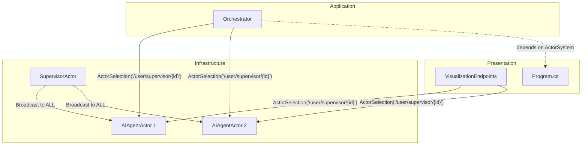
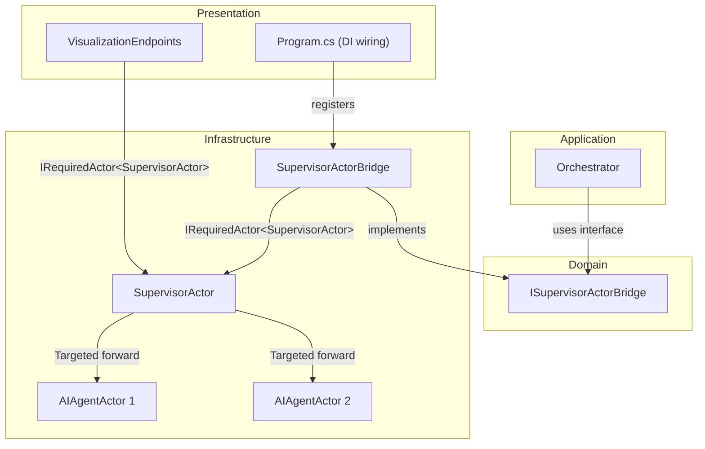

# Design Document: Akka.NET Optimization

## Overview

This design addresses seven requirements for optimizing Akka.NET usage in the AI Support Workflow project. The core changes are:

1. Replace `ActorSelection` with direct `IActorRef` via `IRequiredActor<SupervisorActor>` from Akka.Hosting
2. Eliminate broadcast messaging in `SupervisorActor` with targeted routing
3. Parallelize agent status queries in `VisualizationEndpoints`
4. Centralize agent status collection through the `SupervisorActor`
5. Implement exception-type-aware supervisor strategy
6. Extend the message protocol to support targeted routing and aggregated responses
7. Create actor architecture documentation

The project follows Clean Architecture (`Domain ← Application ← Infrastructure ← Presentation`). Since `IRequiredActor<T>` is an Akka.Hosting type (Infrastructure/Presentation concern), the `Orchestrator` in the Application layer cannot depend on it directly. The design introduces a domain-level abstraction `ISupervisorActorBridge` that the Application layer depends on, with an Infrastructure adapter that wraps the `IActorRef` obtained via `IRequiredActor<SupervisorActor>`.

## Architecture

### Current Architecture (Problems)



**Problems identified:**
- `Orchestrator` depends on `ActorSystem` (Akka core package) and resolves actors via string paths on every request
- `VisualizationEndpoints` resolves each agent individually via `ActorSelection`, sequentially
- `SupervisorActor.HandleAssignIssue` broadcasts to all agents instead of routing to the target
- `SupervisorActor.HandleStatusQuery` broadcasts to all agents without aggregation
- Supervisor strategy uses a single `Directive.Restart` for all exception types

### Target Architecture



**Key changes:**
- `Orchestrator` depends on `ISupervisorActorBridge` (Domain interface), not `ActorSystem`
- `SupervisorActorBridge` (Infrastructure) wraps `IRequiredActor<SupervisorActor>` and implements `ISupervisorActorBridge`
- `VisualizationEndpoints` uses `IRequiredActor<SupervisorActor>` directly (Presentation can depend on Infrastructure)
- `SupervisorActor` routes messages to the specific target agent, not broadcast
- `SupervisorActor` aggregates status responses internally via `Task.WhenAll` pattern
- Supervisor strategy applies different directives per exception type

### Dependency Flow (Clean Architecture Compliance)

```
Domain:        ISupervisorActorBridge, ActorMessages (no external packages)
Application:   Orchestrator → ISupervisorActorBridge (remove Akka dependency from Application.csproj)
Infrastructure: SupervisorActorBridge implements ISupervisorActorBridge (uses Akka.Hosting)
Presentation:  DI wiring, VisualizationEndpoints uses IRequiredActor<SupervisorActor>
```

After this change, the Application layer no longer needs the `Akka` package reference. The `Orchestrator` communicates with actors exclusively through `ISupervisorActorBridge`.

## Components and Interfaces

### 1. ISupervisorActorBridge (Domain Layer — New)

**File:** `src/AiSupportWorkflow.Domain/Interfaces/ISupervisorActorBridge.cs`

```csharp
namespace AiSupportWorkflow.Domain.Interfaces;

using AiSupportWorkflow.Domain.Entities;
using AiSupportWorkflow.Domain.Enums;
using AiSupportWorkflow.Domain.Messages;
using AiSupportWorkflow.Domain.ValueObjects;

public interface ISupervisorActorBridge
{
    Task<ResolutionReport> AssignIssueAsync(
        string agentId, IssueRecord issue, IssueCategory category,
        TimeSpan timeout, CancellationToken ct = default);
}
```

**Rationale:** This interface abstracts the actor communication away from the Application layer. The `Orchestrator` calls `AssignIssueAsync` with the target agent ID, and the bridge handles the Akka `Ask` pattern internally. This removes the `ActorSystem` dependency from `Orchestrator` and the `Akka` package from the Application project.

### 2. SupervisorActorBridge (Infrastructure Layer — New)

**File:** `src/AiSupportWorkflow.Infrastructure/Actors/SupervisorActorBridge.cs`

```csharp
namespace AiSupportWorkflow.Infrastructure.Actors;

using Akka.Actor;
using Akka.Hosting;
using AiSupportWorkflow.Domain.Entities;
using AiSupportWorkflow.Domain.Enums;
using AiSupportWorkflow.Domain.Interfaces;
using AiSupportWorkflow.Domain.Messages;
using AiSupportWorkflow.Domain.ValueObjects;

public class SupervisorActorBridge(IRequiredActor<SupervisorActor> supervisorActor)
    : ISupervisorActorBridge
{
    private readonly IActorRef _supervisor = supervisorActor.ActorRef;

    public async Task<ResolutionReport> AssignIssueAsync(
        string agentId, IssueRecord issue, IssueCategory category,
        TimeSpan timeout, CancellationToken ct)
    {
        var message = new AssignIssueMessage(agentId, issue, category);
        var response = await _supervisor.Ask<ResolutionCompleteMessage>(message, timeout, ct);
        return response.Report;
    }
}
```

### 3. SupervisorActor (Infrastructure Layer — Modified)

**File:** `src/AiSupportWorkflow.Infrastructure/Actors/SupervisorActor.cs`

Changes:
- `HandleAssignIssue`: Route to the specific agent by `TargetAgentId` instead of broadcasting
- `HandleStatusQuery`: If `TargetAgentId` is specified, query that agent only; otherwise aggregate all statuses
- `SupervisorStrategy`: Exception-type-aware decider with logging

```csharp
namespace AiSupportWorkflow.Infrastructure.Actors;

using Akka.Actor;
using AiSupportWorkflow.Domain.Interfaces;
using AiSupportWorkflow.Domain.Messages;
using Microsoft.Extensions.Logging;

public class SupervisorActor : ReceiveActor
{
    private readonly Dictionary<string, IActorRef> _agentActors = new();
    private readonly ILogger<SupervisorActor> _logger;

    public SupervisorActor(IEnumerable<IAIAgent> agents, ILogger<SupervisorActor> logger)
    {
        _logger = logger;

        foreach (var agent in agents)
        {
            var props = Props.Create(() => new AIAgentActor(agent));
            var actorRef = Context.ActorOf(props, agent.AgentId);
            _agentActors[agent.AgentId] = actorRef;
        }

        Receive<AssignIssueMessage>(HandleAssignIssue);
        ReceiveAsync<AgentStatusQuery>(HandleStatusQuery);
    }

    private void HandleAssignIssue(AssignIssueMessage message)
    {
        if (_agentActors.TryGetValue(message.TargetAgentId, out var agent))
        {
            agent.Forward(message);
        }
        else
        {
            Sender.Tell(new AgentNotFoundMessage(message.TargetAgentId));
        }
    }

    private async Task HandleStatusQuery(AgentStatusQuery message)
    {
        var sender = Sender;

        if (message.TargetAgentId is not null)
        {
            if (_agentActors.TryGetValue(message.TargetAgentId, out var agent))
            {
                agent.Forward(message);
            }
            else
            {
                sender.Tell(new AgentNotFoundMessage(message.TargetAgentId));
            }
            return;
        }

        // Aggregate all agent statuses in parallel
        var tasks = _agentActors.Select(kvp =>
            kvp.Value.Ask<AgentStatusResponse>(
                new AgentStatusQuery(null),
                TimeSpan.FromSeconds(5))
            .ContinueWith(t => t.IsCompletedSuccessfully
                ? t.Result
                : new AgentStatusResponse(kvp.Key, "Unavailable", null)));

        var responses = await Task.WhenAll(tasks);
        sender.Tell(new AggregatedAgentStatusResponse(responses.ToList()));
    }

    protected override SupervisorStrategy SupervisorStrategy()
    {
        return new OneForOneStrategy(
            maxNrOfRetries: 3,
            withinTimeRange: TimeSpan.FromMinutes(1),
            decider: Decider.From(ex =>
            {
                var actorName = Context.Sender?.Path?.Name ?? "unknown";
                var directive = ex switch
                {
                    TimeoutException or HttpRequestException =>
                        Directive.Restart,
                    ArgumentException or InvalidOperationException =>
                        Directive.Stop,
                    OutOfMemoryException =>
                        Directive.Escalate,
                    _ => Directive.Restart
                };

                _logger.LogWarning(
                    "Supervisor decision: Actor={Actor}, Exception={ExceptionType}, Directive={Directive}",
                    actorName, ex.GetType().Name, directive);

                return directive;
            }));
    }
}
```

### 4. Orchestrator (Application Layer — Modified)

**File:** `src/AiSupportWorkflow.Application/Services/Orchestrator.cs`

Changes:
- Remove `ActorSystem` constructor parameter
- Add `ISupervisorActorBridge` constructor parameter
- Replace `ResolveWithActorAsync` to use the bridge instead of `ActorSelection`

```csharp
// Constructor changes:
public class Orchestrator(
    IEmailProcessor emailProcessor,
    IIssueClassifier issueClassifier,
    ITeamRouter teamRouter,
    IAgentSelector agentSelector,
    ICodeChangeGenerator codeChangeGenerator,
    IWorkflowStateTracker stateTracker,
    ISupervisorActorBridge supervisorBridge,  // replaces ActorSystem
    ILogger<Orchestrator> logger,
    IOptions<WorkflowConfiguration> workflowConfig) : IOrchestrator

// ResolveWithActorAsync changes:
private Task<ResolutionReport> ResolveWithActorAsync(
    IssueRecord issue, IssueCategory category,
    AgentAssignment agent, CancellationToken ct)
{
    return supervisorBridge.AssignIssueAsync(
        agent.AgentId, issue, category,
        TimeSpan.FromMinutes(2), ct);
}
```

### 5. VisualizationEndpoints (Presentation Layer — Modified)

**File:** `src/AiSupportWorkflow.Presentation/Endpoints/VisualizationEndpoints.cs`

Changes:
- Replace `ActorSystem` injection with `IRequiredActor<SupervisorActor>`
- Send a single `AgentStatusQuery(null)` to the supervisor
- Receive `AggregatedAgentStatusResponse` instead of querying each agent individually
- Remove sequential `ActorSelection` loop

```csharp
routes.MapGet("/api/support/agents", async (
    IRequiredActor<SupervisorActor> supervisorActor,
    IOptions<WorkflowConfiguration> config,
    CancellationToken ct) =>
{
    if (!config.Value.EnableVisualization)
        return Results.NotFound(new { Error = "Visualization is disabled." });

    var supervisor = supervisorActor.ActorRef;
    var response = await supervisor.Ask<AggregatedAgentStatusResponse>(
        new AgentStatusQuery(null),
        TimeSpan.FromSeconds(10),
        ct);

    return Results.Ok(response.Statuses);
});
```

### 6. Program.cs (Presentation Layer — Modified)

**File:** `src/AiSupportWorkflow.Presentation/Program.cs`

Changes:
- `SupervisorActor` constructor now takes `ILogger<SupervisorActor>`
- Register `ISupervisorActorBridge` → `SupervisorActorBridge` in DI

```csharp
builder.Services.AddAkka("SupportWorkflowSystem", (akkaBuilder, sp) =>
{
    akkaBuilder.WithActors((system, registry, resolver) =>
    {
        var agents = resolver.GetService<IEnumerable<IAIAgent>>()
            ?? Enumerable.Empty<IAIAgent>();
        var logger = resolver.GetService<ILogger<SupervisorActor>>()!;

        var supervisorProps = Props.Create(() => new SupervisorActor(agents, logger));
        var supervisor = system.ActorOf(supervisorProps, "supervisor");
        registry.Register<SupervisorActor>(supervisor);
    });
});

builder.Services.AddSingleton<ISupervisorActorBridge, SupervisorActorBridge>();
```

## Data Models

### Updated Message Protocol

**File:** `src/AiSupportWorkflow.Domain/Messages/ActorMessages.cs`

```csharp
namespace AiSupportWorkflow.Domain.Messages;

using AiSupportWorkflow.Domain.Entities;
using AiSupportWorkflow.Domain.Enums;

// Updated: added TargetAgentId for targeted routing (Req 6.1)
public record AssignIssueMessage(string TargetAgentId, IssueRecord Issue, IssueCategory Category);

// Updated: added optional TargetAgentId for single-agent or all-agent query (Req 6.2)
public record AgentStatusQuery(string? TargetAgentId);

public record ResolutionCompleteMessage(Guid IssueId, ResolutionReport Report);

public record AgentStatusResponse(string AgentId, string Status, string? LastAction);

// New: aggregated response for all-agent status query (Req 6.3)
public record AggregatedAgentStatusResponse(List<AgentStatusResponse> Statuses);

// New: error response when target agent is not found (Req 1.4, 2.4)
public record AgentNotFoundMessage(string AgentId);
```

**Breaking change note:** `AssignIssueMessage` gains a new first parameter `TargetAgentId`. All existing callers (currently only `Orchestrator.ResolveWithActorAsync`) must be updated. `AgentStatusQuery` changes from parameterless to having an optional `TargetAgentId`.

### Domain Interface Addition

| Interface | Layer | Purpose |
|-----------|-------|---------|
| `ISupervisorActorBridge` | Domain | Abstracts actor communication for the Application layer |

### Removed Dependencies

| Layer | Removed | Reason |
|-------|---------|--------|
| Application (`Orchestrator`) | `ActorSystem` parameter | Replaced by `ISupervisorActorBridge` |
| Application (`.csproj`) | `Akka` package reference | No longer needed; all Akka usage moved to Infrastructure |
| Presentation (`VisualizationEndpoints`) | `ActorSystem` parameter | Replaced by `IRequiredActor<SupervisorActor>` |

