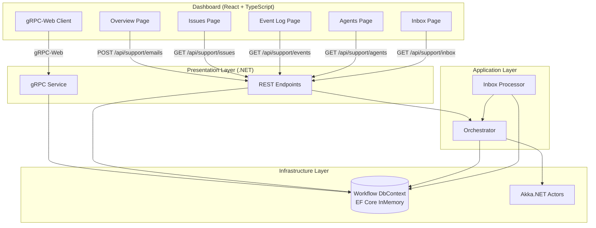
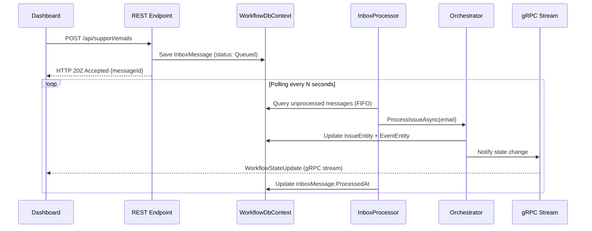

# Design Document — Dashboard Real-Time Monitoring

## Overview

This document describes the technical design for improvements to the AI Support workflow monitoring dashboard. The changes cover both the frontend (React/TypeScript) and the backend (.NET 10), including:

1. **Fixed pipeline graph** — Disabling all user interactions on the ReactFlow component.
2. **Integrated email form** — Moving the `EmailComposer` to the Overview page next to the graph.
3. **Improved Agents page** — Displaying all configured agents with Idle/Working status.
4. **Issues vs Event Log** — Clear separation between current state view (Issues) and persistent audit log (Event Log).
5. **Pipeline animation** — Pulsing/colored visual effects during issue processing.
6. **SSE → gRPC Streaming migration** — Replacing the SSE endpoint with gRPC server streaming via gRPC-Web.
7. **Transactional Inbox** — Inbox pattern for asynchronous email processing with immediate HTTP 202 response.
8. **Inbox Page** — New email queue monitoring page (replaces `/emails`).
9. **EF Core InMemory** — Structured persistence layer replacing the `ConcurrentDictionary`.

The design follows the existing Clean Architecture, maintaining the separation between Domain, Application, Infrastructure, and Presentation.

## Architecture

### High-Level Diagram



### Email Processing Flow (New)



### Architectural Decisions

| Decision | Rationale |
|----------|-----------|
| gRPC-Web instead of WebSocket | Strong typing via Protobuf, browser compatibility through gRPC-Web proxy built into ASP.NET, native server streaming pattern |
| EF Core InMemory | Relational data structure ready for migration to a real SQL database, LINQ support, typed DbSets, zero additional infrastructure |
| Transactional Inbox | Decoupling between reception and processing, failure resilience, natural audit trail |
| `IHostedService` for Inbox Processor | Native integration with the .NET host lifecycle, cancellation token support, no external dependencies |
| `fitView` + disabled interactions | Ensures complete graph visibility without risk of losing visual context |

## Components and Interfaces

### Frontend — New/Modified

#### `dashboard/src/api/grpc-client.ts` (New)
gRPC-Web client that replaces `sse.ts`. Uses `@connectrpc/connect-web` for connecting to the gRPC service.

```typescript
interface GrpcStreamClient {
  subscribe(onUpdate: (state: WorkflowStateUpdate) => void): void;
  disconnect(): void;
  isConnected: boolean;
}
```

#### `dashboard/src/hooks/useGrpcStream.ts` (New — replaces `useSSE.ts`)
React hook that manages the gRPC-Web connection with auto-reconnect.

```typescript
function useGrpcStream(): {
  latestStates: WorkflowState[];
  isConnected: boolean;
}
```

#### `dashboard/src/hooks/useInbox.ts` (New)
Hook for inbox queue polling.

```typescript
function useInbox(pollInterval?: number): {
  messages: InboxMessage[];
  stats: InboxStats;
  isLoading: boolean;
  error: ApiError | null;
  filter: InboxStatus | 'all';
  setFilter: (filter: InboxStatus | 'all') => void;
}
```

#### `dashboard/src/components/PipelineVisualizer.tsx` (Modified)
- Added props: `panOnDrag={false}`, `zoomOnScroll={false}`, `zoomOnPinch={false}`, `zoomOnDoubleClick={false}`, `elementsSelectable={false}`, `preventScrolling={false}`
- Added pulsing CSS animation for the active node
- Added `animated: true` on completed edges
- Automatic selection of the most recent issue from the gRPC stream

#### `dashboard/src/pages/OverviewPage.tsx` (Modified)
- Two-column grid layout: Pipeline (left) + EmailComposer (right)
- Integration with `useGrpcStream` for real-time updates
- Auto-selection of the most recent issue for the graph

#### `dashboard/src/pages/InboxPage.tsx` (New — replaces `EmailsPage.tsx`)
- Table with status filters (Queued, Processed, Failed, All)
- Summary counters at the top
- Periodic polling for updates

#### `dashboard/src/pages/EventLogPage.tsx` (Modified)
- Reads events from new REST endpoint `/api/support/events` (persistent)
- Displays previous stage → new stage
- Limit of 200 entries

#### `dashboard/src/types/index.ts` (Extended)
New types for InboxMessage, StateTransitionEvent, InboxStats.

### Backend — New/Modified

#### `WorkflowDbContext` (New — Infrastructure)
```csharp
public class WorkflowDbContext : DbContext
{
    public DbSet<IssueEntity> Issues { get; set; }
    public DbSet<StateTransitionEvent> Events { get; set; }
    public DbSet<InboxMessage> InboxMessages { get; set; }
}
```

#### `IWorkflowStateTracker` (Modified — Domain Interface)
Interface update to support EF Core persistence:
```csharp
public interface IWorkflowStateTracker
{
    Task TransitionAsync(Guid issueId, WorkflowStage stage, string? detail = null);
    Task<WorkflowState> GetStateAsync(Guid issueId);
    Task<IReadOnlyList<WorkflowState>> GetAllStatesAsync();
    Task<IReadOnlyList<StateTransitionEvent>> GetEventsAsync(int limit = 200);
}
```

#### `EfWorkflowStateTracker` (New — Infrastructure)
Implementation of `IWorkflowStateTracker` based on EF Core that replaces `WorkflowStateTracker`.

#### `InboxProcessor` (New — Infrastructure)
`IHostedService` with polling loop to process inbox messages.

#### `WorkflowMonitorService` (New — gRPC Service in Presentation)
gRPC service with server streaming for real-time notifications.

#### Protobuf Definition (`workflow_monitor.proto`)
```protobuf
syntax = "proto3";
package workflow;

service WorkflowMonitor {
  rpc SubscribeToUpdates (SubscribeRequest) returns (stream WorkflowStateUpdate);
}

message SubscribeRequest {
  optional string issue_id = 1; // optional filter for a single issue
}

message WorkflowStateUpdate {
  string issue_id = 1;
  string stage = 2;
  string last_updated = 3; // ISO 8601
  optional string detail = 4;
}
```

### Backend — New REST Endpoints

| Method | Route | Purpose |
|--------|-------|---------|
| GET | `/api/support/events` | List persistent events (limit=200) |
| GET | `/api/support/inbox` | List inbox messages with status filter |
| POST | `/api/support/emails` | (Modified) Saves to inbox, returns 202 |

## Data Models

### EF Core Entities

#### `IssueEntity`
```csharp
public class IssueEntity
{
    public Guid Id { get; set; }
    public WorkflowStage CurrentStage { get; set; }
    public DateTimeOffset LastUpdated { get; set; }
    public string? Detail { get; set; }
}
```

#### `StateTransitionEvent`
```csharp
public class StateTransitionEvent
{
    public Guid Id { get; set; }
    public Guid IssueId { get; set; }
    public WorkflowStage? PreviousStage { get; set; }
    public WorkflowStage NewStage { get; set; }
    public DateTimeOffset Timestamp { get; set; }
    public string? Detail { get; set; }
}
```

#### `InboxMessage`
```csharp
public class InboxMessage
{
    public Guid Id { get; set; }
    public string MessageType { get; set; } = "SupportEmail";
    public string Payload { get; set; } = string.Empty; // JSON serialized
    public DateTimeOffset ReceivedAt { get; set; }
    public DateTimeOffset? ProcessedAt { get; set; }
    public string? Error { get; set; }
}
```

### Frontend Types (TypeScript)

```typescript
export interface StateTransitionEvent {
  id: string;
  issueId: string;
  previousStage: WorkflowStage | null;
  newStage: WorkflowStage;
  timestamp: string; // ISO 8601
  detail: string | null;
}

export interface InboxMessage {
  id: string;
  sender: string;
  subject: string;
  status: 'queued' | 'processed' | 'failed';
  receivedAt: string;
  processedAt: string | null;
  error: string | null;
}

export interface InboxStats {
  queued: number;
  processed: number;
  failed: number;
}
```

### DbContext Configuration

```csharp
public class IssueEntityConfiguration : IEntityTypeConfiguration<IssueEntity>
{
    public void Configure(EntityTypeBuilder<IssueEntity> builder)
    {
        builder.HasKey(e => e.Id);
        builder.Property(e => e.CurrentStage).HasConversion<string>();
        builder.HasIndex(e => e.CurrentStage);
    }
}

public class StateTransitionEventConfiguration : IEntityTypeConfiguration<StateTransitionEvent>
{
    public void Configure(EntityTypeBuilder<StateTransitionEvent> builder)
    {
        builder.HasKey(e => e.Id);
        builder.HasIndex(e => e.IssueId);
        builder.HasIndex(e => e.Timestamp);
        builder.Property(e => e.PreviousStage).HasConversion<string>();
        builder.Property(e => e.NewStage).HasConversion<string>();
    }
}

public class InboxMessageConfiguration : IEntityTypeConfiguration<InboxMessage>
{
    public void Configure(EntityTypeBuilder<InboxMessage> builder)
    {
        builder.HasKey(e => e.Id);
        builder.HasIndex(e => e.ReceivedAt);
        builder.HasIndex(e => e.ProcessedAt);
    }
}
```

### DI Registration — `AddPersistence()`

```csharp
public static class PersistenceServiceExtensions
{
    public static IServiceCollection AddPersistence(this IServiceCollection services)
    {
        services.AddDbContext<WorkflowDbContext>(options =>
            options.UseInMemoryDatabase("WorkflowDb"));
        
        services.AddScoped<IWorkflowStateTracker, EfWorkflowStateTracker>();
        
        return services;
    }
}
```

## Correctness Properties

*A property is a characteristic or behavior that must be true in all valid executions of a system — essentially, a formal statement about what the system must do. Properties serve as a bridge between human-readable specifications and machine-verifiable correctness guarantees.*

### Property 1: Agent status mapping correctness

*For any* configured agent, if the agent is currently active as an Akka actor the displayed status SHALL be "Working", otherwise it SHALL be "Idle". No other status values are valid.

**Validates: Requirements 3.2, 3.3**

### Property 2: Agent display completeness

*For any* list of configured agents, every agent SHALL be rendered with all four required fields (agentId, team, role, status) visible in the output.

**Validates: Requirements 3.1, 3.4**

### Property 3: Issue display with current state

*For any* list of issues, each issue SHALL appear exactly once in the table with its current stage, detail, and last updated timestamp visible.

**Validates: Requirements 4.1, 4.2**

### Property 4: Issue filtering by stage

*For any* list of issues and any selected stage filter, the displayed issues SHALL be exactly those whose current stage matches the filter. No non-matching issues shall appear, and no matching issues shall be omitted.

**Validates: Requirements 4.3**

### Property 5: Event log reverse chronological ordering

*For any* list of state transition events, the Event Log SHALL display them in strictly descending order of timestamp (newest first).

**Validates: Requirements 4.4**

### Property 6: Event display completeness

*For any* state transition event, the rendered output SHALL contain: issue ID, previous stage (if available), new stage, timestamp, and detail.

**Validates: Requirements 4.6**

### Property 7: Event log capping invariant

*For any* number of events in the Events_Table, the Event Log page SHALL display at most 200 entries.

**Validates: Requirements 4.8**

### Property 8: State transition dual-write invariant

*For any* issue and any stage transition, the system SHALL both update the issue's current stage in the Issues table AND create a new StateTransitionEvent record with the correct previous stage, new stage, timestamp, and detail.

**Validates: Requirements 4.7, 9.6**

### Property 9: Pipeline visualization state correctness

*For any* active stage in the main flow, the Pipeline Graph SHALL: (a) apply a pulsing visual effect to the active stage node, (b) color all preceding completed nodes green, (c) animate edges between completed stages and the active stage, and (d) color terminal error nodes red when they are the active stage.

**Validates: Requirements 5.1, 5.2, 5.3, 5.4**

### Property 10: gRPC notification on state transition

*For any* state transition performed by the Orchestrator, the gRPC stream SHALL emit a WorkflowStateUpdate message containing the correct issueId, stage, timestamp, and detail.

**Validates: Requirements 6.3**

### Property 11: Inbox message creation round-trip

*For any* valid email (non-empty subject and body), submitting it to POST `/api/support/emails` SHALL create an InboxMessage with all required fields (Id, MessageType="SupportEmail", Payload containing the serialized email, ReceivedAt set, ProcessedAt=null, Error=null) and return HTTP 202 with the message Id.

**Validates: Requirements 7.1, 7.2**

### Property 12: Inbox processing failure records error

*For any* InboxMessage whose workflow processing throws an exception, the InboxProcessor SHALL set the Error field to the exception message and set ProcessedAt to a non-null value, preventing infinite retries.

**Validates: Requirements 7.5**

### Property 13: Inbox FIFO processing order

*For any* set of unprocessed InboxMessages with distinct ReceivedAt timestamps, the InboxProcessor SHALL process them in ascending ReceivedAt order (oldest first).

**Validates: Requirements 7.6**

### Property 14: Inbox status badge mapping

*For any* InboxMessage: if ProcessedAt is null, the status SHALL be "Queued" (yellow badge); if ProcessedAt is set and Error is null, the status SHALL be "Processed" (green badge); if Error is non-null, the status SHALL be "Failed" (red badge with error message visible).

**Validates: Requirements 8.3, 8.4, 8.5**

### Property 15: Inbox filtering by status

*For any* list of inbox messages and any selected status filter (Queued, Processed, Failed), the displayed messages SHALL be exactly those matching the filter criteria.

**Validates: Requirements 8.6**

### Property 16: Inbox summary counters accuracy

*For any* list of inbox messages, the summary counters SHALL exactly match the count of messages in each status category (queued, processed, failed).

**Validates: Requirements 8.8**

## Error Handling

### Frontend

| Scenario | Behavior |
|----------|----------|
| gRPC stream disconnected | Visual "Disconnected" indicator in the toolbar; automatic reconnection attempt with exponential backoff (1s, 2s, 4s, max 30s) |
| REST API not reachable | Inline error message in the affected component; automatic retry on the next polling cycle |
| Agents/inbox polling fails | Error state shown with informative message; polling continues normally |
| Email submission fails | Toast/alert with error message; form retains entered data |
| Malformed data from server | Silent catch with console log; UI state unchanged |

### Backend

| Scenario | Behavior |
|----------|----------|
| InboxProcessor: processing fails | Error recorded in the `Error` field of the InboxMessage; `ProcessedAt` set to prevent infinite retries; warning logged |
| InboxProcessor: DbContext exception | Error logged; message remains unprocessed for the next cycle |
| gRPC stream: client disconnected | CancellationToken cancelled; stream closed gracefully; resources released |
| gRPC stream: internal error | Error logged; stream terminated; client receives gRPC error and attempts reconnection |
| State transition: DbContext save fails | Exception propagated to the caller (Orchestrator); workflow fails with "Failed" state |
| Email validation fails | HTTP 400 Bad Request with descriptive message (unchanged) |

### InboxProcessor Resilience

```csharp
// Processing loop pseudocode
while (!cancellationToken.IsCancellationRequested)
{
    try
    {
        var messages = await GetUnprocessedMessages();
        foreach (var msg in messages)
        {
            try
            {
                await ProcessMessage(msg);
                msg.ProcessedAt = DateTimeOffset.UtcNow;
            }
            catch (Exception ex)
            {
                msg.Error = ex.Message;
                msg.ProcessedAt = DateTimeOffset.UtcNow;
                _logger.LogWarning(ex, "Failed to process inbox message {Id}", msg.Id);
            }
            await _dbContext.SaveChangesAsync();
        }
    }
    catch (Exception ex)
    {
        _logger.LogError(ex, "InboxProcessor cycle failed");
    }
    
    await Task.Delay(_pollingInterval, cancellationToken);
}
```

## Testing Strategy

### Dual Approach

The testing strategy combines:
- **Unit tests** (xUnit + NSubstitute): specific scenarios, edge cases, error handling
- **Property-based tests** (FsCheck for .NET, fast-check for TypeScript): universal properties on generated inputs

### Property-Based Testing

**Libraries:**
- Backend: `FsCheck.Xunit` (already present in the project)
- Frontend: `fast-check` (already present in `devDependencies`)

**Configuration:**
- Minimum 100 iterations per property test
- Each test must reference the property from the design document
- Tag format: `Feature: dashboard-realtime-monitoring, Property {N}: {title}`

### Test Plan by Property

| Property | Layer | Library | What is generated |
|----------|-------|---------|-------------------|
| 1: Agent status mapping | Frontend | fast-check | Random agents with active/inactive state |
| 2: Agent display completeness | Frontend | fast-check | Lists of agents with random fields |
| 3: Issue display | Frontend | fast-check | Lists of random WorkflowState |
| 4: Issue filtering | Frontend | fast-check | Issues + random stage filter |
| 5: Event ordering | Frontend + Backend | fast-check / FsCheck | Events with random timestamps |
| 6: Event display completeness | Frontend | fast-check | Random StateTransitionEvent |
| 7: Event capping | Frontend | fast-check | Lists of variable length |
| 8: Dual-write invariant | Backend | FsCheck | IssueId + random stage transitions |
| 9: Pipeline visualization | Frontend | fast-check | Random WorkflowStage |
| 10: gRPC notification | Backend | FsCheck | Random state transitions |
| 11: Inbox creation round-trip | Backend | FsCheck | Random valid emails |
| 12: Inbox failure handling | Backend | FsCheck | Messages that cause exceptions |
| 13: Inbox FIFO order | Backend | FsCheck | Messages with random timestamps |
| 14: Inbox status badge | Frontend | fast-check | InboxMessage with random states |
| 15: Inbox filtering | Frontend | fast-check | Messages + random status filter |
| 16: Inbox counters | Frontend | fast-check | Lists of messages with mixed states |

### Unit Tests (Specific Examples)

| Area | Test |
|------|------|
| PipelineVisualizer | ReactFlow props: panOnDrag=false, zoom disabled, fitView, preventScrolling=false |
| PipelineVisualizer | Idle state: all nodes gray, no animations |
| PipelineVisualizer | Final success: all nodes green |
| OverviewPage | Layout: EmailComposer and PipelineVisualizer present |
| OverviewPage | Summary statistics visible |
| gRPC reconnection | After disconnect, reconnection attempt |
| gRPC disconnected indicator | Visual indicator when not connected |
| InboxProcessor | Registered as IHostedService |
| InboxProcessor | Configurable polling interval |
| WorkflowDbContext | InMemory provider configured |
| WorkflowDbContext | DbSet Issues, Events, InboxMessages exist |
| Email endpoint | Returns 202 Accepted |
| Agents endpoint | API error → informative message |

### Integration Tests

| Area | Test |
|------|------|
| gRPC stream end-to-end | Connection, update reception, disconnection |
| Inbox complete flow | Submit email → inbox → processing → issue created |
| Event persistence | Transition → event saved → available after refresh |
| Agents polling | Periodic polling updates status |
