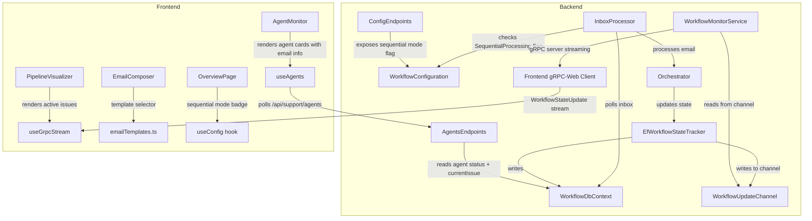

# Design Document: Dashboard UI Polish

## Overview

This design covers five coordinated improvements to the AI Support Workflow monitoring dashboard:

1. **Real-time agent activity visualization** — Enhance the Pipeline Visualizer to show live progress as agents process emails, with per-issue indicators and labels.
2. **Dead code cleanup** — Remove unused `@connectrpc` and `@bufbuild/protobuf` packages and any dead exports from the frontend.
3. **Pre-loaded email templates** — Add a template selector to the Email Composer with 10 pre-defined test scenarios from the `.http` file.
4. **Empty/error state handling** — Add proper empty states, error messages, retry functionality, and current-email visibility to the Agents page.
5. **Configurable sequential processing** — Add a `SequentialProcessing` flag to the backend that forces one-at-a-time email processing for debugging.

All changes maintain backward compatibility. The frontend changes are purely additive UI enhancements. The backend change (sequential mode) defaults to `false`, preserving existing parallel behavior.

## Architecture



### Key Design Decisions

1. **gRPC-Web server streaming replaces polling** — The backend already has a fully functional gRPC streaming service (`WorkflowMonitorService`) that reads from `WorkflowUpdateChannel` and streams `WorkflowStateUpdate` messages to clients. The frontend will use `@connectrpc/connect-web` (already in package.json) to connect to this stream via gRPC-Web protocol. The current polling-based `grpc-client.ts` will be replaced with a real gRPC-Web client that receives push notifications from the backend — no more polling `/api/support/issues` every second.

2. **Proto code generation with `@bufbuild/protobuf`** — The frontend needs TypeScript types generated from `workflow_monitor.proto`. We'll use `buf` CLI or `protoc-gen-es` to generate the client code. The `@bufbuild/protobuf` and `@connectrpc/connect` packages (already in package.json) provide the runtime for the generated code.

3. **Backend API extension for agent current-email info** — The `GET /api/support/agents` response will be extended with `currentIssueId`, `currentSubject`, and `currentStage` fields. This avoids the frontend needing to correlate agent status with issue data.

4. **Template data as a static module** — Email templates are compile-time constants extracted from the `.http` file. No API endpoint needed.

5. **Sequential mode via IOptions pattern** — The `SequentialProcessing` flag is added to `WorkflowConfiguration` and read by `InboxProcessor` via `IOptions<WorkflowConfiguration>`. A new lightweight endpoint exposes the flag to the frontend.

6. **gRPC-Web transport via Envoy-less setup** — ASP.NET Core's `Grpc.AspNetCore.Web` middleware handles gRPC-Web protocol translation natively, so no Envoy proxy is needed. The frontend connects directly to the same origin via `createGrpcWebTransport`.

## Components and Interfaces

### Backend Changes

#### `WorkflowConfiguration` (modified)

```csharp
public class WorkflowConfiguration
{
    public bool EnableVisualization { get; set; }
    public bool SequentialProcessing { get; set; } // NEW — defaults to false
    public int ActorAskTimeoutSeconds { get; set; } = 120;
    public List<TeamConfiguration> Teams { get; set; } = [];
}
```

#### `InboxProcessor` (modified)

When `SequentialProcessing` is `true`, the processor changes behavior:
- Fetches only the **first** unprocessed message (not all pending).
- After processing, checks if the resulting issue has reached a terminal state before processing the next message.
- Uses a simple loop with a check against `WorkflowDbContext` for the issue's current stage.

```csharp
// Pseudocode for sequential mode
if (config.SequentialProcessing)
{
    var message = await dbContext.InboxMessages
        .Where(m => m.ProcessedAt == null)
        .OrderBy(m => m.ReceivedAt)
        .FirstOrDefaultAsync(ct);

    if (message is null) return;

    // Check if previous issue is still in-flight
    var lastProcessedIssue = await GetLastProcessedIssueAsync(dbContext, ct);
    if (lastProcessedIssue is not null && !lastProcessedIssue.IsTerminal())
        return; // Wait for it to complete

    await ProcessMessageAsync(message, dbContext, orchestrator, ct);
}
```

#### `AgentsEndpoints` (modified response)

The agent status response is extended:

```csharp
public record AgentStatusResponse(
    string AgentId,
    string Team,
    string Role,
    string Status,
    string? LastAction,
    string? CurrentIssueId,    // NEW
    string? CurrentSubject,    // NEW
    string? CurrentStage       // NEW
);
```

The endpoint queries the `IssueEntity` table to find any non-terminal issue assigned to the agent (by matching `AgentId` in the issue detail or via a new `AssignedAgentId` field on `IssueEntity`).

#### `ConfigEndpoints` (new)

A new minimal endpoint to expose runtime configuration to the dashboard:

```
GET /api/support/config → { sequentialProcessing: boolean }
```

### Frontend Changes

#### `types/index.ts` (modified)

```typescript
export interface AgentStatus {
  agentId: string;
  team: string;
  role: string;
  status: 'Idle' | 'Working';
  lastAction: string | null;
  currentIssueId: string | null;    // NEW
  currentSubject: string | null;    // NEW
  currentStage: WorkflowStage | null; // NEW
}
```

#### `emailTemplates.ts` (new module)

```typescript
export interface EmailTemplate {
  id: string;
  name: string;
  category: 'Application A' | 'Application B' | 'Edge Cases';
  sender: string;
  subject: string;
  body: string;
}

export const EMAIL_TEMPLATES: EmailTemplate[] = [
  // 10 templates extracted from .http file
];
```

#### `PipelineVisualizer.tsx` (modified)

- Accept `activeIssues: WorkflowState[]` instead of a single `selectedIssue`.
- Render multiple activity indicators (one per active issue at its respective stage).
- Display issueId + subject as a label below the active node.
- When no issues are active, render all nodes in neutral gray (idle state).

#### `AgentMonitor.tsx` (modified)

- When `agent.status === 'Working'` and `currentIssueId` is present, display the issue ID, subject, and current stage in the agent card.
- Add skeleton loading state (animated placeholder cards).

#### `AgentsPage.tsx` (modified)

- Handle empty state: show message about no agents configured + EnableVisualization hint.
- Handle error state: show error with status code + retry button.
- Pass error/retry props to the page from `useAgents` hook.

#### `useAgents.ts` (modified)

- Expose a `retry` function that re-triggers the fetch.
- Already exposes `error` — no change needed there.

#### `EmailComposer.tsx` (modified)

- Add a `<select>` or dropdown above the form with grouped `<optgroup>` elements.
- On template selection, set sender/subject/body state from the template.
- User edits after selection are naturally preserved (React controlled inputs).

#### `grpc-client.ts` (rewritten — real gRPC-Web streaming)

Replace the polling-based implementation with a real gRPC-Web client using `@connectrpc/connect-web`:

```typescript
import { createClient } from '@connectrpc/connect';
import { createGrpcWebTransport } from '@connectrpc/connect-web';
import { WorkflowMonitor } from '../gen/workflow_monitor_pb'; // generated from proto

const transport = createGrpcWebTransport({ baseUrl: window.location.origin });
const client = createClient(WorkflowMonitor, transport);

export interface GrpcStreamClient {
  subscribe(onUpdate: (state: WorkflowState) => void): void;
  disconnect(): void;
  isConnected: boolean;
}

export function createStreamClient(): GrpcStreamClient {
  let abortController: AbortController | null = null;
  let connected = false;

  return {
    get isConnected() { return connected; },

    subscribe(onUpdate) {
      abortController = new AbortController();
      connected = true;

      (async () => {
        try {
          for await (const update of client.subscribeToUpdates({}, { signal: abortController.signal })) {
            onUpdate({
              issueId: update.issueId,
              stage: update.stage as WorkflowStage,
              lastUpdated: update.lastUpdated,
              detail: update.detail || null,
            });
          }
        } catch (err) {
          if (!abortController?.signal.aborted) {
            connected = false;
            // Auto-reconnect after delay
            setTimeout(() => this.subscribe(onUpdate), 2000);
          }
        }
      })();
    },

    disconnect() {
      abortController?.abort();
      abortController = null;
      connected = false;
    },
  };
}
```

#### Proto code generation setup

Add a `buf.gen.yaml` or npm script to generate TypeScript from the proto:

```bash
# Using buf CLI
npx buf generate ../src/AiSupportWorkflow.Presentation/Protos
```

Or add to `package.json` scripts:
```json
"generate": "npx @bufbuild/buf generate ../src/AiSupportWorkflow.Presentation/Protos"
```

Generated output goes to `dashboard/src/gen/` directory.

#### `useGrpcStream.ts` (unchanged interface)

The hook interface remains the same — it still calls `createStreamClient()` and exposes `{ latestStates, isConnected }`. The difference is that updates now arrive via push (gRPC stream) instead of polling.

```typescript
export function useConfig() {
  // Fetches GET /api/support/config once on mount
  // Returns { sequentialProcessing: boolean, isLoading: boolean }
}
```

#### `OverviewPage.tsx` (modified)

- Show a "Sequential Mode" badge when `sequentialProcessing` is `true`.
- Pass all `latestStates` (filtered to non-terminal) to `PipelineVisualizer` as `activeIssues`.

#### `package.json` (modified)

**Keep** (now actually used by the gRPC-Web client):
- `@bufbuild/protobuf`
- `@connectrpc/connect`
- `@connectrpc/connect-web`

**Add** to devDependencies:
- `@bufbuild/buf` — proto code generation CLI
- `@connectrpc/protoc-gen-connect-es` — Connect-ES code generator plugin
- `@bufbuild/protoc-gen-es` — Protobuf-ES code generator plugin

## Data Models

### Extended Agent Status (API Response)

| Field | Type | Description |
|-------|------|-------------|
| agentId | string | Agent identifier (e.g., "TeamA_BackendDeveloper") |
| team | string | Team name |
| role | string | Agent role |
| status | "Idle" \| "Working" | Current activity status |
| lastAction | string? | Description of last completed action |
| currentIssueId | string? | Issue ID being processed (null when Idle) |
| currentSubject | string? | Email subject of current issue (null when Idle) |
| currentStage | WorkflowStage? | Current pipeline stage of the issue (null when Idle) |

### Email Template

| Field | Type | Description |
|-------|------|-------------|
| id | string | Unique template identifier (e.g., "scenario-a1") |
| name | string | Display name (e.g., "A1: NullReferenceException") |
| category | string | Grouping category for the selector |
| sender | string | Pre-filled sender value |
| subject | string | Pre-filled subject value |
| body | string | Pre-filled body value |

### Config Response

| Field | Type | Description |
|-------|------|-------------|
| sequentialProcessing | boolean | Whether sequential mode is active |

## Correctness Properties

*A property is a characteristic or behavior that should hold true across all valid executions of a system — essentially, a formal statement about what the system should do. Properties serve as the bridge between human-readable specifications and machine-verifiable correctness guarantees.*

### Property 1: Pipeline node color mapping is consistent with stage position

*For any* valid WorkflowStage that is the current active stage, all stages before it in the main flow should return green styling, the active stage itself should return blue with a box-shadow (pulsing glow), and all stages after it should return neutral gray styling.

**Validates: Requirements 1.1, 1.6**

### Property 2: Multi-issue activity indicators reflect all active issues

*For any* list of WorkflowState objects representing active issues at distinct stages, the pipeline visualization should produce activity indicators at each respective stage, and each indicator should include the corresponding issueId and subject.

**Validates: Requirements 1.3, 1.4**

### Property 3: Template selection fills all form fields

*For any* valid EmailTemplate object with non-empty sender, subject, and body, selecting that template should result in the form state containing exactly the template's sender, subject, and body values.

**Validates: Requirements 3.2**

### Property 4: User modifications persist after template selection

*For any* template selection followed by any user modification to a form field, the form field should retain the user's modified value and not revert to the template value on subsequent renders.

**Validates: Requirements 3.5**

### Property 5: Error display contains HTTP status code and message

*For any* valid HTTP error status code (400–599) and any non-empty error message string, the rendered error state should contain both the numeric status code and the error message text.

**Validates: Requirements 4.3**

### Property 6: Working agent card displays current email information

*For any* agent with status "Working" and valid currentIssueId, currentSubject, and currentStage values, the rendered agent card should display all three pieces of information (issue ID, subject, and stage name).

**Validates: Requirements 4.6, 4.7**

### Property 7: Sequential mode processes exactly one message per cycle

*For any* inbox containing N > 1 unprocessed messages, when `SequentialProcessing` is `true` and no previous issue is in-flight, the InboxProcessor should process exactly one message and leave the remaining N-1 messages unprocessed.

**Validates: Requirements 5.2**

### Property 8: Parallel mode processes all pending messages in one cycle

*For any* inbox containing N ≥ 1 unprocessed messages, when `SequentialProcessing` is `false`, the InboxProcessor should process all N messages in a single cycle.

**Validates: Requirements 5.4**

## Error Handling

### Frontend Error States

| Scenario | Handling |
|----------|----------|
| Agents API returns empty array | Display empty-state message with EnableVisualization hint |
| Agents API returns HTTP error | Display error with status code + message, show retry button |
| Agents API network failure | Treat as error state, show retry button |
| Config API failure | Default to `sequentialProcessing: false`, no badge shown |
| gRPC stream disconnection | Auto-reconnect with exponential backoff (2s, 4s, 8s...) |
| gRPC stream error (Unavailable) | Show "Disconnected" indicator, attempt reconnect |
| Template selector with no templates | Should never happen (compile-time data), but render empty select |

### Backend Error States

| Scenario | Handling |
|----------|----------|
| Sequential mode: previous issue stuck (never reaches terminal) | InboxProcessor continues to poll; the issue will eventually timeout via Akka Ask timeout and be marked Failed |
| Config endpoint failure | Return 500 with standard error response |
| Agent status query with no matching issue | Return null for currentIssueId/currentSubject/currentStage fields |

## Testing Strategy

### Property-Based Tests (fast-check — frontend)

Property-based testing is appropriate for this feature because several requirements involve pure functions with clear input/output behavior (color mapping, template filling, error rendering) and universal properties that hold across wide input spaces.

- **Library**: `fast-check` (already in devDependencies)
- **Minimum iterations**: 100 per property
- **Tag format**: `Feature: dashboard-ui-polish, Property {N}: {title}`

Properties to implement:
1. `getNodeColor` color mapping (Property 1)
2. Multi-issue node building (Property 2)
3. Template selection state (Property 3)
4. User modification persistence (Property 4)
5. Error display rendering (Property 5)
6. Working agent card content (Property 6)

### Property-Based Tests (FsCheck — backend)

- **Library**: `FsCheck.Xunit` (already in test dependencies)
- **Minimum iterations**: 100 per property

Properties to implement:
7. Sequential mode single-message processing (Property 7)
8. Parallel mode all-message processing (Property 8)

### Unit Tests (example-based)

| Area | Tests |
|------|-------|
| PipelineVisualizer | Idle state renders all gray; single issue highlights correctly; terminal stages render red |
| EmailComposer | Template selector renders; all 10 templates present; grouped by category; empty validation template has empty strings |
| AgentsPage | Empty state message shown; EnableVisualization hint shown; error state with retry button; retry triggers re-fetch |
| AgentMonitor | Loading skeleton displayed; Idle agent shows "No recent activity"; Working agent shows email info |
| WorkflowConfiguration | SequentialProcessing defaults to false |
| ConfigEndpoints | Returns correct config response |
| Dead code | TypeScript compiles after removal; all tests pass after removal |

### Integration Tests

| Area | Tests |
|------|-------|
| InboxProcessor sequential mode | Process one message, verify next is blocked until terminal state |
| AgentsEndpoints | Returns extended response with currentIssueId when agent is Working |
| Config endpoint | Returns sequentialProcessing flag from configuration |
