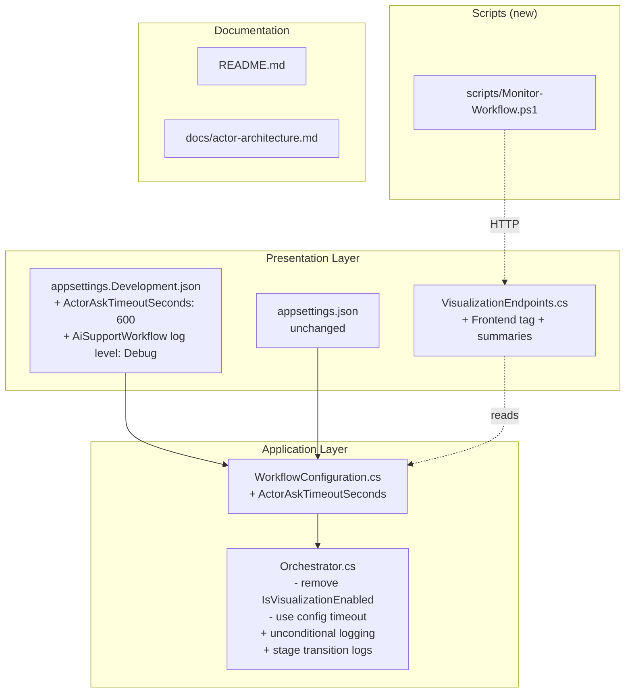

# Design Document

## Overview

This design covers six developer experience improvements to the AI Support Workflow project. The changes are scoped to the Application, Presentation, and configuration layers, plus a new standalone PowerShell script and documentation updates. No domain model changes are required.

**Summary of changes:**

1. **Configurable Actor Ask Timeout** — Add `ActorAskTimeoutSeconds` to `WorkflowConfiguration`, replace the hardcoded `TimeSpan.FromMinutes(2)` in `Orchestrator.ResolveWithActorAsync` with a config-driven value, and set a 10-minute timeout in `appsettings.Development.json`.
2. **Frontend-Dedicated Endpoint Tags** — Add a `"Frontend"` OpenAPI tag and descriptive summaries to the SSE stream and agents endpoints in `VisualizationEndpoints.cs`.
3. **PowerShell SSE Monitor Script** — Create `scripts/Monitor-Workflow.ps1` with `-BaseUrl` and `-Agents` parameters for terminal-based workflow monitoring.
4. **Decouple Logging from Visualization** — Remove the `IsVisualizationEnabled` guard and property from `Orchestrator`, making decision logging unconditional.
5. **Structured Verbose Logging** — Add `Debug`-level structured log entries at every `WorkflowStage` transition, with `Warning` for `Failed`, using `LoggerMessage` source-generated pattern or structured placeholders.
6. **Documentation Updates** — Update `README.md` and `docs/actor-architecture.md` to reflect all changes.

## Architecture

The changes stay within the existing Clean Architecture boundaries. No new projects, layers, or external dependencies are introduced.



**Dependency impact:** None. `WorkflowConfiguration` already exists in the Application layer and is already injected into `Orchestrator`. The `VisualizationEndpoints` already use `IOptions<WorkflowConfiguration>`. No new cross-layer dependencies are created.

## Components and Interfaces

### 1. WorkflowConfiguration (modified)

**File:** `src/AiSupportWorkflow.Application/Configuration/WorkflowConfiguration.cs`

Add a single property:

```csharp
public int ActorAskTimeoutSeconds { get; set; } = 120;
```

No other changes to this class. The existing `EnableVisualization` and `Teams` properties remain unchanged.

### 2. Orchestrator (modified)

**File:** `src/AiSupportWorkflow.Application/Services/Orchestrator.cs`

Changes:
- **Remove** the `IsVisualizationEnabled` property.
- **Remove** the `if (!IsVisualizationEnabled) return;` guard from `LogClassificationDecision`, `LogTeamAssignmentDecision`, and `LogAgentSelectionDecision`.
- **Modify** `ResolveWithActorAsync` to read `ActorAskTimeoutSeconds` from config, falling back to 120 if the value is ≤ 0.
- **Add** a private helper method to compute the effective timeout:
  ```csharp
  private TimeSpan GetActorAskTimeout()
  {
      var seconds = workflowConfig.Value.ActorAskTimeoutSeconds;
      return TimeSpan.FromSeconds(seconds > 0 ? seconds : 120);
  }
  ```
- **Add** structured `Debug`-level log calls wrapping each `stateTracker.Transition(...)` call, emitting `IssueId`, source stage, target stage, and detail.
- **Add** a `Warning`-level log for the `Failed` stage transition.
- **Add** extra structured properties (`Sender`, `Subject`) for the `Received` stage log.
- Use structured logging placeholders (`{PropertyName}`) throughout — no string interpolation.

### 3. VisualizationEndpoints (modified)

**File:** `src/AiSupportWorkflow.Presentation/Endpoints/VisualizationEndpoints.cs`

Changes:
- Add `"Frontend"` to the `WithTags(...)` call: `.WithTags("Visualization", "Frontend")`.
- Add `.WithSummary("Frontend-dedicated: SSE stream of workflow state updates")` to the `/stream` endpoint.
- Add `.WithSummary("Frontend-dedicated: Current state of all AI agents")` to the `/agents` endpoint.

No behavioral changes — the `EnableVisualization` guard remains for these endpoints.

### 4. Monitor-Workflow.ps1 (new)

**File:** `scripts/Monitor-Workflow.ps1`

A standalone PowerShell script with:
- `[CmdletBinding()]` and `param()` block with `-BaseUrl` (string, default `http://localhost:5080`) and `-Agents` (switch).
- **`-Agents` mode:** `Invoke-RestMethod` to `{BaseUrl}/api/support/agents`, format as table, exit.
- **SSE streaming mode:** `Invoke-WebRequest` with streaming to `{BaseUrl}/api/support/stream`, parse `data:` lines, print with timestamp.
- **Error handling:** Catch 404 → display "visualization disabled" message. Catch connection failure → display error with URL, exit code 1.
- **Ctrl+C:** Use `try/finally` for graceful cleanup of the HTTP stream.

### 5. Configuration Files (modified)

**`appsettings.Development.json`** — Add:
```json
{
  "Logging": {
    "LogLevel": {
      "AiSupportWorkflow": "Debug"
    }
  },
  "Workflow": {
    "ActorAskTimeoutSeconds": 600
  }
}
```

**`appsettings.json`** — No changes. The absence of `ActorAskTimeoutSeconds` means the default (120) applies. The existing `Logging:LogLevel:Default` of `Information` suppresses `Debug` logs in non-development environments.

### 6. Documentation (modified)

**`README.md`** — Update:
- Configuration section: document `Workflow:ActorAskTimeoutSeconds`.
- New section: `scripts/Monitor-Workflow.ps1` usage with parameters and examples.
- API Endpoints table: mark `/api/support/stream` and `/api/support/agents` as frontend-dedicated.
- Key Behavioral Constraints: state that workflow decision logging is always active, independent of `EnableVisualization`.
- Document how to enable verbose logging via `AiSupportWorkflow` log level.

**`docs/actor-architecture.md`** — Update the `ISupervisorActorBridge` section to reference the configurable timeout from `WorkflowConfiguration` instead of the hardcoded 2-minute value.

## Data Models

### WorkflowConfiguration (updated)

```csharp
public class WorkflowConfiguration
{
    public bool EnableVisualization { get; set; }
    public int ActorAskTimeoutSeconds { get; set; } = 120;  // NEW
    public List<TeamConfiguration> Teams { get; set; } = [];
}
```

### appsettings.Development.json (updated)

```json
{
  "Logging": {
    "LogLevel": {
      "AiSupportWorkflow": "Debug"
    }
  },
  "LlmProvider": {
    "ApiKey": "YOUR_API_KEY_HERE",
    "Provider": "OpenAI",
    "ModelName": "gpt-4o-mini"
  },
  "Workflow": {
    "ActorAskTimeoutSeconds": 600
  }
}
```

No new entities, enums, or domain types are introduced. The `WorkflowStage` enum and `WorkflowState` record remain unchanged.


## Correctness Properties

*A property is a characteristic or behavior that should hold true across all valid executions of a system — essentially, a formal statement about what the system should do. Properties serve as the bridge between human-readable specifications and machine-verifiable correctness guarantees.*

### Property 1: Configurable timeout respects fallback rule

*For any* integer value of `ActorAskTimeoutSeconds`, the timeout passed by the Orchestrator to `ISupervisorActorBridge.AssignIssueAsync` SHALL equal `TimeSpan.FromSeconds(value)` when `value > 0`, and `TimeSpan.FromSeconds(120)` when `value <= 0`.

**Validates: Requirements 1.3, 1.6**

### Property 2: Decision logs include all required structured properties

*For any* successful workflow execution (where classification returns `IsCodeRelated = true` and routing/selection succeed), the Orchestrator SHALL emit:
- A classification log containing `IssueId`, `Category`, `ConfidenceScore`, `IsCodeRelated`, and `Reasoning`.
- A team assignment log containing `IssueId`, `TeamName`, and `ApplicationName`.
- An agent selection log containing `IssueId`, `AgentId`, and `Role`.

**Validates: Requirements 4.3, 4.4, 4.5**

### Property 3: Stage transition logs are emitted at Debug level

*For any* workflow stage transition (except `Failed`), the Orchestrator SHALL emit a structured log entry at `Debug` level containing the `IssueId`, source `WorkflowStage`, target `WorkflowStage`, and transition detail string.

**Validates: Requirements 5.1**

### Property 4: Received stage log includes email metadata

*For any* `IncomingEmail` with non-empty `Sender` and `Subject`, the Orchestrator's `Received` stage transition log SHALL include the `Sender` and `Subject` as additional structured properties at `Debug` level.

**Validates: Requirements 5.2**

### Property 5: Failed stage logs at Warning level

*For any* workflow failure, the Orchestrator's `Failed` stage transition log SHALL be emitted at `Warning` level (not `Debug`) and SHALL include the failure reason as a structured property.

**Validates: Requirements 5.3**

## Error Handling

### Timeout Fallback

If `ActorAskTimeoutSeconds` is configured as zero or negative, the Orchestrator silently falls back to 120 seconds. No exception is thrown, no warning is logged — this is a defensive default. The `GetActorAskTimeout()` helper encapsulates this logic.

### PowerShell Script Error Handling

| Scenario | Behavior |
|----------|----------|
| SSE endpoint returns 404 | Display message: "Visualization is disabled. Enable it by setting Workflow:EnableVisualization to true in appsettings.json." Exit code 0. |
| Connection to BaseUrl fails | Display error with attempted URL. Exit code 1. |
| Ctrl+C during SSE streaming | Graceful cleanup via `try/finally`. Dispose HTTP stream. Exit code 0. |
| Agents endpoint returns 404 | Same "visualization disabled" message as SSE. Exit code 0. |

### Existing Error Handling (unchanged)

- The `Orchestrator.ProcessIssueAsync` catch block continues to log errors and transition to `Failed` stage.
- The `VisualizationEndpoints` 404 behavior when `EnableVisualization` is false remains unchanged.

## Testing Strategy

### Property-Based Tests (FsCheck)

The project already uses FsCheck.Xunit in `tests/AiSupportWorkflow.PropertyTests/`. Each correctness property maps to a single FsCheck property test with a minimum of 100 iterations.

| Property | Test Description | Generator Strategy |
|----------|------------------|--------------------|
| Property 1 | Timeout fallback rule | Generate random integers (positive, zero, negative). Configure `WorkflowConfiguration`, mock `ISupervisorActorBridge`, run orchestrator, capture the `TimeSpan` argument. |
| Property 2 | Decision log structured properties | Generate random `ClassificationResult`, `TeamAssignment`, `AgentAssignment` values. Mock all dependencies, capture `ILogger` calls, verify structured property names. |
| Property 3 | Stage transition Debug logs | Generate random workflow paths (varying email content, classification results). Capture all `ILogger` calls, verify each transition has a Debug-level entry with required properties. |
| Property 4 | Received stage email metadata | Generate random `IncomingEmail` with arbitrary `Sender` and `Subject` strings. Verify the Received log includes both values. |
| Property 5 | Failed stage Warning level | Generate random exceptions/failure scenarios. Verify the Failed transition log is at Warning level. |

**Tag format:** `Feature: developer-experience-improvements, Property {N}: {description}`

### Unit Tests (xUnit + NSubstitute)

Unit tests cover specific examples and edge cases not suited for PBT:

| Test | Validates |
|------|-----------|
| `WorkflowConfiguration_ActorAskTimeoutSeconds_DefaultsTo120` | Req 1.1 |
| `Orchestrator_LogsDecisions_WhenVisualizationDisabled` | Req 4.1 |
| `Orchestrator_LogsDecisions_WhenVisualizationEnabled` | Req 4.1 |
| `Orchestrator_DoesNotHave_IsVisualizationEnabled_Property` | Req 4.6 (reflection-based) |
| `Orchestrator_UsesStructuredPlaceholders_NotInterpolation` | Req 5.6 (code review / static analysis) |

### Integration / Manual Tests

| Test | Validates |
|------|-----------|
| Verify `appsettings.json` does not contain `ActorAskTimeoutSeconds` | Req 1.4 |
| Verify `appsettings.Development.json` contains `ActorAskTimeoutSeconds: 600` | Req 1.5 |
| Verify endpoint tags include both "Visualization" and "Frontend" | Req 2.1 |
| Verify endpoint summaries match expected strings | Req 2.2, 2.3 |
| Verify endpoints return 404 when visualization disabled | Req 2.4 |
| Verify `scripts/Monitor-Workflow.ps1` exists and has correct parameters | Req 3.1, 3.2 |
| Manual test: run Monitor-Workflow.ps1 against live server | Req 3.3, 3.4, 3.5, 3.6, 3.7 |
| Verify `appsettings.Development.json` has `AiSupportWorkflow: Debug` | Req 5.4 |
| Verify `appsettings.json` retains `Default: Information` | Req 5.5 |
| Documentation review for all Req 6.x criteria | Req 6.1–6.9 |
