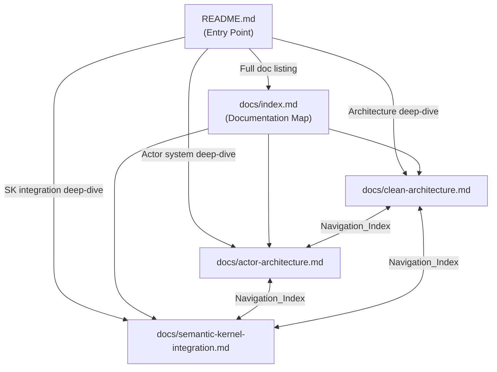
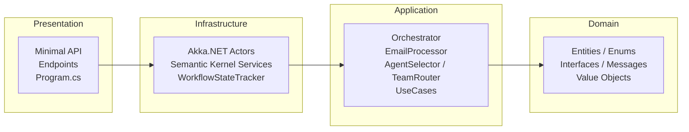
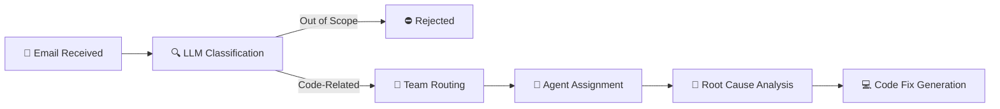

# Design Document — Documentation Overhaul

## Overview

This feature overhauls the AI Support Workflow project documentation without any code changes. The work involves rewriting the root `README.md` as a comprehensive entry point, creating a `docs/index.md` navigation hub, adding consistent navigation headers to all existing in-depth documents, and ensuring all documented information (endpoints, versions, folder structure) matches the actual codebase.

The design prioritizes discoverability (a new developer should find everything from the README), navigability (cross-links between all docs), and accuracy (documentation reflects the real code).

## Architecture

Since this is a documentation-only feature, there is no software architecture to design. The "architecture" here is the information architecture of the documentation set.

### Document Hierarchy



All navigation is bidirectional: every in-depth document links back to the README and to every other in-depth document via a Navigation_Index block.

## Components and Interfaces

### Component 1: README.md (Rewrite)

The root README is the single entry point. It will be structured with these sections in order:

1. **Title + Badge Area** — Project name, short tagline about spec-driven AI experiment with Kiro.
2. **What It Does** — Workflow description: email → classification → routing → resolution → code fix.
3. **Architecture** — Mermaid diagram of the four Clean Architecture layers with dependency arrows, plus a Mermaid diagram of the workflow pipeline.
4. **Technologies** — Table of .NET 10, Akka.NET 1.5.64, Semantic Kernel 1.74.0, OpenAI, xUnit, FsCheck, NSubstitute with links to official docs.
5. **Getting Started** — Clone, configure API key in `appsettings.Development.json`, `dotnet run` command.
6. **API Endpoints** — Table of all 5 endpoints (method, route, description), followed by detailed subsections for each endpoint with request/response examples and a reference to the `.http` file.
7. **Deep-Dive Documentation** — Navigable sections for Clean Architecture, Actor Architecture, and Semantic Kernel Integration. Each has a 2-3 sentence summary and a link to the corresponding `docs/` file.
8. **DummyApps & Test Scenarios** — Explanation of ApplicationA/ApplicationB as test fixtures, the three bug categories, and reference to `BugScenarios.md` files and the `.http` file for ready-made test requests.
9. **Testing** — Test organization (xUnit + NSubstitute for unit, FsCheck for property), commands to run all/unit/property tests, conventions (one class per service, AAA pattern).
10. **Project Structure** — Folder tree showing `src/`, `tests/`, `DummyApps/`, `docs/` with brief descriptions.
11. **License** — MIT license reference.

### Component 2: docs/index.md (New File)

A documentation map listing all available documents with:
- A Navigation_Index at the top (link back to README)
- A table or list of all docs with filename, title, and one-line description
- Direct links to each document

### Component 3: Navigation_Index Block (Added to Existing Docs)

A consistent block added to the top of each in-depth document, immediately after the H1 title. Format:

```markdown
> **📚 Navigation:** [← Back to README](../README.md) | [Documentation Index](index.md) | [Clean Architecture](clean-architecture.md) | [Actor Architecture](actor-architecture.md) | [Semantic Kernel Integration](semantic-kernel-integration.md)
```

The link to the current document is rendered as bold text (not a link) to indicate the active page. This format is consistent across all three existing docs and the new `index.md`.

### Component 4: Documentation-Code Coherence Verification

Before finalizing documentation, the following must be manually verified:

| Check | Source of Truth | Documentation Target |
|-------|----------------|---------------------|
| API endpoint routes | `SupportEmailEndpoints.cs`, `WorkflowStatusEndpoints.cs`, `VisualizationEndpoints.cs` | README API Endpoints section |
| Technology versions | `.csproj` files (`net10.0`, package versions) | README Technologies section |
| Folder structure | Actual repository layout | README Project Structure section |
| Class/interface names | Source code namespaces | In-depth documents |
| Build/test commands | `AiSupportWorkflow.sln`, project paths | README Getting Started and Testing sections |

**Verified endpoint routes from code:**

| File | Route | Method |
|------|-------|--------|
| `SupportEmailEndpoints.cs` | `POST /api/support/emails` | Submit support email |
| `WorkflowStatusEndpoints.cs` | `GET /api/support/issues/{id:guid}` | Get workflow state by ID |
| `WorkflowStatusEndpoints.cs` | `GET /api/support/issues` | List all issues |
| `VisualizationEndpoints.cs` | `GET /api/support/stream` | SSE workflow updates |
| `VisualizationEndpoints.cs` | `GET /api/support/agents` | Agent statuses |

## Data Models

Not applicable — this feature produces only Markdown files. No data models, schemas, or storage are involved.

## Mermaid Diagram Specifications

### Diagram 1: Clean Architecture Layers

To be included in the README Architecture section:



### Diagram 2: Workflow Pipeline

To be included in the README Architecture section:



## Error Handling

Not applicable — this feature involves only static Markdown files. There are no runtime errors, exceptions, or failure modes to handle.

## Testing Strategy

Since this is a documentation-only feature with no code changes, property-based testing does not apply. There are no pure functions, data transformations, or algorithmic logic to test.

**Why PBT does not apply:** All acceptance criteria concern the presence of specific content in Markdown files, structural consistency of navigation links, and coherence between documentation text and source code. These are verifiable through manual review and example-based checks, not through randomized input generation.

### Verification Approach

1. **Manual Review Checklist** — Each requirement's acceptance criteria is checked by reading the produced Markdown files:
   - All required sections exist in README.md
   - All 5 API endpoints are documented with correct routes
   - Navigation_Index is present and consistent in all `docs/*.md` files
   - `docs/index.md` exists and links to all documents
   - Mermaid diagrams render correctly

2. **Link Validation** — All internal links (`[text](path)`) point to files that exist in the repository. Can be verified with a simple script or manual check.

3. **Code Coherence Spot-Checks** — Compare documented endpoint routes against the three `*Endpoints.cs` files, documented versions against `.csproj` files, and documented folder structure against the actual repo layout.

4. **Mermaid Rendering** — Verify diagrams render correctly in GitHub's Markdown preview or a Mermaid live editor.
