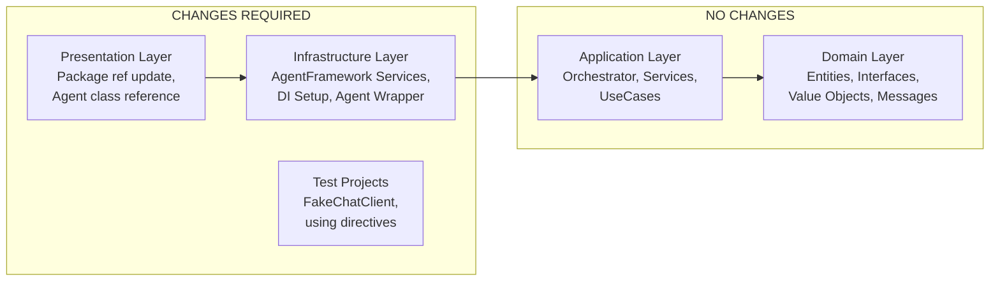
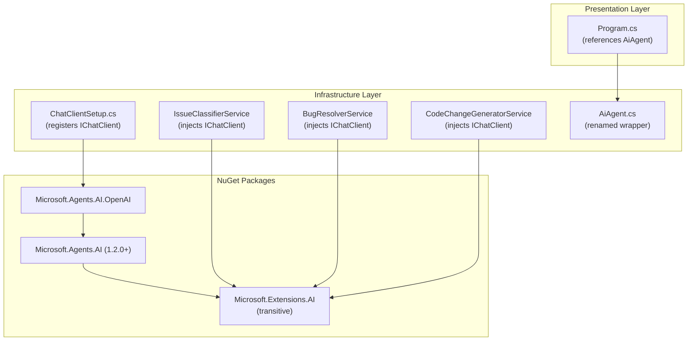

# Design Document: Migrate to Microsoft Agent Framework

## Overview

This design covers the migration of the AI Support Workflow project from Microsoft Semantic Kernel (v1.74.0) to Microsoft Agent Framework (v1.2.0+). The Agent Framework is the official successor to Semantic Kernel, unifying Semantic Kernel and AutoGen into a single SDK built on `Microsoft.Extensions.AI` — the standard .NET AI abstraction layer.

The migration is a **lateral replacement** of the LLM integration layer. The domain and application layers require zero changes because the project already follows clean architecture with inward dependency flow. All changes are confined to:

- **Infrastructure layer**: LLM service implementations, DI setup, agent wrapper, folder/namespace renames
- **Presentation layer**: Package reference update, agent class reference update
- **Test projects**: Test helper replacement, using directive updates
- **Documentation**: Full refresh of integration docs, README, and migration note

The key API mapping is:

| Semantic Kernel | Agent Framework / Microsoft.Extensions.AI |
|---|---|
| `IChatCompletionService` | `IChatClient` |
| `ChatHistory` | `List<ChatMessage>` |
| `PromptExecutionSettings` + `ExtensionData` hack | `ChatOptions` with typed `Temperature` property |
| `ChatMessageContent` | `ChatResponse` |
| `GetChatMessageContentAsync(history, settings)` | `GetResponseAsync(messages, options)` |
| `AddOpenAIChatCompletion(model, apiKey)` | `OpenAIClient` + `OpenAIChatClient` registered as `IChatClient` |

### Design Rationale

1. **Standard .NET abstraction**: `IChatClient` is to AI what `ILogger` is to logging — a first-class .NET interface. This replaces a framework-specific abstraction with a platform-standard one.
2. **Cleaner temperature configuration**: The `ExtensionData` dictionary hack (`["temperature"] = 0.2`) is replaced with the typed `ChatOptions.Temperature` property.
3. **Provider isolation**: The services already don't use OpenAI-specific types. After migration, the DI setup remains the only place that knows about OpenAI, but now backed by a Microsoft-standard interface.
4. **Future-proofing**: Agent Framework is the actively maintained successor. Semantic Kernel is being sunset.

## Architecture

### Unchanged Layers

The clean architecture boundary means the migration touches only the outer layers:



### Dependency Flow After Migration



Key point: Only `ChatClientSetup.cs` references `Microsoft.Agents.AI.OpenAI`. The three LLM services depend only on `Microsoft.Extensions.AI` types (`IChatClient`, `ChatMessage`, `ChatOptions`, `ChatResponse`).

## Components and Interfaces

### 1. ChatClientSetup (replaces SemanticKernelSetup)

**File**: `src/AiSupportWorkflow.Infrastructure/AgentFramework/ChatClientSetup.cs`
**Namespace**: `AiSupportWorkflow.Infrastructure.AgentFramework`

```csharp
public static class ChatClientSetup
{
    public static IServiceCollection AddChatClient(
        this IServiceCollection services, IConfiguration configuration)
}
```

**Behavior**:
1. Reads `LlmProvider` section → `LlmProviderConfiguration` (unchanged schema)
2. Validates API key is present (throws `InvalidOperationException` if missing)
3. Creates `OpenAIClient(apiKey)` → `OpenAIChatClient(openAiClient, modelName)`
4. Registers as `IChatClient` singleton in DI
5. Configures HTTP resilience with Polly (3 retries, exponential backoff, jitter) — unchanged

**Migration detail**:
```csharp
// Before (Semantic Kernel)
services.AddOpenAIChatCompletion(config.ModelName, config.ApiKey);

// After (Agent Framework)
var openAiClient = new OpenAIClient(new ApiKeyCredential(config.ApiKey));
IChatClient chatClient = new OpenAIChatClient(openAiClient, config.ModelName);
services.AddSingleton(chatClient);
```

### 2. IssueClassifierService (migrated)

**File**: `src/AiSupportWorkflow.Infrastructure/AgentFramework/IssueClassifierService.cs`
**Namespace**: `AiSupportWorkflow.Infrastructure.AgentFramework`

**Migration detail**:
```csharp
// Before
public class IssueClassifierService(IChatCompletionService chatService, ...) : IIssueClassifier
{
    private static readonly PromptExecutionSettings Settings = new()
    {
        ExtensionData = new Dictionary<string, object> { ["temperature"] = 0.1 }
    };
    // ...
    var history = new ChatHistory(SystemPrompt);
    history.AddUserMessage(...);
    var response = await chatService.GetChatMessageContentAsync(history, Settings, cancellationToken: ct);
    return ParseClassificationResponse(response.Content ?? "");
}

// After
public class IssueClassifierService(IChatClient chatClient, ...) : IIssueClassifier
{
    private static readonly ChatOptions Options = new() { Temperature = 0.1f };
    // ...
    var messages = new List<ChatMessage>
    {
        new(ChatRole.System, SystemPrompt),
        new(ChatRole.User, $"Subject: {issue.Subject}\n\nBody: {issue.Body}")
    };
    var response = await chatClient.GetResponseAsync(messages, Options, ct);
    return ParseClassificationResponse(response.Text ?? "");
}
```

The `ParseClassificationResponse` method is unchanged — it receives a string and parses JSON.

### 3. BugResolverService (migrated)

**File**: `src/AiSupportWorkflow.Infrastructure/AgentFramework/BugResolverService.cs`
**Namespace**: `AiSupportWorkflow.Infrastructure.AgentFramework`

Same pattern as IssueClassifierService. Temperature changes from `ExtensionData["temperature"] = 0.2` to `ChatOptions { Temperature = 0.2f }`.

### 4. CodeChangeGeneratorService (migrated)

**File**: `src/AiSupportWorkflow.Infrastructure/AgentFramework/CodeChangeGeneratorService.cs`
**Namespace**: `AiSupportWorkflow.Infrastructure.AgentFramework`

Same pattern. Temperature: `0.5f`.

### 5. AiAgent (replaces SemanticKernelAgent)

**File**: `src/AiSupportWorkflow.Infrastructure/Agents/AiAgent.cs`
**Namespace**: `AiSupportWorkflow.Infrastructure.Agents`

The class is renamed but behavior is identical — it holds agent identity (`AgentId`, `TeamName`, `Role`) and delegates `AnalyzeAndResolveAsync` to `IBugResolver.ResolveAsync`.

```csharp
public class AiAgent(
    string agentId,
    string teamName,
    AgentRole role,
    IBugResolver bugResolver) : IAIAgent
{
    // Identical implementation to SemanticKernelAgent
}
```

### 6. InfrastructureServiceExtensions (updated)

**File**: `src/AiSupportWorkflow.Infrastructure/InfrastructureServiceExtensions.cs`

Changes:
- `using AiSupportWorkflow.Infrastructure.AgentFramework;` (was `SemanticKernel`)
- `services.AddChatClient(configuration);` (was `AddSemanticKernel`)

### 7. Program.cs (updated)

Changes:
- `using AiSupportWorkflow.Infrastructure.Agents;` — already present, no change needed
- `new AiAgent(...)` (was `new SemanticKernelAgent(...)`)

### 8. FakeChatClient (replaces FakeChatCompletionService)

**File**: `tests/AiSupportWorkflow.UnitTests/Helpers/FakeChatClient.cs`

```csharp
internal sealed class FakeChatClient : IChatClient
{
    private readonly Func<IList<ChatMessage>, Task<ChatResponse>> _handler;

    public FakeChatClient(string responseContent)
    {
        _handler = _ => Task.FromResult(
            new ChatResponse(new ChatMessage(ChatRole.Assistant, responseContent)));
    }

    public FakeChatClient(Exception exception)
    {
        _handler = _ => throw exception;
    }

    public async Task<ChatResponse> GetResponseAsync(
        IList<ChatMessage> messages,
        ChatOptions? options = null,
        CancellationToken cancellationToken = default)
    {
        return await _handler(messages);
    }

    // GetStreamingResponseAsync and Dispose — minimal implementations
}
```

### 9. Test File Updates

All three test files (`IssueClassifierTests.cs`, `BugResolverTests.cs`, `CodeChangeGeneratorTests.cs`) need:
- Replace `using Microsoft.SemanticKernel.ChatCompletion;` → remove (IChatClient comes from `Microsoft.Extensions.AI`)
- Replace `using AiSupportWorkflow.Infrastructure.SemanticKernel;` → `using AiSupportWorkflow.Infrastructure.AgentFramework;`
- Replace `IChatCompletionService` → `IChatClient` in `CreateSut` methods
- Replace `FakeChatCompletionService` → `FakeChatClient`

## Data Models

No data model changes. All domain entities, value objects, enums, and messages remain identical:

- `ClassificationResult`, `ResolutionReport`, `PullRequest`, `AgentAssignment` — unchanged
- `IssueRecord`, `IncomingEmail`, `WorkflowState` — unchanged
- `IIssueClassifier`, `IBugResolver`, `ICodeChangeGenerator`, `IAIAgent` — unchanged
- `LlmProviderConfiguration` — unchanged (same schema: Provider, ModelName, ApiKey, Endpoint)

The only "data" change is in how LLM requests are constructed:

| Concept | Before | After |
|---|---|---|
| Message list | `ChatHistory` (SK class) | `List<ChatMessage>` (M.E.AI) |
| System message | `new ChatHistory(systemPrompt)` | `new ChatMessage(ChatRole.System, text)` |
| User message | `history.AddUserMessage(text)` | `new ChatMessage(ChatRole.User, text)` |
| Settings | `PromptExecutionSettings { ExtensionData = { ["temperature"] = 0.1 } }` | `ChatOptions { Temperature = 0.1f }` |
| Response text | `response.Content` | `response.Text` |

### NuGet Package Changes

**Infrastructure .csproj** — remove and add:
```xml
<!-- Remove -->
<PackageReference Include="Microsoft.SemanticKernel" Version="1.74.0" />
<PackageReference Include="Microsoft.SemanticKernel.Connectors.OpenAI" Version="1.74.0" />

<!-- Add -->
<PackageReference Include="Microsoft.Agents.AI" Version="1.2.0" />
<PackageReference Include="Microsoft.Agents.AI.OpenAI" Version="1.2.0" />
```

**Presentation .csproj** — remove and add:
```xml
<!-- Remove -->
<PackageReference Include="Microsoft.SemanticKernel" Version="1.74.0" />

<!-- Add -->
<PackageReference Include="Microsoft.Agents.AI" Version="1.2.0" />
```

### File-by-File Change Plan

| # | Current Path | Action | New Path |
|---|---|---|---|
| 1 | `Infrastructure/SemanticKernel/SemanticKernelSetup.cs` | Rewrite + move | `Infrastructure/AgentFramework/ChatClientSetup.cs` |
| 2 | `Infrastructure/SemanticKernel/IssueClassifierService.cs` | Migrate + move | `Infrastructure/AgentFramework/IssueClassifierService.cs` |
| 3 | `Infrastructure/SemanticKernel/BugResolverService.cs` | Migrate + move | `Infrastructure/AgentFramework/BugResolverService.cs` |
| 4 | `Infrastructure/SemanticKernel/CodeChangeGeneratorService.cs` | Migrate + move | `Infrastructure/AgentFramework/CodeChangeGeneratorService.cs` |
| 5 | `Infrastructure/Agents/SemanticKernelAgent.cs` | Rename class + file | `Infrastructure/Agents/AiAgent.cs` |
| 6 | `Infrastructure/InfrastructureServiceExtensions.cs` | Update references | (same path) |
| 7 | `Infrastructure/AiSupportWorkflow.Infrastructure.csproj` | Swap packages | (same path) |
| 8 | `Presentation/Program.cs` | Update agent class ref | (same path) |
| 9 | `Presentation/AiSupportWorkflow.Presentation.csproj` | Swap package | (same path) |
| 10 | `UnitTests/Helpers/FakeChatCompletionService.cs` | Rewrite + rename | `UnitTests/Helpers/FakeChatClient.cs` |
| 11 | `UnitTests/IssueClassifierTests.cs` | Update usings + CreateSut | (same path) |
| 12 | `UnitTests/BugResolverTests.cs` | Update usings + CreateSut | (same path) |
| 13 | `UnitTests/CodeChangeGeneratorTests.cs` | Update usings + CreateSut | (same path) |
| 14 | `docs/semantic-kernel-integration.md` | Replace entirely | `docs/agent-framework-integration.md` |
| 15 | `README.md` | Update all SK references | (same path) |


## Correctness Properties

*A property is a characteristic or behavior that should hold true across all valid executions of a system — essentially, a formal statement about what the system should do. Properties serve as the bridge between human-readable specifications and machine-verifiable correctness guarantees.*

The migration is primarily a lateral API replacement, so the key correctness concern is **behavioral preservation** — the services must produce identical outputs for identical inputs after the migration. The properties below focus on the pure logic that can be verified through property-based testing.

### Property 1: ChatOptions temperature preservation

*For any* valid temperature value (float in the range [0.0, 2.0]), constructing a `ChatOptions` with that temperature and reading it back SHALL return the same value.

**Validates: Requirements 2.5**

### Property 2: Classification JSON parsing round-trip

*For any* valid classification JSON object containing a category (one of BackendBug, FrontendBug, QualityTestIssue, OutOfScope), a confidence score (double in [0.0, 1.0]), and a reasoning string, the `IssueClassifierService` parser SHALL produce a `ClassificationResult` with matching `Category`, `ConfidenceScore` (clamped to [0.0, 1.0]), and `IsCodeRelated` consistent with the category.

**Validates: Requirements 2.7**

### Property 3: Resolution JSON parsing round-trip

*For any* valid resolution JSON object containing rootCause, affectedComponent, severity, proposedFix, requiresEscalation, and escalationReason fields, the `BugResolverService` parser SHALL produce a `ResolutionReport` with matching field values and the correct `IssueId`.

**Validates: Requirements 2.8**

### Property 4: Pull request JSON parsing round-trip

*For any* valid pull request JSON object containing title, description, affectedFiles (non-empty list of non-whitespace strings), and diff, the `CodeChangeGeneratorService` parser SHALL produce a `PullRequest` with matching `Title`, `Description`, `AffectedFilePaths`, and `SimulatedDiff`, and the correct `IssueId`.

**Validates: Requirements 2.9**

### Property 5: Unsupported provider rejection

*For any* provider string that is not equal to "openai" (case-insensitive), the DI setup SHALL throw an `InvalidOperationException`.

**Validates: Requirements 3.5**

### Property 6: Agent identity preservation and delegation

*For any* agentId (non-empty string), teamName (non-empty string), and AgentRole, constructing an `AiAgent` with those values SHALL expose them via `AgentId`, `TeamName`, and `Role` properties, and calling `AnalyzeAndResolveAsync` SHALL delegate to the injected `IBugResolver.ResolveAsync` with a matching `AgentAssignment`.

**Validates: Requirements 5.3**

### Property 7: FakeChatClient response round-trip

*For any* non-null string, constructing a `FakeChatClient` with that string and calling `GetResponseAsync` SHALL return a `ChatResponse` whose text content equals the input string.

**Validates: Requirements 6.4**

## Error Handling

Error handling behavior is **preserved identically** from the Semantic Kernel implementation. No error handling logic changes — only the types used to interact with the LLM change.

### LLM Service Error Handling (unchanged)

All three services follow the same pattern:

1. **Try**: Construct messages, call `IChatClient.GetResponseAsync`, parse JSON response
2. **Catch any exception**: Log the error, return a fallback result

| Service | Fallback Behavior |
|---|---|
| `IssueClassifierService` | Returns `ClassificationResult(false, OutOfScope, 0.0, "Classification failed — manual review required")` |
| `BugResolverService` | Returns escalated `ResolutionReport` with `RequiresEscalation = true` and error message |
| `CodeChangeGeneratorService` | Returns a minimal `PullRequest` with simulated diff |

### JSON Parse Error Handling (unchanged)

Each service has a private `Parse*Response` method that wraps `JsonDocument.Parse` in a try/catch. Malformed JSON returns the same fallback as an LLM error.

### DI Setup Error Handling (unchanged)

- Missing/empty API key → `InvalidOperationException` with descriptive message
- Unsupported provider → `InvalidOperationException` with descriptive message

### What Changes

The only error-related change is the **exception types** that might be thrown by the LLM client. `IChatClient.GetResponseAsync` may throw different exception types than `IChatCompletionService.GetChatMessageContentAsync`. However, since all services catch `Exception` (the base type), this is transparent to the error handling logic.

## Testing Strategy

### Dual Testing Approach

The project uses both unit tests and property-based tests:

- **Unit tests** (xUnit + NSubstitute): Verify specific examples, edge cases, and error conditions for each service
- **Property tests** (FsCheck): Verify universal properties across randomly generated inputs

### Unit Tests (existing, migrated)

The existing unit tests are migrated by swapping the test helper and using directives. Test logic and assertions remain identical:

| Test Class | Tests | Migration Change |
|---|---|---|
| `IssueClassifierTests` | 3 tests (valid backend bug, out of scope, LLM exception) | `FakeChatCompletionService` → `FakeChatClient`, `IChatCompletionService` → `IChatClient` |
| `BugResolverTests` | 2 tests (valid JSON, LLM exception) | Same swap |
| `CodeChangeGeneratorTests` | 2 tests (valid JSON, LLM exception) | Same swap |

### Property-Based Tests (new, for migration correctness)

Property-based tests validate the correctness properties defined above using FsCheck. Each test runs a minimum of 100 iterations.

| Property | Test Description | FsCheck Generator |
|---|---|---|
| Property 1 | ChatOptions temperature preservation | `Arb.generate<float>` filtered to [0.0, 2.0] |
| Property 2 | Classification JSON parsing round-trip | Generate random `IssueCategory`, confidence in [0,1], reasoning string → build JSON → parse → compare |
| Property 3 | Resolution JSON parsing round-trip | Generate random rootCause, affectedComponent, severity, proposedFix, requiresEscalation → build JSON → parse → compare |
| Property 4 | Pull request JSON parsing round-trip | Generate random title, description, file list, diff → build JSON → parse → compare |
| Property 5 | Unsupported provider rejection | Generate random non-"openai" strings → verify `InvalidOperationException` |
| Property 6 | Agent identity preservation | Generate random agentId, teamName, AgentRole → construct AiAgent → verify properties and delegation |
| Property 7 | FakeChatClient round-trip | Generate random strings → construct FakeChatClient → call GetResponseAsync → verify text matches |

**Configuration**:
- Library: FsCheck.Xunit (already in project, v3.3.2)
- Minimum iterations: 100 per property (`MaxTest = 100`)
- Tag format: `Feature: migrate-to-agent-framework, Property {N}: {title}`

### Smoke Tests (manual verification)

These are verified during the implementation phase, not as automated tests:
- Solution builds with zero errors (`dotnet build`)
- All tests pass (`dotnet test`)
- Zero references to `Microsoft.SemanticKernel` in any .csproj or .cs file
- Correct folder structure (`AgentFramework/` exists, `SemanticKernel/` removed)

### Existing Property Tests (unaffected)

The existing property tests in `AiSupportWorkflow.PropertyTests/` test domain and application logic (classification consistency, routing, email processing, etc.). These tests do not reference Semantic Kernel types and require **no changes**. They serve as regression tests — if they still pass after migration, the domain behavior is preserved.
