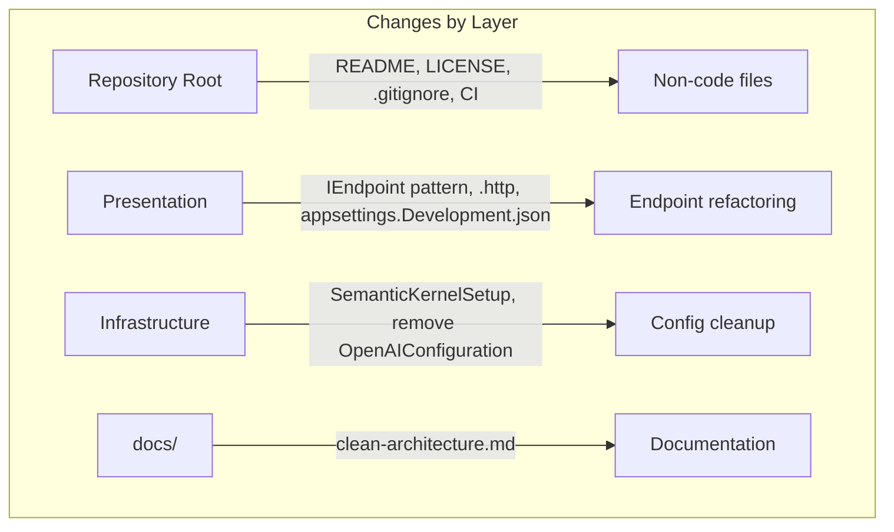

# Design Document

## Overview

This design covers 12 project polish and developer experience (DX) improvements for the AI Support Workflow .NET 10.0 project. The changes span configuration management, code style alignment, documentation, CI/CD, licensing, and package maintenance. All changes are non-functional — they improve the developer workflow, project hygiene, and open-source readiness without altering the runtime behavior of the support workflow pipeline.

The design is organized into three logical groups:

1. **Configuration & Secrets** (Requirements 1, 2): Migrate API key reading from environment variables to `IConfiguration` / `appsettings.Development.json`, and exclude that file from Git.
2. **Code Style & Cleanup** (Requirements 3, 4, 5, 6): Create `.http` file, simplify README, adopt the `IEndpoint` pattern from the author's conventions, and remove the obsolete `OpenAIConfiguration` class.
3. **Documentation, Packages & CI** (Requirements 7, 8, 9, 10, 11, 12): Add clean architecture docs, update NuGet packages, verify licenses, add MIT license, set up GitHub Actions CI, and enforce branch naming.

## Architecture

No architectural changes are introduced. The existing Clean Architecture layering (Domain → Application → Infrastructure → Presentation) remains intact. All modifications target:

- **Infrastructure layer**: `SemanticKernelSetup.cs` configuration reading, removal of `OpenAIConfiguration.cs`
- **Presentation layer**: Endpoint registration pattern refactoring, `Program.cs` simplification, `.http` file, `appsettings.Development.json`
- **Repository root**: `.gitignore`, `README.md`, `LICENSE`, `.github/workflows/`
- **docs/ folder**: Clean architecture documentation



## Components and Interfaces

### 1. Configuration Migration (Requirements 1, 2)

**Current state**: `SemanticKernelSetup.AddSemanticKernel()` reads the API key via `Environment.GetEnvironmentVariable("OPENAI_API_KEY")` with a fallback to `config.ApiKey`. The `OpenAIConfiguration` class exists but is unused — `LlmProviderConfiguration` is the active config class.

**Target state**: `SemanticKernelSetup` reads the API key exclusively from `IConfiguration` via the `LlmProvider:ApiKey` path. The environment variable fallback is removed. A guard clause throws `InvalidOperationException` when the key is empty or missing.

**Changes**:
- Modify `SemanticKernelSetup.AddSemanticKernel()`:
  - Remove `Environment.GetEnvironmentVariable("OPENAI_API_KEY") ?? config.ApiKey` line
  - Replace with `config.ApiKey` only
  - Add validation: `if (string.IsNullOrWhiteSpace(config.ApiKey)) throw new InvalidOperationException("LLM API key is not configured. Set 'LlmProvider:ApiKey' in appsettings.Development.json.");`
- Create `src/AiSupportWorkflow.Presentation/appsettings.Development.json` with placeholder structure:
  ```json
  {
    "LlmProvider": {
      "ApiKey": "YOUR_API_KEY_HERE",
      "Provider": "OpenAI",
      "ModelName": "gpt-4o-mini"
    }
  }
  ```
- Add `appsettings.Development.json` to `.gitignore`
- Ensure `appsettings.json` (base) does NOT contain any `ApiKey` value (already compliant — current base config has no `ApiKey` field in `LlmProvider`)

### 2. HTTP File for Endpoint Testing (Requirement 3)

**File**: `src/AiSupportWorkflow.Presentation/AiSupportWorkflow.Presentation.http`

Following the `.http` file convention from the author's [MediatRPipelines](https://github.com/GabrieleTronchin/MediatRPipelines) repo, the file uses a `@HostAddress` variable and `###` separators between requests. It covers all 5 API endpoints:

1. `POST /api/support/emails` — with a sample JSON body (`Sender`, `Subject`, `Body`)
2. `GET /api/support/issues/{id}` — with a placeholder GUID
3. `GET /api/support/issues` — list all issues
4. `GET /api/support/stream` — SSE stream
5. `GET /api/support/agents` — agent statuses

### 3. README Simplification (Requirement 4)

**Current state**: The README contains detailed tables of API endpoints, package versions, project structure trees, and configuration specifics.

**Target state**: A concise, high-level overview with:
- Project title + short description (AI-driven support workflow experiment)
- AI-generated disclaimer (Kiro spec-driven development)
- Brief "What It Does" section (3-4 sentences)
- "Key Technologies" section with links to official docs for Semantic Kernel, Akka.NET, and OpenAI
- "Getting Started" section explaining `appsettings.Development.json` setup and how to run
- MIT License reference
- Link to `docs/` for detailed architecture documentation

No endpoint tables, no package version tables, no project structure trees.

### 4. IEndpoint Pattern Adoption (Requirement 5)

**Reference implementation**: The author's [MediatRPipelines](https://github.com/GabrieleTronchin/MediatRPipelines) project uses:

1. `IEndpoint` interface in `Endpoints/Primitives/IEndpoint.cs`:
   ```csharp
   public interface IEndpoint
   {
       void MapEndpoint(IEndpointRouteBuilder app);
   }
   ```

2. `ServiceExtension.cs` with two methods:
   - `AddEndpoints(Assembly)` — scans the assembly for `IEndpoint` implementations and registers them as transient services
   - `MapEndpoints(WebApplication)` — resolves all `IEndpoint` instances and calls `MapEndpoint` on each

3. Each endpoint group is a class implementing `IEndpoint`, using `app.MapGroup("/path").WithTags("Tag Name")` for route grouping.

**Changes to this project**:

- Create `src/AiSupportWorkflow.Presentation/Endpoints/Primitives/IEndpoint.cs` with the interface
- Create `src/AiSupportWorkflow.Presentation/ServiceExtension.cs` with `AddEndpoints` and `MapEndpoints`
- Refactor the three existing static endpoint classes into `IEndpoint` implementations:
  - `SupportEmailEndpoints` → class implementing `IEndpoint`, using `app.MapGroup("/api/support").WithTags("Support Emails")`
  - `WorkflowStatusEndpoints` → class implementing `IEndpoint`, using `app.MapGroup("/api/support").WithTags("Workflow Status")`
  - `VisualizationEndpoints` → class implementing `IEndpoint`, using `app.MapGroup("/api/support").WithTags("Visualization")`
- Update `Program.cs` to use `builder.Services.AddEndpoints(typeof(Program).Assembly)` and `app.MapEndpoints()` instead of the three manual `Map*` calls
- Maintain the existing `.editorconfig` rules (no changes needed)

### 5. Remove Obsolete OpenAIConfiguration (Requirement 6)

- Delete `src/AiSupportWorkflow.Infrastructure/Configuration/OpenAIConfiguration.cs`
- Verify no remaining references to `OpenAIConfiguration` exist in the codebase (currently no code references it — `InfrastructureServiceExtensions` already uses `LlmProviderConfiguration`)

### 6. Clean Architecture Documentation (Requirement 7)

**File**: `docs/clean-architecture.md`

Content structure:
- Four-layer description: Domain, Application, Infrastructure, Presentation
- Inward dependency rule with project reference mapping
- Folder-to-layer mapping table
- Compliance verification against the current project structure
- Reference to [Microsoft's official clean architecture guidance](https://learn.microsoft.com/en-us/dotnet/architecture/modern-web-apps-azure/common-web-application-architectures#clean-architecture)
- NuGet package license verification section (Requirement 9) — documenting that all packages are free/open-source

### 7. NuGet Package Updates (Requirement 8)

All packages across the 4 `.csproj` files will be updated to their latest stable versions. Current packages and their update targets:

| Project | Package | Current | Action |
|---------|---------|---------|--------|
| Infrastructure | Akka | 1.5.64 | Update to latest stable |
| Infrastructure | Akka.Hosting | 1.5.64 | Update to latest stable |
| Infrastructure | Microsoft.Extensions.Options.ConfigurationExtensions | 10.0.0-preview.5 | Update to latest stable (non-preview if available) |
| Infrastructure | Microsoft.SemanticKernel | 1.74.0 | Update to latest stable |
| Infrastructure | Microsoft.Extensions.Http.Resilience | 9.6.0 | Update to latest stable |
| Infrastructure | Microsoft.SemanticKernel.Connectors.OpenAI | 1.74.0 | Update to latest stable |
| Application | Microsoft.Extensions.Logging.Abstractions | 10.0.0-preview.5 | Update to latest stable (non-preview if available) |
| Application | Microsoft.Extensions.Options | 10.0.2 | Update to latest stable |
| UnitTests | Akka.TestKit.Xunit2 | 1.5.64 | Update to latest stable |
| UnitTests | coverlet.collector | 8.0.1 | Update to latest stable |
| UnitTests | Microsoft.AspNetCore.Mvc.Testing | 10.0.0-preview.5 | Update to latest stable (non-preview if available) |
| UnitTests | Microsoft.NET.Test.Sdk | 18.4.0 | Update to latest stable |
| UnitTests | NSubstitute | 5.3.0 | Update to latest stable |
| UnitTests | xunit | 2.9.3 | Update to latest stable |
| UnitTests | xunit.runner.visualstudio | 3.1.0 | Update to latest stable |
| PropertyTests | coverlet.collector | 8.0.1 | Update to latest stable |
| PropertyTests | FsCheck.Xunit | 3.3.2 | Update to latest stable |
| PropertyTests | Microsoft.NET.Test.Sdk | 18.4.0 | Update to latest stable |
| PropertyTests | xunit | 2.9.3 | Update to latest stable |
| PropertyTests | xunit.runner.visualstudio | 3.1.0 | Update to latest stable |
| Presentation | Akka.Hosting | 1.5.64 | Update to latest stable |
| Presentation | Microsoft.SemanticKernel | 1.74.0 | Update to latest stable |

**Process**: Use `dotnet list package --outdated` to identify latest versions, then update each `.csproj`. Verify with `dotnet build` and `dotnet test`.

### 8. Package License Verification (Requirement 9)

All current packages are verified as free and open-source:

| Package | License | Free for OSS |
|---------|---------|-------------|
| Akka.NET / Akka.Hosting / Akka.TestKit.Xunit2 | Apache-2.0 | Yes |
| Microsoft.SemanticKernel / Connectors.OpenAI | MIT | Yes |
| Microsoft.Extensions.* | MIT | Yes |
| xUnit / xunit.runner.visualstudio | Apache-2.0 | Yes |
| FsCheck.Xunit | BSD-3-Clause | Yes |
| NSubstitute | BSD-3-Clause | Yes |
| coverlet.collector | MIT | Yes |
| Microsoft.NET.Test.Sdk | MIT | Yes |
| Microsoft.AspNetCore.Mvc.Testing | MIT | Yes |

This verification will be documented in `docs/clean-architecture.md` as a dedicated section.

### 9. MIT License (Requirement 10)

- Create `LICENSE` file at repository root with the full MIT License text
- Copyright line: current year and the project author's name
- Update README to reference the license

### 10. GitHub Actions CI Pipeline (Requirement 11)

**File**: `.github/workflows/ci.yml`

```yaml
name: CI

on:
  pull_request:
    branches: [dev]

jobs:
  build-and-test:
    runs-on: ubuntu-latest
    steps:
      - uses: actions/checkout@v4
      - uses: actions/setup-dotnet@v4
        with:
          dotnet-version: '10.0.x'
      - run: dotnet restore AiSupportWorkflow.sln
      - run: dotnet build AiSupportWorkflow.sln --no-restore
      - run: dotnet test AiSupportWorkflow.sln --no-build
```

The pipeline triggers on PRs targeting `dev`, restores, builds, and tests sequentially. A failing step blocks the PR.

### 11. Branch Naming Enforcement (Requirement 12)

**Approach**: Add a separate job (or a step in the CI workflow) that validates the source branch name of the PR matches `feature/[a-z0-9-]+`.

This can be implemented as:
- A step in the existing CI workflow that runs before build
- Uses `github.head_ref` to get the source branch name
- Validates against the regex pattern `^feature/[a-z0-9-]+$`
- Fails the workflow if the pattern doesn't match

```yaml
  check-branch-name:
    runs-on: ubuntu-latest
    steps:
      - name: Validate branch name
        run: |
          BRANCH="${{ github.head_ref }}"
          if [[ ! "$BRANCH" =~ ^feature/[a-z0-9-]+$ ]]; then
            echo "::error::Branch name '$BRANCH' does not match required pattern 'feature/{branch-name}' (lowercase alphanumeric and hyphens only)"
            exit 1
          fi
```

## Data Models

No new domain entities or data models are introduced. The only data-related changes are:

1. **Configuration model** — `LlmProviderConfiguration` remains unchanged. The `OpenAIConfiguration` class is deleted (it was already unused).

2. **appsettings.Development.json** — New file with the following structure:
   ```json
   {
     "LlmProvider": {
       "ApiKey": "YOUR_API_KEY_HERE",
       "Provider": "OpenAI",
       "ModelName": "gpt-4o-mini"
     }
   }
   ```

3. **IEndpoint interface** — New interface in the Presentation layer:
   ```csharp
   public interface IEndpoint
   {
       void MapEndpoint(IEndpointRouteBuilder app);
   }
   ```
   This is a structural contract, not a data model, but it defines the shape of all endpoint registrations.

## Error Handling

### Configuration Validation (Requirement 1)

When `LlmProvider:ApiKey` is empty or missing at startup, `SemanticKernelSetup` throws:

```csharp
throw new InvalidOperationException(
    "LLM API key is not configured. Set 'LlmProvider:ApiKey' in appsettings.Development.json.");
```

This is a fail-fast approach — the application will not start without a valid API key. This replaces the previous silent fallback to an empty string from the environment variable.

### CI Pipeline Failures (Requirements 11, 12)

- Build or test failures produce a failing GitHub Actions status check, blocking the PR merge.
- Branch naming violations produce a clear error message in the workflow log identifying the invalid branch name and the expected pattern.

## Testing Strategy

### PBT Applicability Assessment

Property-based testing is **NOT applicable** to this feature. All 12 requirements cover:
- Configuration file changes (appsettings, .gitignore)
- Static file creation (.http, LICENSE, README, docs)
- Code style refactoring (IEndpoint pattern — structural, not behavioral)
- NuGet package version updates
- CI/CD pipeline configuration (YAML)
- Branch naming validation (regex in YAML)

None of these involve pure functions with meaningful input variation, universal properties, or algorithmic logic. There are no parsers, serializers, data transformations, or business logic changes.

### Recommended Testing Approach

1. **Build verification**: `dotnet build AiSupportWorkflow.sln` must succeed after all changes
2. **Existing test suite**: `dotnet test AiSupportWorkflow.sln` must pass — all 39 unit tests and 15 property-based tests must remain green, confirming no regressions from the refactoring
3. **Manual verification**:
   - Confirm `appsettings.Development.json` is excluded by `.gitignore` (run `git status` after creating the file)
   - Confirm the `.http` file works in Visual Studio / VS Code REST Client
   - Confirm the CI pipeline triggers on a PR to `dev`
   - Confirm branch naming validation rejects non-conforming branch names
4. **Startup validation**: Run the application locally to verify the `InvalidOperationException` is thrown when `ApiKey` is missing, and that the app starts correctly when a valid key is provided
