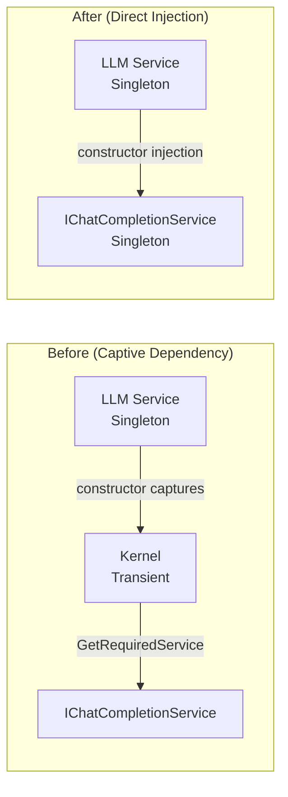
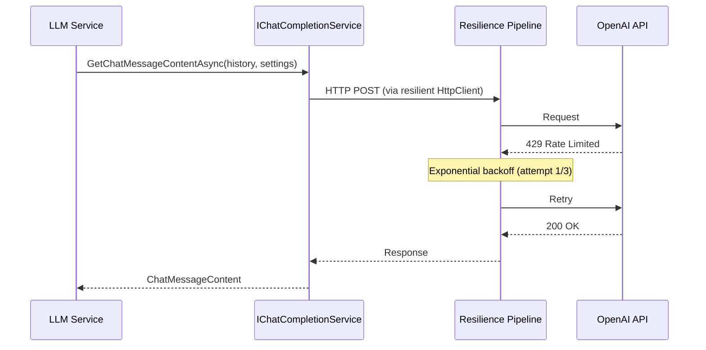
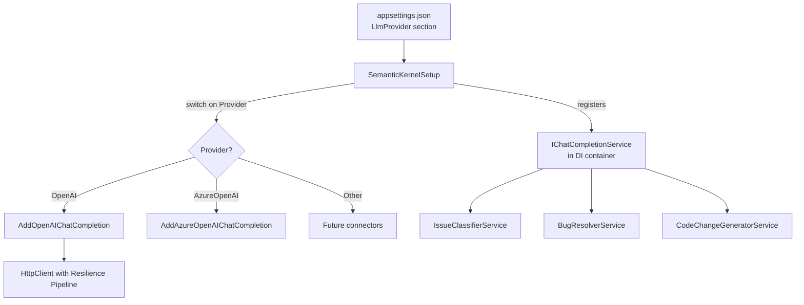
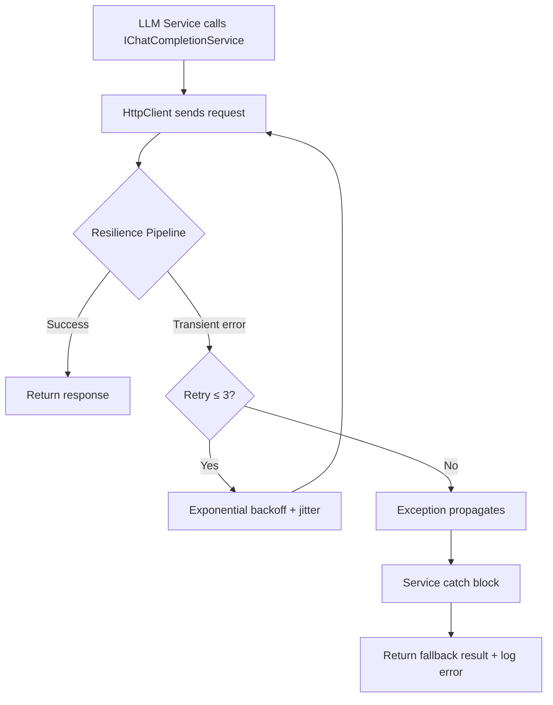

# Design Document: Semantic Kernel Optimization

## Overview

This design addresses five optimization areas in the existing Semantic Kernel integration: fixing the captive dependency antipattern, adding provider-agnostic prompt execution settings, adding HTTP-level retry/resilience, switching from `Kernel` to direct `IChatCompletionService` injection, and abstracting the provider configuration for portability.

### Key Design Decisions

1. **Direct `IChatCompletionService` injection** — LLM services receive `IChatCompletionService` via constructor instead of `Kernel`. This eliminates the captive dependency (Requirement 1) and the service-locator pattern (Requirement 4) in one change.
2. **Singleton LLM services remain singletons** — Since `IChatCompletionService` is registered as singleton (Semantic Kernel's `AddOpenAIChatCompletion` registers it as singleton), the consuming services can safely remain singletons too. No factory or `IServiceProvider` resolution needed.
3. **Provider-agnostic `PromptExecutionSettings` base class only** — All services use the base `PromptExecutionSettings` class with `ExtensionData` for temperature. No `OpenAIPromptExecutionSettings` anywhere in service code.
4. **`Microsoft.Extensions.Http.Resilience` for retry** — Resilience is applied at the `HttpClient` level via the standard .NET resilience pipeline, so all LLM calls benefit without per-service retry code.
5. **`LlmProviderConfiguration` replaces `OpenAIConfiguration`** — A provider-agnostic config model with a `Provider` selector field. The `SemanticKernelSetup` switches on the provider name to register the correct connector.

### What Changes, What Doesn't

| Component | Change |
|-----------|--------|
| `IssueClassifierService` | Constructor takes `IChatCompletionService` + `ILogger`. Adds `PromptExecutionSettings` to LLM call. |
| `BugResolverService` | Same pattern as above. |
| `CodeChangeGeneratorService` | Same pattern as above. |
| `SemanticKernelSetup` | Registers `IChatCompletionService` directly. Adds resilience pipeline to HttpClient. Reads new config model. |
| `InfrastructureServiceExtensions` | Binds `LlmProviderConfiguration` instead of `OpenAIConfiguration`. |
| `OpenAIConfiguration` | Replaced by `LlmProviderConfiguration`. |
| `appsettings.json` | `OpenAI` section becomes `LlmProvider` section with `Provider` field. |
| Domain interfaces | No changes. |
| Unit tests | Simplified — inject `IChatCompletionService` directly, no `Kernel.CreateBuilder()` needed. |

## Architecture

### Before vs After: LLM Service Dependency



### Resilience Pipeline Flow



### DI Registration Flow



## Components and Interfaces

### Modified: LLM Service Constructors

All three services follow the same pattern — `Kernel` parameter replaced with `IChatCompletionService`:

```csharp
// Before
public class IssueClassifierService(Kernel kernel, ILogger<IssueClassifierService> logger) : IIssueClassifier

// After
public class IssueClassifierService(IChatCompletionService chatService, ILogger<IssueClassifierService> logger) : IIssueClassifier
```

The `kernel.GetRequiredService<IChatCompletionService>()` call inside each method body is replaced by using the injected `chatService` directly.

### Modified: LLM Calls with PromptExecutionSettings

Each service defines its own settings as a static field:

```csharp
// IssueClassifierService — low temperature for deterministic classification
private static readonly PromptExecutionSettings Settings = new()
{
    ExtensionData = new Dictionary<string, object> { ["temperature"] = 0.1 }
};

// BugResolverService — low temperature for consistent analysis
private static readonly PromptExecutionSettings Settings = new()
{
    ExtensionData = new Dictionary<string, object> { ["temperature"] = 0.2 }
};

// CodeChangeGeneratorService — moderate temperature for creative code generation
private static readonly PromptExecutionSettings Settings = new()
{
    ExtensionData = new Dictionary<string, object> { ["temperature"] = 0.5 }
};
```

The settings are passed to `GetChatMessageContentAsync`:

```csharp
var response = await chatService.GetChatMessageContentAsync(history, Settings, cancellationToken: ct);
```

### Modified: SemanticKernelSetup

```csharp
public static class SemanticKernelSetup
{
    public static IServiceCollection AddSemanticKernel(
        this IServiceCollection services,
        IConfiguration configuration)
    {
        var config = configuration.GetSection("LlmProvider").Get<LlmProviderConfiguration>()
            ?? new LlmProviderConfiguration();
        var apiKey = Environment.GetEnvironmentVariable("OPENAI_API_KEY") ?? config.ApiKey;

        // Register the chat completion service based on provider
        switch (config.Provider.ToLowerInvariant())
        {
            case "openai":
                services.AddOpenAIChatCompletion(config.ModelName, apiKey);
                break;
            // Future providers added here
            default:
                throw new InvalidOperationException($"Unsupported LLM provider: {config.Provider}");
        }

        // Add resilience pipeline to the HttpClient used by Semantic Kernel
        services.ConfigureHttpClientDefaults(builder =>
        {
            builder.AddStandardResilienceHandler(options =>
            {
                options.Retry.MaxRetryAttempts = 3;
                options.Retry.UseJitter = true;
                options.Retry.BackoffType = DelayBackoffType.Exponential;
            });
        });

        return services;
    }
}
```

### New: LlmProviderConfiguration

```csharp
public class LlmProviderConfiguration
{
    public string Provider { get; set; } = "OpenAI";
    public string ModelName { get; set; } = "gpt-4o-mini";
    public string ApiKey { get; set; } = "";
    public string? Endpoint { get; set; }
}
```

### Modified: InfrastructureServiceExtensions

```csharp
public static IServiceCollection AddInfrastructure(
    this IServiceCollection services,
    IConfiguration configuration)
{
    services.Configure<LlmProviderConfiguration>(configuration.GetSection("LlmProvider"));
    services.Configure<WorkflowConfiguration>(configuration.GetSection("Workflow"));

    services.AddSemanticKernel(configuration);

    services.AddSingleton<IIssueClassifier, IssueClassifierService>();
    services.AddSingleton<IBugResolver, BugResolverService>();
    services.AddSingleton<ICodeChangeGenerator, CodeChangeGeneratorService>();
    services.AddSingleton<IWorkflowStateTracker, WorkflowStateTracker>();

    return services;
}
```

### Modified: appsettings.json

```json
{
  "LlmProvider": {
    "Provider": "OpenAI",
    "ModelName": "gpt-4o-mini"
  }
}
```

### Modified: Unit Test Pattern

```csharp
// Before — required building a Kernel
private static IssueClassifierService CreateSut(IChatCompletionService chatService)
{
    var builder = Kernel.CreateBuilder();
    builder.Services.AddSingleton(chatService);
    return new IssueClassifierService(builder.Build(), NullLogger<IssueClassifierService>.Instance);
}

// After — direct injection
private static IssueClassifierService CreateSut(IChatCompletionService chatService) =>
    new(chatService, NullLogger<IssueClassifierService>.Instance);
```

## Data Models

### New: LlmProviderConfiguration

| Property | Type | Default | Description |
|----------|------|---------|-------------|
| `Provider` | `string` | `"OpenAI"` | Provider selector: `"OpenAI"`, `"AzureOpenAI"`, `"Ollama"`, etc. |
| `ModelName` | `string` | `"gpt-4o-mini"` | Model identifier for the selected provider |
| `ApiKey` | `string` | `""` | API key (overridden by `OPENAI_API_KEY` env var for OpenAI) |
| `Endpoint` | `string?` | `null` | Optional endpoint URL (required for Azure OpenAI, Ollama) |

### Removed: OpenAIConfiguration

The `OpenAIConfiguration` class is replaced entirely by `LlmProviderConfiguration`. The `OpenAI` config section in `appsettings.json` is renamed to `LlmProvider`.

### Unchanged

All domain entities, value objects, enums, and interfaces remain unchanged. The `WorkflowConfiguration`, `TeamConfiguration`, and `AgentRoleConfiguration` classes are unaffected.


## Correctness Properties

*A property is a characteristic or behavior that should hold true across all valid executions of a system — essentially, a formal statement about what the system should do. Properties serve as the bridge between human-readable specifications and machine-verifiable correctness guarantees.*

### Property 1: Deterministic services use low temperature

*For any* call to `IssueClassifierService.ClassifyAsync` or `BugResolverService.ResolveAsync` with any valid input, the `PromptExecutionSettings` passed to `IChatCompletionService.GetChatMessageContentsAsync` shall have a temperature value in the range [0.0, 0.3].

**Validates: Requirements 2.1, 2.2**

### Property 2: Creative service uses moderate temperature

*For any* call to `CodeChangeGeneratorService.GenerateAsync` with any valid input, the `PromptExecutionSettings` passed to `IChatCompletionService.GetChatMessageContentsAsync` shall have a temperature value in the range [0.3, 0.7].

**Validates: Requirements 2.3**

### Property 3: LLM service fallback on exception

*For any* LLM service (`IssueClassifierService`, `BugResolverService`, `CodeChangeGeneratorService`) and any valid input, if the `IChatCompletionService` throws an exception, the service shall return a well-formed fallback result (not throw) with appropriate fallback values.

**Validates: Requirements 3.5, 4.5**

### Property 4: Behavioral equivalence — classification

*For any* valid `IssueRecord` and any JSON response string that the LLM might return, the refactored `IssueClassifierService` (taking `IChatCompletionService` directly) shall produce the same `ClassificationResult` as the original implementation (taking `Kernel`).

**Validates: Requirements 1.3, 4.5**

### Property 5: Behavioral equivalence — bug resolution

*For any* valid `IssueRecord`, `AgentAssignment`, and any JSON response string, the refactored `BugResolverService` shall produce the same `ResolutionReport` as the original implementation.

**Validates: Requirements 1.3, 4.5**

### Property 6: Behavioral equivalence — code change generation

*For any* valid `ResolutionReport` and any JSON response string, the refactored `CodeChangeGeneratorService` shall produce a `PullRequest` with the same title, description, affected files, and issue ID linkage as the original implementation.

**Validates: Requirements 1.3, 4.5**

### Property 7: Provider configuration round trip

*For any* valid `LlmProviderConfiguration` instance, serializing it to JSON and deserializing it back shall produce an equivalent configuration object with the same Provider, ModelName, ApiKey, and Endpoint values.

**Validates: Requirements 5.1**

### Property 8: Unsupported provider rejection

*For any* provider string that is not in the set of supported providers (currently `{"openai"}`), calling `AddSemanticKernel` shall throw an `InvalidOperationException`.

**Validates: Requirements 5.2, 5.6**

## Error Handling

### Strategy

The error handling strategy is unchanged from the existing implementation. The optimization adds a resilience layer *before* the existing error handling:

1. **Transient LLM failures** (429, 5xx, network timeout) — Handled by the `Microsoft.Extensions.Http.Resilience` pipeline at the HttpClient level. Up to 3 retries with exponential backoff + jitter. Each retry logged at Warning level.
2. **Exhausted retries** — After 3 failed attempts, the exception propagates to the LLM service's existing `catch` block, which logs the error and returns a fallback result.
3. **Malformed LLM responses** — Unchanged. Each service's `Parse*Response` method catches JSON parse failures and returns a fallback.
4. **Configuration errors** — Unsupported provider name in `LlmProviderConfiguration.Provider` throws `InvalidOperationException` at startup (fail-fast).

### Error Flow with Resilience



### Specific Error Scenarios

| Scenario | Handler | Outcome |
|----------|---------|---------|
| HTTP 429 rate limit | Resilience pipeline retries (up to 3) | Transparent retry, service unaware |
| HTTP 5xx server error | Resilience pipeline retries (up to 3) | Transparent retry, service unaware |
| Network timeout | Resilience pipeline retries (up to 3) | Transparent retry, service unaware |
| All retries exhausted | Service catch block | Log error, return fallback result |
| Malformed JSON response | Service parse method | Return fallback result |
| Unsupported provider in config | `SemanticKernelSetup` | `InvalidOperationException` at startup |

## Testing Strategy

### Dual Testing Approach

- **Unit tests** (xUnit): Verify specific examples, edge cases, error conditions, DI registration correctness
- **Property-based tests** (FsCheck with xUnit): Verify universal properties across generated inputs

### Property-Based Testing Configuration

- **Library**: FsCheck (via `FsCheck.Xunit` NuGet package)
- **Minimum iterations**: 100 per property test
- **Each property test must reference its design document property** using the tag format:
  `// Feature: semantic-kernel-optimization, Property {number}: {property_text}`
- **Each correctness property is implemented by a single property-based test**

### Test Organization

Property tests go in the existing `tests/AiSupportWorkflow.PropertyTests/` project. Unit tests go in `tests/AiSupportWorkflow.UnitTests/`.

### Property Test Mapping

| Property | Test Location | Description |
|----------|---------------|-------------|
| Property 1 | PropertyTests | Deterministic services pass temperature in [0.0, 0.3] |
| Property 2 | PropertyTests | Creative service passes temperature in [0.3, 0.7] |
| Property 3 | PropertyTests | All LLM services return fallback on exception |
| Property 4 | PropertyTests | Classification output matches expected for any valid JSON |
| Property 5 | PropertyTests | Resolution output matches expected for any valid JSON |
| Property 6 | PropertyTests | Code generation output matches expected for any valid JSON |
| Property 7 | PropertyTests | LlmProviderConfiguration serialization round trip |
| Property 8 | PropertyTests | Unsupported provider throws InvalidOperationException |

### Unit Test Focus Areas

- **DI registration**: Verify `AddInfrastructure` registers all interfaces and `IChatCompletionService` is resolvable
- **Resilience configuration**: Verify retry settings (max 3 attempts, exponential backoff) are applied
- **Existing tests updated**: All three test classes (`IssueClassifierTests`, `BugResolverTests`, `CodeChangeGeneratorTests`) updated to inject `IChatCompletionService` directly instead of building a `Kernel`
- **Edge cases**: Empty/malformed JSON responses, null content, boundary temperature values

### Mocking Strategy

- LLM calls mocked via `FakeChatCompletionService` (already exists in test helpers)
- For temperature verification tests: a capturing fake that records the `PromptExecutionSettings` passed to it
- No `Kernel.CreateBuilder()` needed in any test after refactoring

### Required Package Additions

| Package | Project | Purpose |
|---------|---------|---------|
| `Microsoft.Extensions.Http.Resilience` | Infrastructure | HttpClient resilience pipeline |

No new test packages needed — FsCheck.Xunit and NSubstitute are already available.
