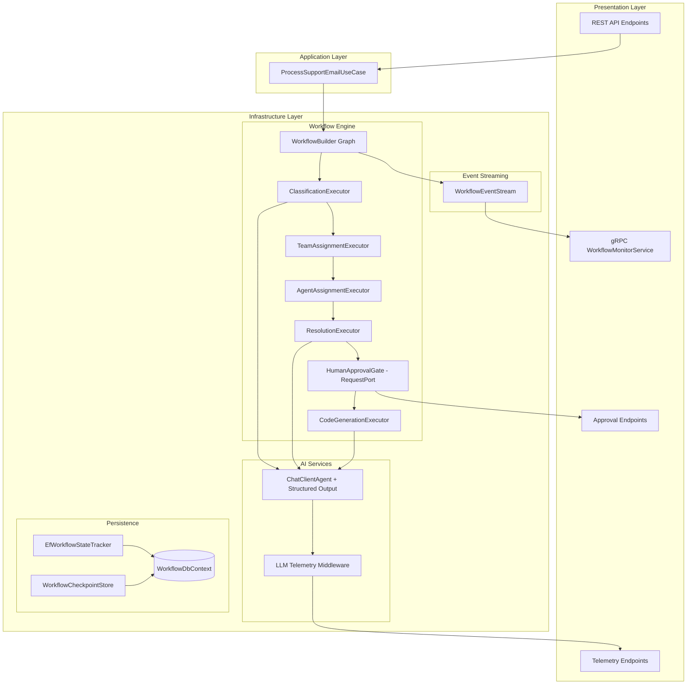
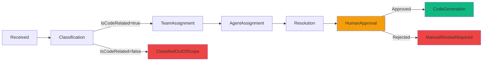
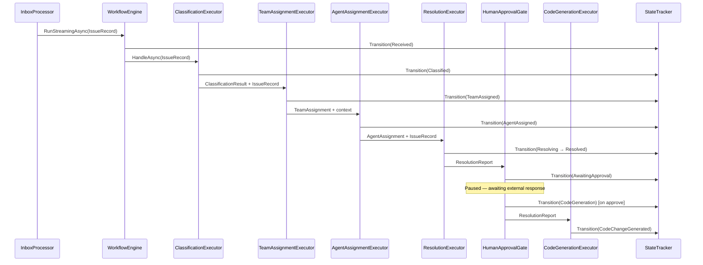

# Design Document: Workflow Engine Migration

## Overview

This design describes the migration from Akka.NET actors (`SupervisorActor`, `AIAgentActor`) and the imperative `Orchestrator` class to Microsoft Agent Framework Workflows. The new architecture uses `WorkflowBuilder` to define a declarative directed graph of `Executor` nodes connected by `Edge` definitions, replacing the linear imperative pipeline with a composable, event-driven workflow engine.

Key architectural changes:
- **Orchestration**: Akka.NET actor hierarchy → WorkflowBuilder graph with typed Executors
- **LLM interaction**: Manual JSON prompt/parse → `ChatClientAgent` with structured output schemas
- **Human approval**: Not present → `RequestPort`-based Human-in-the-Loop gate
- **Real-time events**: Custom `WorkflowUpdateChannel` → Native `WorkflowEvent` stream bridged to gRPC
- **Telemetry**: Not present → `IChatClient` delegating middleware capturing token usage and latency
- **State persistence**: In-memory only → EF Core persisted workflow checkpoints for paused workflows

The migration preserves all existing API contracts, gRPC streaming behavior, and domain model semantics.

## Architecture

### High-Level Architecture Diagram



### Workflow Graph Structure



### Data Flow Between Executors



## Components and Interfaces

### 1. WorkflowBuilder Graph Definition

The workflow graph is constructed in a dedicated factory class registered as a singleton:

```csharp
internal sealed class SupportWorkflowFactory(
    ClassificationExecutor classificationExecutor,
    TeamAssignmentExecutor teamAssignmentExecutor,
    AgentAssignmentExecutor agentAssignmentExecutor,
    ResolutionExecutor resolutionExecutor,
    CodeGenerationExecutor codeGenerationExecutor,
    RequestPort<ResolutionReport, ApprovalDecision> approvalPort)
{
    public Workflow Build()
    {
        var builder = new WorkflowBuilder(classificationExecutor);

        // Main flow
        builder.AddEdge(classificationExecutor, teamAssignmentExecutor,
            condition: msg => msg is ClassificationResult { IsCodeRelated: true });
        builder.AddEdge(teamAssignmentExecutor, agentAssignmentExecutor);
        builder.AddEdge(agentAssignmentExecutor, resolutionExecutor);
        builder.AddEdge(resolutionExecutor, approvalPort);
        builder.AddEdge(approvalPort, codeGenerationExecutor,
            condition: msg => msg is ApprovalDecision { Approved: true });

        // Terminal output
        builder.WithOutputFrom(codeGenerationExecutor);

        return builder.Build();
    }
}
```

### 2. Executor Implementations

#### ClassificationExecutor

Replaces `IssueClassifierService` manual JSON parsing with `ChatClientAgent` structured output.

```csharp
internal sealed partial class ClassificationExecutor(
    ChatClientAgent classificationAgent,
    IWorkflowStateTracker stateTracker) : Executor("ClassificationExecutor")
{
    [MessageHandler]
    private async ValueTask<ClassificationResult> HandleAsync(
        IssueRecord issue, IWorkflowContext context, CancellationToken ct)
    {
        await stateTracker.TransitionAsync(issue.Id, WorkflowStage.Received, subject: issue.Subject);

        var result = await classificationAgent.GetStructuredResponseAsync<ClassificationResult>(
            $"Subject: {issue.Subject}\n\nBody: {issue.Body}", ct);

        if (!result.IsCodeRelated)
        {
            await stateTracker.TransitionAsync(issue.Id, WorkflowStage.ClassifiedOutOfScope, result.Reasoning);
            await context.YieldOutputAsync(WorkflowResult.OutOfScope(issue.Id), ct);
            return result; // Edge condition prevents further traversal
        }

        await stateTracker.TransitionAsync(issue.Id, WorkflowStage.Classified,
            $"{result.Category} ({result.ConfidenceScore:P0})");

        // Store issue in workflow state for downstream executors
        await context.QueueStateUpdateAsync(issue.Id.ToString(), issue, scopeName: "Issues", ct);
        return result;
    }
}
```

#### TeamAssignmentExecutor

Wraps the existing deterministic `TeamRouter.Route` logic (no LLM call).

```csharp
internal sealed partial class TeamAssignmentExecutor(
    ITeamRouter teamRouter,
    IWorkflowStateTracker stateTracker) : Executor("TeamAssignmentExecutor")
{
    [MessageHandler]
    private async ValueTask<TeamAssignment> HandleAsync(
        ClassificationResult classification, IWorkflowContext context, CancellationToken ct)
    {
        var issueId = await context.ReadStateAsync<Guid>("CurrentIssueId", scopeName: "Workflow", ct);
        var issue = await context.ReadStateAsync<IssueRecord>(issueId.ToString(), scopeName: "Issues", ct)
            ?? throw new InvalidOperationException("Issue not found in workflow state");

        var teamResult = teamRouter.Route(issue, classification);
        if (!teamResult.IsSuccess)
            throw new InvalidOperationException(teamResult.Error!);

        await stateTracker.TransitionAsync(issueId, WorkflowStage.TeamAssigned, teamResult.Value!.TeamName);
        return teamResult.Value!;
    }
}
```

#### AgentAssignmentExecutor

Wraps the existing deterministic `AgentSelector.Select` logic.

```csharp
internal sealed partial class AgentAssignmentExecutor(
    IAgentSelector agentSelector,
    IWorkflowStateTracker stateTracker) : Executor("AgentAssignmentExecutor")
{
    [MessageHandler]
    private async ValueTask<AgentAssignment> HandleAsync(
        TeamAssignment team, IWorkflowContext context, CancellationToken ct)
    {
        var classification = await context.ReadStateAsync<ClassificationResult>(
            "LatestClassification", scopeName: "Workflow", ct)
            ?? throw new InvalidOperationException("Classification not found");

        var agent = agentSelector.Select(team, classification.Category);
        var issueId = await context.ReadStateAsync<Guid>("CurrentIssueId", scopeName: "Workflow", ct);
        await stateTracker.TransitionAsync(issueId, WorkflowStage.AgentAssigned, agent.AgentId);
        return agent;
    }
}
```

#### ResolutionExecutor

Replaces `BugResolverService` manual JSON parsing with `ChatClientAgent` structured output.

```csharp
internal sealed partial class ResolutionExecutor(
    ChatClientAgent resolutionAgent,
    IWorkflowStateTracker stateTracker) : Executor("ResolutionExecutor")
{
    [MessageHandler]
    private async ValueTask<ResolutionReport> HandleAsync(
        AgentAssignment agent, IWorkflowContext context, CancellationToken ct)
    {
        var issueId = await context.ReadStateAsync<Guid>("CurrentIssueId", scopeName: "Workflow", ct);
        var issue = await context.ReadStateAsync<IssueRecord>(issueId.ToString(), scopeName: "Issues", ct)
            ?? throw new InvalidOperationException("Issue not found");

        await stateTracker.TransitionAsync(issueId, WorkflowStage.Resolving);

        var report = await resolutionAgent.GetStructuredResponseAsync<ResolutionReport>(
            $"Agent: {agent.AgentId} ({agent.Role})\nSubject: {issue.Subject}\n\nBody: {issue.Body}", ct);

        await stateTracker.TransitionAsync(issueId, WorkflowStage.Resolved, report.ProposedFixSummary);
        return report;
    }
}
```

#### HumanApprovalGate (RequestPort)

Uses the framework's `RequestPort` mechanism to pause execution and wait for external approval.

```csharp
// The RequestPort is created as a typed communication channel
var approvalPort = RequestPort.Create<ResolutionReport, ApprovalDecision>("HumanApprovalGate");
```

The `ApprovalDecision` type:

```csharp
public record ApprovalDecision(bool Approved, string? Reason = null);
```

When the workflow reaches the `RequestPort`, it emits a `RequestInfoEvent` containing the `ResolutionReport`. The workflow pauses until an external system (the approval API endpoint) sends back an `ApprovalDecision`.

#### CodeGenerationExecutor

Replaces `CodeChangeGeneratorService` manual JSON parsing with `ChatClientAgent` structured output.

```csharp
internal sealed partial class CodeGenerationExecutor(
    ChatClientAgent codeGenAgent,
    IWorkflowStateTracker stateTracker) : Executor("CodeGenerationExecutor")
{
    [MessageHandler]
    private async ValueTask HandleAsync(
        ApprovalDecision approval, IWorkflowContext context, CancellationToken ct)
    {
        var issueId = await context.ReadStateAsync<Guid>("CurrentIssueId", scopeName: "Workflow", ct);
        var report = await context.ReadStateAsync<ResolutionReport>(
            "LatestResolution", scopeName: "Workflow", ct)
            ?? throw new InvalidOperationException("Resolution not found");

        var pullRequest = await codeGenAgent.GetStructuredResponseAsync<PullRequest>(
            BuildCodeGenPrompt(report), ct);

        await stateTracker.TransitionAsync(issueId, WorkflowStage.CodeChangeGenerated, pullRequest.Title);
        await context.YieldOutputAsync(WorkflowResult.Completed(issueId, pullRequest), ct);
    }

    private static string BuildCodeGenPrompt(ResolutionReport report) =>
        $"""
        Issue ID: {report.IssueId}
        Root Cause: {report.RootCauseDescription}
        Affected Component: {report.AffectedComponent}
        Severity: {report.SeverityAssessment}
        Proposed Fix: {report.ProposedFixSummary}
        """;
}
```

### 3. ChatClientAgent with Structured Output

Each LLM-backed executor uses a `ChatClientAgent` configured with a structured output schema. This eliminates manual JSON parsing and provides type-safe responses.

```csharp
internal static class ChatClientAgentFactory
{
    public static ChatClientAgent CreateClassificationAgent(IChatClient chatClient) =>
        new ChatClientAgentBuilder(chatClient)
            .WithSystemPrompt(ClassificationPrompts.System)
            .WithStructuredOutput<ClassificationResult>()
            .WithOptions(new ChatOptions { Temperature = 0.1f })
            .Build();

    public static ChatClientAgent CreateResolutionAgent(IChatClient chatClient) =>
        new ChatClientAgentBuilder(chatClient)
            .WithSystemPrompt(ResolutionPrompts.System)
            .WithStructuredOutput<ResolutionReport>()
            .WithOptions(new ChatOptions { Temperature = 0.2f })
            .Build();

    public static ChatClientAgent CreateCodeGenAgent(IChatClient chatClient) =>
        new ChatClientAgentBuilder(chatClient)
            .WithSystemPrompt(CodeGenPrompts.System)
            .WithStructuredOutput<PullRequest>()
            .WithOptions(new ChatOptions { Temperature = 0.5f })
            .Build();
}
```

### 4. LLM Telemetry Middleware

A delegating handler that wraps `IChatClient` to capture request/response metadata.

```csharp
internal sealed class LlmTelemetryMiddleware(
    IChatClient innerClient,
    ILogger<LlmTelemetryMiddleware> logger,
    LlmTelemetryStore telemetryStore) : DelegatingChatClient(innerClient)
{
    public override async Task<ChatResponse> GetResponseAsync(
        IEnumerable<ChatMessage> messages,
        ChatOptions? options = null,
        CancellationToken ct = default)
    {
        var stopwatch = Stopwatch.StartNew();
        try
        {
            var response = await base.GetResponseAsync(messages, options, ct);
            stopwatch.Stop();

            var entry = new LlmCallEntry(
                ModelName: response.ModelId ?? options?.ModelId ?? "unknown",
                PromptTokens: response.Usage?.InputTokenCount ?? 0,
                CompletionTokens: response.Usage?.OutputTokenCount ?? 0,
                LatencyMs: stopwatch.ElapsedMilliseconds,
                Success: true,
                Timestamp: DateTimeOffset.UtcNow);

            telemetryStore.Record(entry);
            logger.LogInformation(
                "LLM call: Model={Model}, PromptTokens={Prompt}, CompletionTokens={Completion}, Latency={Latency}ms",
                entry.ModelName, entry.PromptTokens, entry.CompletionTokens, entry.LatencyMs);

            return response;
        }
        catch (Exception ex)
        {
            stopwatch.Stop();
            var entry = new LlmCallEntry(
                ModelName: options?.ModelId ?? "unknown",
                PromptTokens: 0, CompletionTokens: 0,
                LatencyMs: stopwatch.ElapsedMilliseconds,
                Success: false,
                Timestamp: DateTimeOffset.UtcNow,
                ErrorMessage: ex.Message);

            telemetryStore.Record(entry);
            logger.LogError(ex, "LLM call failed: Latency={Latency}ms", stopwatch.ElapsedMilliseconds);
            throw;
        }
    }
}
```

### 5. Workflow Event Bridge to gRPC

Native `WorkflowEvent` instances are bridged to the existing gRPC streaming infrastructure, replacing the custom `WorkflowUpdateChannel`.

```csharp
internal sealed class WorkflowEventBridge(WorkflowUpdateChannel updateChannel)
{
    public async Task BridgeEventsAsync(StreamingRun run, CancellationToken ct)
    {
        await foreach (var evt in run.WatchStreamAsync().WithCancellation(ct))
        {
            if (evt is ExecutorCompletedEvent completed)
            {
                // The StateTracker already writes to the channel on each transition.
                // This bridge handles any additional workflow-level events.
            }

            if (evt is WorkflowOutputEvent output && output.Data is WorkflowResult result)
            {
                // Terminal event — no additional action needed since StateTracker handles it.
            }

            if (evt is RequestInfoEvent requestInfo)
            {
                // Human approval requested — emit AwaitingApproval state
                // Already handled by the executor calling StateTracker
            }
        }
    }
}
```

**Design Decision**: The `EfWorkflowStateTracker` remains the single source of truth for gRPC streaming. Each executor calls `stateTracker.TransitionAsync()` which writes to the `WorkflowUpdateChannel`. The native workflow events are used for internal orchestration (error handling, completion detection) but do not replace the existing dual-write mechanism. This preserves the gRPC contract without changes.

### 6. Approval API Endpoints

```csharp
internal sealed class ApprovalEndpoints : IEndpoint
{
    public void MapEndpoint(IEndpointRouteBuilder app)
    {
        var group = app.MapGroup("/api/support/approvals").WithTags("Human Approval");

        group.MapGet("/pending", async (WorkflowApprovalService approvalService, CancellationToken ct) =>
        {
            var pending = await approvalService.GetPendingApprovalsAsync(ct);
            return Results.Ok(pending);
        });

        group.MapPost("/{issueId:guid}/approve", async (
            Guid issueId, WorkflowApprovalService approvalService, CancellationToken ct) =>
        {
            await approvalService.ApproveAsync(issueId, ct);
            return Results.NoContent();
        });

        group.MapPost("/{issueId:guid}/reject", async (
            Guid issueId, RejectRequest request,
            WorkflowApprovalService approvalService, CancellationToken ct) =>
        {
            await approvalService.RejectAsync(issueId, request.Reason, ct);
            return Results.NoContent();
        });
    }
}

public record RejectRequest(string? Reason);
```

### 7. Telemetry API Endpoints

```csharp
internal sealed class TelemetryEndpoints : IEndpoint
{
    public void MapEndpoint(IEndpointRouteBuilder app)
    {
        var group = app.MapGroup("/api/support").WithTags("Telemetry");

        group.MapGet("/agents/{agentId}/telemetry", (
            string agentId, LlmTelemetryStore store) =>
        {
            var telemetry = store.GetAgentTelemetry(agentId);
            return Results.Ok(telemetry);
        });

        group.MapGet("/telemetry/summary", (LlmTelemetryStore store) =>
        {
            var summary = store.GetGlobalSummary();
            return Results.Ok(summary);
        });
    }
}
```

### 8. DI Registration — AddWorkflowEngine()

```csharp
public static class WorkflowEngineServiceExtensions
{
    public static IServiceCollection AddWorkflowEngine(
        this IServiceCollection services, IConfiguration configuration)
    {
        services.Configure<WorkflowConfiguration>(configuration.GetSection("Workflow"));

        // LLM Telemetry
        services.AddSingleton<LlmTelemetryStore>();
        services.Decorate<IChatClient, LlmTelemetryMiddleware>();

        // ChatClientAgents (structured output)
        services.AddSingleton(sp =>
            ChatClientAgentFactory.CreateClassificationAgent(sp.GetRequiredService<IChatClient>()));
        services.AddKeyedSingleton("Resolution", (sp, _) =>
            ChatClientAgentFactory.CreateResolutionAgent(sp.GetRequiredService<IChatClient>()));
        services.AddKeyedSingleton("CodeGen", (sp, _) =>
            ChatClientAgentFactory.CreateCodeGenAgent(sp.GetRequiredService<IChatClient>()));

        // Executors
        services.AddSingleton<ClassificationExecutor>();
        services.AddSingleton<TeamAssignmentExecutor>();
        services.AddSingleton<AgentAssignmentExecutor>();
        services.AddSingleton<ResolutionExecutor>();
        services.AddSingleton<CodeGenerationExecutor>();

        // RequestPort for Human Approval
        services.AddSingleton(RequestPort.Create<ResolutionReport, ApprovalDecision>("HumanApprovalGate"));

        // Workflow Factory
        services.AddSingleton<SupportWorkflowFactory>();
        services.AddSingleton(sp => sp.GetRequiredService<SupportWorkflowFactory>().Build());

        // Approval Service
        services.AddScoped<WorkflowApprovalService>();

        // Workflow State Persistence
        services.AddSingleton<WorkflowCheckpointStore>();

        // Reuse existing services
        // ITeamRouter, IAgentSelector, IWorkflowStateTracker remain registered as before

        return services;
    }
}
```

### 9. Frontend Components

#### Approval Page Component

```typescript
// dashboard/src/pages/ApprovalsPage.tsx
interface PendingApproval {
  issueId: string;
  subject: string;
  resolutionSummary: string;
  rootCause: string;
  affectedComponent: string;
  severity: string;
  proposedFix: string;
  waitingSince: string; // ISO 8601
}
```

#### Telemetry Display on Agents Page

```typescript
// dashboard/src/types/index.ts (additions)
interface AgentTelemetry {
  agentId: string;
  totalPromptTokens: number;
  totalCompletionTokens: number;
  totalCalls: number;
  averageLatencyMs: number;
  lastCall: LlmCallDetail | null;
}

interface LlmCallDetail {
  modelName: string;
  promptTokens: number;
  completionTokens: number;
  latencyMs: number;
  success: boolean;
  timestamp: string;
}

interface TelemetrySummary {
  totalTokens: number;
  totalCalls: number;
  averageLatencyMs: number;
  errorRate: number;
}
```

## Data Models

### New Domain Types

```csharp
// Domain/Enums/WorkflowStage.cs — add new value
public enum WorkflowStage
{
    Received,
    Classified,
    ClassifiedOutOfScope,
    TeamAssigned,
    AgentAssigned,
    Resolving,
    Resolved,
    AwaitingApproval,      // NEW
    CodeChangeGenerated,
    Failed,
    ManualReviewRequired
}

// Domain/ValueObjects/ApprovalDecision.cs — NEW
public record ApprovalDecision(bool Approved, string? Reason = null);
```

### New Persistence Entities

```csharp
// Infrastructure/Persistence/Entities/WorkflowCheckpoint.cs — NEW
public class WorkflowCheckpoint
{
    public Guid Id { get; set; }
    public Guid IssueId { get; set; }
    public string ExecutorId { get; set; } = "";
    public string SerializedState { get; set; } = "";  // JSON
    public DateTimeOffset PausedAt { get; set; }
    public DateTimeOffset? ResumedAt { get; set; }
    public bool IsActive { get; set; }
}

// Infrastructure/Persistence/Entities/LlmCallRecord.cs — NEW
public class LlmCallRecord
{
    public Guid Id { get; set; }
    public string AgentId { get; set; } = "";
    public string ModelName { get; set; } = "";
    public int PromptTokens { get; set; }
    public int CompletionTokens { get; set; }
    public long LatencyMs { get; set; }
    public bool Success { get; set; }
    public string? ErrorMessage { get; set; }
    public DateTimeOffset Timestamp { get; set; }
}
```

### LLM Telemetry In-Memory Store

```csharp
public record LlmCallEntry(
    string ModelName,
    int PromptTokens,
    int CompletionTokens,
    long LatencyMs,
    bool Success,
    DateTimeOffset Timestamp,
    string? ErrorMessage = null,
    string? AgentId = null);
```

### Database Schema Changes

The `WorkflowDbContext` gains two new `DbSet` properties:

```csharp
public DbSet<WorkflowCheckpoint> WorkflowCheckpoints { get; set; }
public DbSet<LlmCallRecord> LlmCallRecords { get; set; }
```

### Package Dependency Changes

**Remove:**
- `Akka.NET` (1.5.67)
- `Akka.Hosting` (1.5.67)
- `Akka.TestKit.Xunit2` (1.5.67)

**Add:**
- `Microsoft.Agents.AI.Workflows` (1.3.0)

**Retain:**
- `Microsoft.Agents.AI` (1.3.0)
- `Microsoft.Agents.AI.OpenAI` (1.3.0)
- All other existing packages

### Files to Delete

- `backend/src/AiSupportWorkflow.Infrastructure/Actors/SupervisorActor.cs`
- `backend/src/AiSupportWorkflow.Infrastructure/Actors/AIAgentActor.cs`
- `backend/src/AiSupportWorkflow.Domain/Interfaces/ISupervisorActorBridge.cs`
- `backend/src/AiSupportWorkflow.Domain/Messages/ActorMessages.cs`
- `backend/src/AiSupportWorkflow.Presentation/SupervisorActorBridge.cs` (or equivalent)
- `backend/src/AiSupportWorkflow.Presentation/AgentStatusProvider.cs` (replaced by telemetry-based status)


## Correctness Properties

*A property is a characteristic or behavior that should hold true across all valid executions of a system — essentially, a formal statement about what the system should do. Properties serve as the bridge between human-readable specifications and machine-verifiable correctness guarantees.*

### Property 1: Stage Ordering Invariant

*For any* valid `IncomingEmail` that completes the full workflow successfully (reaching `CodeChangeGenerated`), the recorded state transitions SHALL occur in exactly this order: Received → Classified → TeamAssigned → AgentAssigned → Resolving → Resolved → AwaitingApproval → CodeChangeGenerated.

**Validates: Requirements 1.2, 1.6, 2.6**

### Property 2: Out-of-Scope Conditional Termination

*For any* `ClassificationResult` where `IsCodeRelated` is `false`, the workflow SHALL terminate at `ClassifiedOutOfScope` and no downstream executors (TeamAssignment, AgentAssignment, Resolution, CodeGeneration) SHALL be invoked.

**Validates: Requirements 1.3**

### Property 3: Unhandled Exception Transitions to Failed

*For any* executor in the workflow pipeline, if that executor throws an unhandled exception, the workflow SHALL transition to the `Failed` terminal state and the error detail SHALL contain the exception message.

**Validates: Requirements 1.4, 3.5**

### Property 4: Human Approval Gate Pauses Execution

*For any* successful `ResolutionReport` produced by the Resolution Executor, the workflow SHALL pause at the Human Approval Gate, the state SHALL be recorded as `AwaitingApproval`, and the CodeGeneration Executor SHALL NOT be invoked until an external approval decision is received.

**Validates: Requirements 4.1, 4.6**

### Property 5: Approval Resumes to Code Generation

*For any* workflow paused at the Human Approval Gate, when an `ApprovalDecision` with `Approved = true` is submitted, the workflow SHALL resume and the CodeGeneration Executor SHALL be invoked, producing a `PullRequest` and transitioning to `CodeChangeGenerated`.

**Validates: Requirements 4.3**

### Property 6: Rejection Terminates at ManualReviewRequired

*For any* workflow paused at the Human Approval Gate, when an `ApprovalDecision` with `Approved = false` is submitted, the workflow SHALL transition to the `ManualReviewRequired` terminal state and the CodeGeneration Executor SHALL NOT be invoked.

**Validates: Requirements 4.4**

### Property 7: Workflow Event Completeness

*For any* state transition recorded by the `IWorkflowStateTracker`, the emitted `WorkflowEvent` (delivered via gRPC stream) SHALL contain a non-empty issue ID, the new `WorkflowStage` value, a timestamp no earlier than the previous transition's timestamp, and the detail string.

**Validates: Requirements 5.1, 5.4**

### Property 8: LLM Middleware Telemetry Capture

*For any* LLM call (successful or failed) passing through the `LlmTelemetryMiddleware`, the middleware SHALL record a telemetry entry containing: model name, prompt token count, completion token count, latency in milliseconds, success/failure status, and (on failure) the error message.

**Validates: Requirements 6.1, 6.3**

### Property 9: LLM Middleware Transparency

*For any* request (list of `ChatMessage`) and response (`ChatResponse`) passing through the `LlmTelemetryMiddleware`, the middleware SHALL not alter the request messages sent to the inner client, and SHALL return the exact same response object to the caller.

**Validates: Requirements 6.4**

### Property 10: Behavioral Equivalence with Previous Orchestrator

*For any* valid `IncomingEmail` processed by both the old `Orchestrator` and the new Workflow Engine (with identical mocked LLM responses), the sequence of `WorkflowStage` transitions SHALL be identical, excluding the new `AwaitingApproval` stage inserted between `Resolved` and `CodeChangeGenerated`.

**Validates: Requirements 8.1**

### Property 11: Dual-Write Persistence Invariant

*For any* state transition performed by the workflow, the `IWorkflowStateTracker` SHALL both update the `IssueEntity.CurrentStage` to the new stage AND create a new `StateTransitionEvent` record with the correct `PreviousStage` and `NewStage` values.

**Validates: Requirements 8.2**

### Property 12: Email Validation Preservation

*For any* string pair `(subject, body)` where either is null, empty, or composed entirely of whitespace characters, the workflow SHALL reject the email and not create an `IssueRecord`. For any pair where both are non-empty and non-whitespace, the workflow SHALL accept the email and create an `IssueRecord`.

**Validates: Requirements 8.5**

### Property 13: Deterministic Routing and Agent Selection

*For any* valid `IssueRecord` and `ClassificationResult`, the team routing SHALL produce the same `TeamAssignment` as the existing regex-based logic (matching "Application A" or "Application B" in subject+body), and the agent selection SHALL produce the same `AgentRole` as the existing `IssueCategory`-to-`AgentRole` mapping.

**Validates: Requirements 8.6, 8.7**

### Property 14: Checkpoint Persistence on Pause

*For any* workflow that reaches the Human Approval Gate, the system SHALL persist a `WorkflowCheckpoint` record containing the serialized workflow state, and that serialized state SHALL contain sufficient context (at minimum: `IssueRecord`, `ClassificationResult`, `TeamAssignment`, `AgentAssignment`, `ResolutionReport`) to resume execution without re-running completed executors.

**Validates: Requirements 9.1, 9.3**

### Property 15: Corrupted Checkpoint Recovery

*For any* `WorkflowCheckpoint` with corrupted or unparseable `SerializedState`, when the system attempts to resume the workflow, it SHALL transition the workflow to the `Failed` state with an error detail describing the corruption.

**Validates: Requirements 9.4**

### Property 16: Cost Estimate Calculation

*For any* non-negative token count and non-negative rate per 1K tokens, the displayed cost estimate SHALL equal `(totalTokens / 1000.0) * ratePerThousand`, rounded to two decimal places.

**Validates: Requirements 10.6**

## Error Handling

### Executor-Level Errors

Each executor follows a consistent error handling pattern:

1. **ChatClientAgent failures** (network timeout, invalid response, rate limiting): The executor allows the exception to propagate. The workflow engine catches unhandled exceptions and transitions to `Failed` with the error message recorded in the state detail.

2. **Deterministic logic failures** (team routing ambiguity, missing configuration): The executor throws `InvalidOperationException` with a descriptive message. Same transition to `Failed`.

3. **State corruption**: If workflow state reads return null for required data, the executor throws `InvalidOperationException`. The workflow transitions to `Failed`.

### Workflow-Level Error Handling

```csharp
// The workflow execution wrapper in the new IOrchestrator implementation
try
{
    await using var run = await InProcessExecution.RunStreamingAsync(workflow, issue);
    await foreach (var evt in run.WatchStreamAsync().WithCancellation(ct))
    {
        // Process events...
    }
}
catch (Exception ex)
{
    await stateTracker.TransitionAsync(issueId, WorkflowStage.Failed, ex.Message);
    return WorkflowResult.Failed(issueId, ex.Message);
}
```

### Human Approval Gate Errors

- **Approval for non-existent workflow**: Returns HTTP 404.
- **Approval for workflow not in AwaitingApproval state**: Returns HTTP 409 Conflict.
- **Checkpoint deserialization failure on resume**: Transitions to `Failed` (Property 15).

### LLM Middleware Error Handling

The middleware captures error telemetry but always re-throws the original exception unchanged, ensuring downstream error handling (executor → workflow → Failed state) is not disrupted.

### Recovery Strategy

- **Paused workflows**: Persisted via `WorkflowCheckpoint`. On application restart, a hosted service scans for active checkpoints and resumes them.
- **Failed workflows**: Terminal state. No automatic retry. Manual intervention required (resubmit the email).
- **Transient LLM failures**: Handled by the existing Polly resilience pipeline (3 retries with exponential backoff + jitter) configured in `ChatClientSetup`.

## Testing Strategy

### Property-Based Tests (FsCheck — .NET)

Property-based tests validate the correctness properties defined above. Each test runs a minimum of **100 iterations** with randomly generated inputs.

**Library**: FsCheck.Xunit 3.3.3 (already in the project)

**Test structure**:
- One test method per correctness property
- Each test tagged with: `// Feature: workflow-engine-migration, Property {N}: {title}`
- Generators for domain types: `IssueRecord`, `ClassificationResult`, `ResolutionReport`, `IncomingEmail`, `WorkflowConfiguration`
- Mocked `IChatClient` returns deterministic structured responses based on input

**Key generators needed**:
- `Arb<IncomingEmail>` — random sender, subject (with/without "Application A/B"), body
- `Arb<ClassificationResult>` — random category, confidence, reasoning, IsCodeRelated
- `Arb<ResolutionReport>` — random root cause, component, severity, fix summary
- `Arb<WorkflowConfiguration>` — random team/agent configurations

### Property-Based Tests (fast-check — Frontend)

**Library**: fast-check (already in the project)

**Frontend properties to test**:
- Property 16 (cost estimate calculation)
- Property 7 (event completeness — verify TypeScript types enforce required fields)
- AwaitingApproval node color logic (Property 12.2 from requirements)

### Unit Tests (xUnit + NSubstitute)

Unit tests cover specific examples, edge cases, and integration points:

- **Each executor**: Happy path with mocked ChatClientAgent, error path with throwing mock
- **TeamAssignmentExecutor**: Specific routing examples ("Application A" → Team A, ambiguous → error)
- **AgentAssignmentExecutor**: Each IssueCategory → AgentRole mapping
- **LlmTelemetryMiddleware**: Specific token counts, specific error types
- **WorkflowApprovalService**: Approve/reject specific workflows, non-existent workflow
- **WorkflowCheckpointStore**: Persist, retrieve, resume, corrupted state
- **API endpoints**: HTTP status codes, response shapes

### Integration Tests

- Full workflow execution with in-memory database and mocked LLM
- gRPC streaming with multiple subscribers
- Application restart and checkpoint resume
- Approval API → workflow resume → CodeGeneration completion

### Test Configuration

```csharp
// Property test example structure
[Property(MaxTest = 100)]
// Feature: workflow-engine-migration, Property 12: Email Validation Preservation
public Property EmailValidation_RejectsWhitespaceOnly(NonEmptyString sender)
{
    return Prop.ForAll(
        Arb.From<string>().Filter(s => string.IsNullOrWhiteSpace(s)),
        whitespaceSubject =>
        {
            var email = new IncomingEmail(sender.Get, whitespaceSubject, "valid body");
            var result = emailProcessor.Process(email);
            return (!result.IsSuccess).Label("whitespace subject should be rejected");
        });
}
```

### Frontend Test Configuration

```typescript
// fast-check property test example
import { fc, test } from '@fast-check/vitest';

// Feature: workflow-engine-migration, Property 16: Cost Estimate Calculation
test.prop([fc.nat(), fc.double({ min: 0, max: 1, noNaN: true })])(
  'cost estimate equals tokens/1000 * rate',
  (tokens, rate) => {
    const expected = Math.round((tokens / 1000) * rate * 100) / 100;
    expect(calculateCost(tokens, rate)).toBeCloseTo(expected, 2);
  }
);
```
