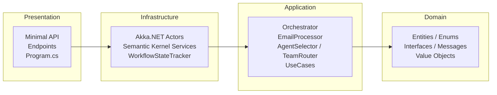
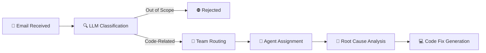

# AI Support Workflow

**A spec-driven AI experiment — built entirely by AI using [Kiro](https://kiro.dev).**

An AI-driven technical support workflow built with .NET 10. This project simulates the full lifecycle of a support request — from email intake to automated code fix generation — using LLM-powered agents orchestrated through an actor-based architecture.

> **Note:** This entire codebase was generated by AI as a spec-driven development experiment. Nothing was manually written, reviewed, or audited. Use at your own risk.

---

## What It Does

The system automates technical support by processing incoming emails through a multi-stage AI pipeline:

1. **Email Reception** — A support email is submitted via the REST API with a sender, subject, and body.
2. **LLM Classification** — The email is analyzed by an LLM to determine whether it describes a code-related issue and to categorize it (backend bug, frontend bug, or quality/test issue). Out-of-scope emails are rejected here.
3. **Team Routing** — The email text is matched against known applications (Application A, Application B) to route the issue to the correct team.
4. **Agent Assignment** — Based on the issue category, a specialized AI agent is selected (backend developer, frontend developer, or QA engineer).
5. **Root Cause Analysis** — The assigned agent, running as an Akka.NET actor, performs LLM-powered analysis to identify the root cause and produce a resolution report.
6. **Code Fix Generation** — A simulated pull request is generated with the proposed fix, including affected file paths and a diff.

Each agent operates as an independent actor under a supervisor, and the full pipeline state is tracked and queryable through the API.

---

## Architecture

The project follows Clean Architecture with a strict inward dependency flow, combined with an actor-based workflow pipeline for processing support requests.

### Clean Architecture Layers

Dependencies flow inward — each layer only depends on the layer closer to the core. The Domain layer has zero external dependencies.



### Workflow Pipeline

Each support email flows through a multi-stage AI pipeline. Out-of-scope emails are rejected at classification; code-related issues proceed through routing, assignment, analysis, and fix generation.



---

## Technologies

| Technology | Version | Purpose | Docs |
|---|---|---|---|
| .NET | 10.0 | Runtime and web framework | [dotnet.microsoft.com](https://dotnet.microsoft.com/) |
| Akka.NET | 1.5.64 | Actor model for agent lifecycle and message passing | [getakka.net](https://getakka.net/) |
| Semantic Kernel | 1.74.0 | AI orchestration and LLM integration | [learn.microsoft.com](https://learn.microsoft.com/en-us/semantic-kernel/overview/) |
| OpenAI | GPT-4o-mini | LLM provider for classification, analysis, and code generation | [platform.openai.com](https://platform.openai.com/docs) |
| xUnit | 2.9.3 | Unit testing framework | [xunit.net](https://xunit.net/) |
| FsCheck | 3.3.2 | Property-based testing | [fscheck.github.io/FsCheck](https://fscheck.github.io/FsCheck/) |
| NSubstitute | 5.3.0 | Mocking library for unit tests | [nsubstitute.github.io](https://nsubstitute.github.io/NSubstitute/) |

---

## Getting Started

1. **Clone the repository:**

   ```bash
   git clone https://github.com/your-username/AiSupportWorkflow.git
   cd AiSupportWorkflow
   ```

2. **Configure your OpenAI API key:**

   Create the file `src/AiSupportWorkflow.Presentation/appsettings.Development.json`:

   ```json
   {
     "LlmProvider": {
       "ApiKey": "YOUR_API_KEY_HERE",
       "Provider": "OpenAI",
       "ModelName": "gpt-4o-mini"
     }
   }
   ```

   This file is git-ignored and will not be committed.

3. **Run the project:**

   ```bash
   dotnet run --project src/AiSupportWorkflow.Presentation
   ```

   The API will be available at `http://localhost:5000` (or the port configured in `launchSettings.json`).

---

## API Endpoints

All endpoints are served under the `/api/support` base path.

| Method | Route | Description |
|--------|-------|-------------|
| `POST` | `/api/support/emails` | Submit a support email for processing |
| `GET` | `/api/support/issues/{id:guid}` | Get workflow state by issue ID |
| `GET` | `/api/support/issues` | List all processed issues |
| `GET` | `/api/support/stream` | SSE stream of real-time workflow updates |
| `GET` | `/api/support/agents` | Get current state of all AI agents |

### POST /api/support/emails

Submits a support email to the AI workflow pipeline. The email is validated, classified by an LLM, routed to the appropriate team and agent, and processed through root cause analysis and code fix generation.

**Request body:**

```json
{
  "Sender": "dev.team@example.com",
  "Subject": "NullReferenceException in GetOrderSummary endpoint",
  "Body": "We have a critical bug in Application A. The GetOrderSummary endpoint throws a NullReferenceException when order.Items is null."
}
```

All three fields are strings. `Subject` and `Body` must be non-empty.

**Success response** (`200 OK`):

```json
{
  "issueId": "3fa85f64-5717-4562-b3fc-2c963f66afa6",
  "isSuccess": true,
  "pullRequest": {
    "id": "...",
    "issueId": "...",
    "title": "...",
    "description": "...",
    "affectedFilePaths": ["..."],
    "simulatedDiff": "..."
  },
  "isOutOfScope": false,
  "failureReason": null
}
```

For out-of-scope emails, `isSuccess` is `true`, `isOutOfScope` is `true`, and `pullRequest` is `null`.

**Error response** (`400 Bad Request`) — missing fields:

```json
{
  "error": "Subject and Body are required."
}
```

**Error response** (`400 Bad Request`) — processing failure (e.g., routing failure):

```json
{
  "failureReason": "Routing failed: no matching application found."
}
```

### GET /api/support/issues/{id:guid}

Returns the current workflow state for a specific issue.

**Parameters:**

| Name | Type | Location | Description |
|------|------|----------|-------------|
| `id` | `GUID` | Path | The issue ID returned when the email was submitted |

**Example request:**

```
GET /api/support/issues/3fa85f64-5717-4562-b3fc-2c963f66afa6
```

**Response** (`200 OK`):

```json
{
  "issueId": "3fa85f64-5717-4562-b3fc-2c963f66afa6",
  "stage": "CodeChangeGenerated",
  "lastUpdated": "2025-01-15T10:30:00+00:00",
  "detail": "Pull request generated.",
  "isTerminal": true
}
```

The `stage` field is one of: `Received`, `Classified`, `ClassifiedOutOfScope`, `TeamAssigned`, `AgentAssigned`, `Resolving`, `Resolved`, `CodeChangeGenerated`, `Failed`, `ManualReviewRequired`.

### GET /api/support/issues

Returns the list of all processed issues and their current workflow states.

**Example request:**

```
GET /api/support/issues
```

**Response** (`200 OK`):

```json
[
  {
    "issueId": "3fa85f64-5717-4562-b3fc-2c963f66afa6",
    "stage": "CodeChangeGenerated",
    "lastUpdated": "2025-01-15T10:30:00+00:00",
    "detail": "Pull request generated.",
    "isTerminal": true
  }
]
```

### GET /api/support/stream

Opens a Server-Sent Events (SSE) stream that pushes real-time workflow state updates every second. The response uses `text/event-stream` content type with `no-cache` and `keep-alive` headers.

> **Requires visualization to be enabled.** Set `Workflow:EnableVisualization` to `true` in `appsettings.json`. Returns `404 Not Found` with `{ "error": "Visualization is disabled." }` when disabled.

**Example request:**

```
GET /api/support/stream
```

**Response** (SSE stream):

```
data: [{"issueId":"...","stage":"Resolving","lastUpdated":"...","detail":"...","isTerminal":false}]

data: [{"issueId":"...","stage":"Resolved","lastUpdated":"...","detail":"...","isTerminal":false}]
```

### GET /api/support/agents

Returns the current state of all AI agents managed by the supervisor actor.

> **Requires visualization to be enabled.** Set `Workflow:EnableVisualization` to `true` in `appsettings.json`. Returns `404 Not Found` with `{ "error": "Visualization is disabled." }` when disabled.

**Example request:**

```
GET /api/support/agents
```

**Response** (`200 OK`):

```json
[
  {
    "agentId": "TeamA_BackendDeveloper",
    "status": "Idle",
    "lastAction": null
  }
]
```

### HTTP File for Testing

The project includes an HTTP file with ready-made requests for all endpoints:

```
src/AiSupportWorkflow.Presentation/AiSupportWorkflow.Presentation.http
```

Open this file in Visual Studio, VS Code (with the REST Client extension), or JetBrains Rider to send requests directly from your IDE. It contains test requests for all six bug scenarios across Application A and Application B, plus edge cases (out-of-scope emails, ambiguous routing, failed routing, and empty input validation).

## Deep-Dive Documentation

### Clean Architecture

The project applies Clean Architecture across four layers — Domain, Application, Infrastructure, and Presentation — each in its own project under `src/`. Dependencies flow strictly inward: the Domain layer has zero external package references, while Infrastructure implements Domain interfaces using Akka.NET and Semantic Kernel. The document includes a full compliance verification of `.csproj` references and a NuGet package license audit confirming all dependencies are permissive open-source.

📄 [Read the full Clean Architecture guide →](docs/clean-architecture.md)

### Actor Architecture

The Akka.NET actor system uses a `SupervisorActor` that creates and manages `AIAgentActor` children, one per team-role combination (e.g., `TeamA_BackendDeveloper`). Messages are immutable C# records routed by agent ID, with a `OneForOneStrategy` supervision policy that restarts on transient failures and stops on programming errors. The `ISupervisorActorBridge` abstraction keeps the Application layer free of any Akka dependency while enabling full actor communication.

📄 [Read the full Actor Architecture guide →](docs/actor-architecture.md)

### Semantic Kernel Integration

Microsoft Semantic Kernel provides the AI orchestration layer through three LLM-backed services: `IssueClassifierService` (classification at temperature 0.1), `BugResolverService` (root cause analysis at 0.2), and `CodeChangeGeneratorService` (code fix generation at 0.5). Each service injects `IChatCompletionService`, uses structured JSON prompts, and falls back gracefully on LLM or parse errors. Agents are wired as `SemanticKernelAgent` instances from configuration and wrapped in Akka.NET actors for the resolution stage.

📄 [Read the full Semantic Kernel Integration guide →](docs/semantic-kernel-integration.md)

---

## DummyApps & Test Scenarios

The `DummyApps/` folder contains two sample applications — **ApplicationA** and **ApplicationB** — that serve as test fixtures for the AI workflow. Each application includes source code with intentional bugs and a `BugScenarios.md` file documenting three predefined scenarios (one per issue category).

### Bug Categories

| Category | Description | Example |
|----------|-------------|---------|
| **BackendBug** | Server-side logic errors (null references, SQL injection) | App A: `NullReferenceException` in `GetOrderSummary`; App B: SQL injection in `SearchUsers` |
| **FrontendBug** | UI/component rendering issues (wrong bindings, missing null checks) | App A: incorrect property binding in `OrderSummary.razor`; App B: missing null check on avatar URL |
| **QualityTestIssue** | Missing or flaky tests that let bugs slip through | App A: missing test for empty order edge case; App B: flaky test with hardcoded date |

### Scenario Files

- [`DummyApps/ApplicationA/BugScenarios.md`](DummyApps/ApplicationA/BugScenarios.md) — Three scenarios (A1–A3) covering an order management system
- [`DummyApps/ApplicationB/BugScenarios.md`](DummyApps/ApplicationB/BugScenarios.md) — Three scenarios (B1–B3) covering a user management system

Each scenario documents the category, description, affected file, buggy code, and expected fix. Send the matching email through the API to trigger the full workflow for any scenario.

### Ready-Made Test Requests

The HTTP file at `src/AiSupportWorkflow.Presentation/AiSupportWorkflow.Presentation.http` contains ready-made requests for all six bug scenarios across both applications, plus edge cases for out-of-scope emails, ambiguous routing (both apps mentioned), failed routing (no app mentioned), and empty input validation. Open it in Visual Studio, VS Code (REST Client), or Rider to test directly from your IDE.

---

## Testing

### Test Organization

| Type | Framework | Location | Purpose |
|------|-----------|----------|---------|
| Unit tests | xUnit + NSubstitute | `tests/AiSupportWorkflow.UnitTests/` | Verify individual services with mocked dependencies |
| Property tests | FsCheck (via FsCheck.Xunit) | `tests/AiSupportWorkflow.PropertyTests/` | Generative/invariant testing across randomized inputs |

### Commands

```bash
# Run all tests (unit + property)
dotnet test AiSupportWorkflow.sln

# Run unit tests only
dotnet test tests/AiSupportWorkflow.UnitTests

# Run property-based tests only
dotnet test tests/AiSupportWorkflow.PropertyTests
```

### Conventions

- **One test class per service** — each service under test has a dedicated test class.
- **Arrange-Act-Assert (AAA) pattern** — all unit tests follow the standard AAA structure for clarity.
- **NSubstitute for mocking** — domain interfaces are mocked with NSubstitute to isolate the unit under test from external dependencies.
- **FsCheck for properties** — property-based tests define invariants that must hold across all generated inputs, catching edge cases that example-based tests might miss.

---

## Project Structure

```
AiSupportWorkflow/
├── src/
│   ├── AiSupportWorkflow.Domain/            # Pure domain layer — entities, enums, interfaces, value objects, messages
│   ├── AiSupportWorkflow.Application/       # Business logic — orchestrator, services, use cases, configuration
│   ├── AiSupportWorkflow.Infrastructure/    # External integrations — Akka.NET actors, Semantic Kernel, services
│   └── AiSupportWorkflow.Presentation/      # REST API & composition root — Minimal API endpoints, Program.cs
│
├── tests/
│   ├── AiSupportWorkflow.UnitTests/         # xUnit + NSubstitute unit tests
│   └── AiSupportWorkflow.PropertyTests/     # FsCheck property-based tests
│
├── DummyApps/
│   ├── ApplicationA/                        # Sample app with predefined bug scenarios
│   └── ApplicationB/                        # Sample app with predefined bug scenarios
│
├── docs/                                    # In-depth architectural documentation
│   ├── index.md
│   ├── clean-architecture.md
│   ├── actor-architecture.md
│   └── semantic-kernel-integration.md
│
├── AiSupportWorkflow.sln                    # Solution file
└── README.md
```

**Architecture layers follow a strict inward dependency flow:** Presentation → Infrastructure → Application → Domain. The Domain layer has zero external dependencies.

---

## License

This project is licensed under the MIT License. See [LICENSE](LICENSE) for details.
