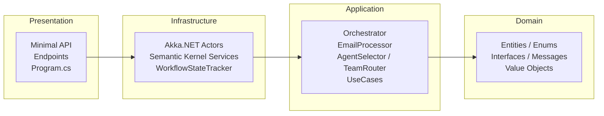
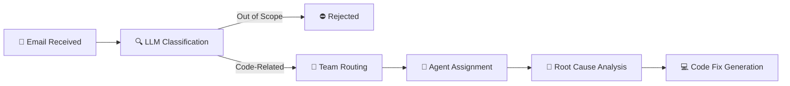

# AI Support Workflow

**A spec-driven AI experiment — built entirely by AI using [Kiro](https://kiro.dev).**

An AI-driven technical support workflow built with .NET 10. This project simulates the full lifecycle of a support request — from email intake to automated code fix generation — using LLM-powered agents orchestrated through an actor-based architecture.

> **Note:** This entire codebase was generated by AI as a spec-driven development experiment. Nothing was manually written, reviewed, or audited. Use at your own risk.

---

## What It Does

The system automates technical support by processing incoming emails through a multi-stage AI pipeline:

1. **Email Reception** — A support email is submitted via the REST API with a sender, subject, and body.
2. **LLM Classification** — The email is analyzed by an LLM to determine whether it describes a code-related issue and to categorize it (backend bug, frontend bug, or quality/test issue). Out-of-scope emails are rejected here.
3. **Team Routing** — The email text is matched against known applications (Application A, Application B) to route the issue to the correct team.
4. **Agent Assignment** — Based on the issue category, a specialized AI agent is selected (backend developer, frontend developer, or QA engineer).
5. **Root Cause Analysis** — The assigned agent, running as an Akka.NET actor, performs LLM-powered analysis to identify the root cause and produce a resolution report.
6. **Code Fix Generation** — A simulated pull request is generated with the proposed fix, including affected file paths and a diff.

Each agent operates as an independent actor under a supervisor, and the full pipeline state is tracked and queryable through the API.

---

## Architecture

The project follows Clean Architecture with a strict inward dependency flow, combined with an actor-based workflow pipeline for processing support requests.

### Clean Architecture Layers

Dependencies flow inward — each layer only depends on the layer closer to the core. The Domain layer has zero external dependencies.



### Workflow Pipeline

Each support email flows through a multi-stage AI pipeline. Out-of-scope emails are rejected at classification; code-related issues proceed through routing, assignment, analysis, and fix generation.



---

## DummyApps & Test Scenarios

The `DummyApps/` folder contains two sample applications — **ApplicationA** and **ApplicationB** — that serve as test fixtures for the AI workflow. Each application includes source code with intentional bugs and a `BugScenarios.md` file documenting three predefined scenarios (one per issue category).

### Bug Categories

| Category | Description | Example |
|----------|-------------|---------|
| **BackendBug** | Server-side logic errors (null references, SQL injection) | App A: `NullReferenceException` in `GetOrderSummary`; App B: SQL injection in `SearchUsers` |
| **FrontendBug** | UI/component rendering issues (wrong bindings, missing null checks) | App A: incorrect property binding in `OrderSummary.razor`; App B: missing null check on avatar URL |
| **QualityTestIssue** | Missing or flaky tests that let bugs slip through | App A: missing test for empty order edge case; App B: flaky test with hardcoded date |

### Scenario Files

- [`DummyApps/ApplicationA/BugScenarios.md`](DummyApps/ApplicationA/BugScenarios.md) — Three scenarios (A1–A3) covering an order management system
- [`DummyApps/ApplicationB/BugScenarios.md`](DummyApps/ApplicationB/BugScenarios.md) — Three scenarios (B1–B3) covering a user management system


---

## API Endpoints

All endpoints are served under the `/api/support` base path.

| Method | Route | Description |
|--------|-------|-------------|
| `POST` | `/api/support/emails` | Submit a support email for processing |
| `GET` | `/api/support/issues/{id:guid}` | Get workflow state by issue ID |
| `GET` | `/api/support/issues` | List all processed issues |
| `GET` | `/api/support/stream` | SSE stream of real-time workflow updates |
| `GET` | `/api/support/agents` | Current state of all AI agents |

📄 [Full API reference with request/response examples →](docs/api-endpoints.md)

---

## Project Structure

```
AiSupportWorkflow/
├── src/
│   ├── AiSupportWorkflow.Domain/            # Pure domain layer — entities, enums, interfaces, value objects, messages
│   ├── AiSupportWorkflow.Application/       # Business logic — orchestrator, services, use cases, configuration
│   ├── AiSupportWorkflow.Infrastructure/    # External integrations — Akka.NET actors, Semantic Kernel, services
│   └── AiSupportWorkflow.Presentation/      # REST API & composition root — Minimal API endpoints, Program.cs
│
├── tests/
│   ├── AiSupportWorkflow.UnitTests/         # xUnit + NSubstitute unit tests
│   └── AiSupportWorkflow.PropertyTests/     # FsCheck property-based tests
│
├── DummyApps/
│   ├── ApplicationA/                        # Sample app with predefined bug scenarios
│   └── ApplicationB/                        # Sample app with predefined bug scenarios
│
├── docs/                                    # In-depth documentation
├── scripts/                                 # PowerShell monitoring script
├── AiSupportWorkflow.sln                    # Solution file
└── README.md
```

---

## Deep-Dive Documentation

| Document | Description |
|----------|-------------|
| [Clean Architecture](docs/clean-architecture.md) | Four-layer structure, dependency rules, and compliance verification |
| [Actor Architecture](docs/actor-architecture.md) | Akka.NET actor system, supervision strategy, and message routing |
| [Semantic Kernel Integration](docs/semantic-kernel-integration.md) | LLM-backed services for classification, resolution, and code generation |
| [API Endpoints](docs/api-endpoints.md) | Full API reference with request/response examples |
| [Debugging](docs/debugging.md) | HTTP file for IDE-based testing and PowerShell monitor script |


---

## Getting Started

1. **Clone the repository:**

   ```bash
   git clone https://github.com/your-username/AiSupportWorkflow.git
   cd AiSupportWorkflow
   ```

2. **Configure your OpenAI API key:**

   Create the file `src/AiSupportWorkflow.Presentation/appsettings.Development.json`:

   ```json
   {
     "LlmProvider": {
       "ApiKey": "YOUR_API_KEY_HERE",
       "Provider": "OpenAI",
       "ModelName": "gpt-4o-mini"
     }
   }
   ```

   This file is git-ignored and will not be committed.

3. **Run the project:**

   ```bash
   dotnet run --project src/AiSupportWorkflow.Presentation
   ```

   The API will be available at `http://localhost:5000` (or the port configured in `launchSettings.json`).

### Configuration

The `Workflow` section in `appsettings.json` controls runtime behavior:

| Setting | Type | Default | Description |
|---------|------|---------|-------------|
| `EnableVisualization` | `bool` | `false` | Enables the SSE stream and agents endpoints |
| `ActorAskTimeoutSeconds` | `int` | `120` | Timeout for the Akka.NET actor Ask. Values ≤ 0 fall back to 120s. |
| `Teams` | `array` | — | Team and agent configuration |

### Verbose Logging

Set the `AiSupportWorkflow` log level to `Debug` in `appsettings.Development.json`:

```json
{
  "Logging": {
    "LogLevel": {
      "AiSupportWorkflow": "Debug"
    }
  }
}
```

---

## License

This project is licensed under the MIT License. See [LICENSE](LICENSE) for details.
