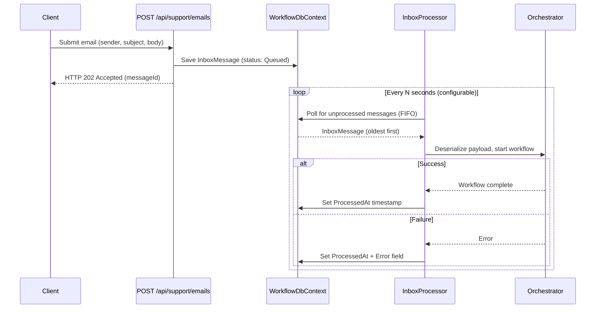

# Transactional Inbox Pattern

> **📚 Navigation:** [← Back to README](../README.md)

## What Is the Transactional Inbox Pattern?

The Transactional Inbox is a messaging pattern that decouples the reception of a message from its processing. Instead of handling a request synchronously within the HTTP request lifecycle, the system persists the message to a local store (the "inbox") and returns immediately. A background processor then picks up messages from the inbox and processes them asynchronously.

This pattern is commonly used in distributed systems to ensure reliable message delivery without requiring an external message broker.

---

## Why We Adopted It

The AI Support Workflow pipeline involves multiple LLM calls, actor coordination, and state transitions that can take significant time. Processing emails synchronously within the HTTP request created several problems:

| Problem | Solution via Inbox |
|---------|-------------------|
| **Slow client response** — Users waited for the entire pipeline to complete | **Immediate response** — HTTP 202 Accepted returned instantly |
| **Tight coupling** — HTTP handler directly orchestrated the workflow | **Decoupled reception/processing** — Inbox separates concerns |
| **No failure resilience** — A crash mid-pipeline lost the request | **Failure resilience** — Message persists; errors are recorded without data loss |
| **No audit trail** — No record of what was submitted vs. processed | **Natural audit trail** — Every submission is a persistent inbox record with timestamps |

---

## Flow



---

## InboxMessage Structure

| Field | Type | Description |
|-------|------|-------------|
| `Id` | `Guid` | Unique message identifier (returned to client on submission) |
| `MessageType` | `string` | Type discriminator (e.g., `"SupportEmail"`) |
| `Payload` | `string` | Serialized email as JSON (`{ sender, subject, body }`) |
| `ReceivedAt` | `DateTimeOffset` | Timestamp when the message was received |
| `ProcessedAt` | `DateTimeOffset?` | Timestamp when processing completed (null = queued) |
| `Error` | `string?` | Error message if processing failed (null = success) |

### Status Derivation

The message status is derived from the fields:

- **Queued** — `ProcessedAt` is null
- **Processed** — `ProcessedAt` is set and `Error` is null
- **Failed** — `Error` is set (and `ProcessedAt` is also set)

---

## Error Handling

When the workflow fails for a message:

1. The error description is recorded in the `Error` field of the `InboxMessage`.
2. The `ProcessedAt` field is set to the current timestamp.

Setting `ProcessedAt` on failure is intentional — it prevents the processor from retrying the same message indefinitely. Failed messages remain in the inbox as a permanent record and are visible in the dashboard's Inbox page with a "Failed" status badge.

There is no automatic retry mechanism. If a message needs to be reprocessed, a new email submission is required.

---

## Processing Order

The `InboxProcessor` processes messages in **FIFO order** (First In, First Out), sorted by `ReceivedAt` timestamp. This ensures that emails submitted earlier are processed before later ones, maintaining a fair and predictable processing sequence.

---

## Configuration

The polling interval is configurable in `appsettings.json` under the `Workflow` section:

```json
{
  "Workflow": {
    "InboxPollingIntervalSeconds": 5
  }
}
```

| Setting | Type | Default | Description |
|---------|------|---------|-------------|
| `InboxPollingIntervalSeconds` | `int` | `5` | How often (in seconds) the background processor checks for new messages |

A lower value means faster processing but higher database polling frequency. The default of 5 seconds provides a good balance for development and demonstration purposes.

---

## Related

- [← Back to README](../README.md)
- [Dashboard](dashboard.md) — Monitoring UI that displays inbox status
- [API Endpoints](api-endpoints.md) — REST API reference including the POST endpoint
